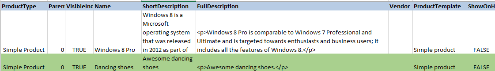
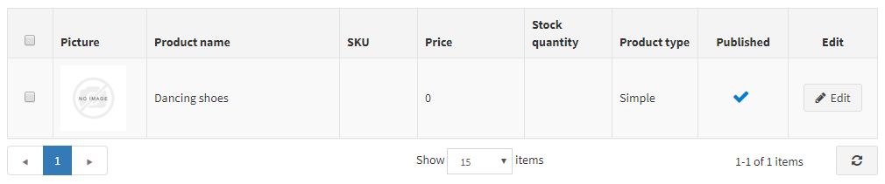

# Importar/exportar productos

nopCommerce soporta la importación desde formato Excel y la exportación de productos en XML o Excel. Puede descargar los productos de su catálogo en PDF.
Puede encontrar estas opciones en **Catálogo → Productos** en la parte superior izquierda de la página principal.

## Exportar productos

 Puede exportar productos en formato XML o Excel haciendo clic en el botón **Exportar**. Después de hacer clic en el botón **Exportar** verá el menú desplegable que le permite **Exportar a XML (todos los encontrados)** o **Exportar a XML (seleccionado)** y **Exportar a Excel (todos los encontrados)** o **Exportar a Excel (seleccionado)**. 
 

 Si no necesita descargar todos los productos, utilice el panel de *Búsqueda* para encontrar los productos necesarios o/y utilice las casillas de verificación para seleccionar los productos necesarios. Se descargará un archivo con los productos que haya elegido. El archivo consiste en todas las características de los productos de los paneles de la página de edición de productos (información del producto, SEO, imágenes, etc.).

> [!NOTE]
>
> Si utiliza los atributos del producto, la tabla de Excel exportada se agrupará por filas. Para ver los detalles de los atributos, haga clic en + junto a su producto en la tabla. 
> 

## Importar productos

Si no quiere añadir todos los productos a su catálogo manualmente, puede utilizar la opción de importación.

> [!NOTE]
> 
> Antes de iniciar la importación, debe descargar una plantilla de tabla para la importación en formato Excel, tal y como se describe en el [productos de exportación](#exporting-products) sección. Para una importación precisa y correcta de sus productos es crucial nombrar todas las columnas de la tabla correctamente (exactamente como en la tabla descargada).

No es obligatorio rellenar todos los campos de la tabla. El producto se creará en base a los campos rellenados.

Los productos importados se distinguen por el SKU. Si el SKU ya existe, se actualizará su producto correspondiente.

La importación requiere muchos recursos de memoria. Por eso no se recomienda importar más de 500 - 1000 registros a la vez. Si tiene más registros, es mejor dividirlos en varios archivos de Excel e importarlos por separado.

### Ejemplo

Por ejemplo, queremos añadir zapatos de baile a nuestro catálogo. Vamos a crear una nueva fila en la tabla:

Luego haga clic en **Importar**, elija el archivo y haga clic en el botón **Importar desde Excel**. A continuación, comprueba si tienes un nuevo producto en el catálogo.

## Configuración de la importación/exportación

La siguiente sección describe la configuración de la importación/exportación: [Export/import](xref:es/running-your-store/catalog/catalog-settings#exportimport).

## Ver también

* [Añadir productos](xref:es/running-your-store/catalog/products/add-products)
