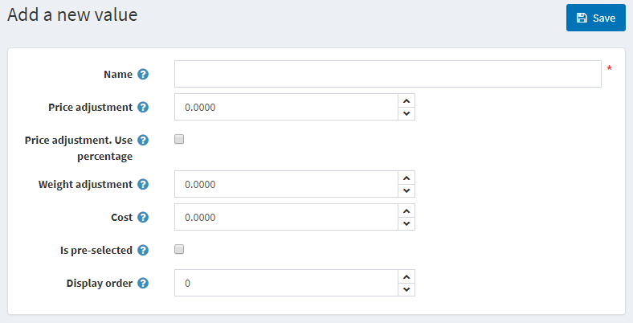
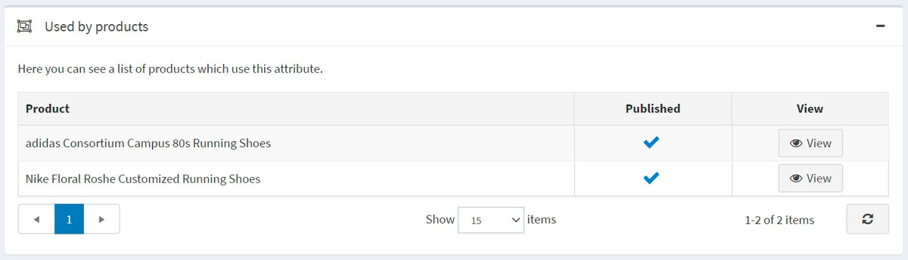

# Atributos del producto

Los atributos del producto son variaciones de un producto (como el color, el tamaño, etc.).

Un usuario puede crear diferentes combinaciones de los atributos. Por ejemplo, un producto puede estar en diferentes tallas y colores. Así, un usuario crearía dos atributos y sus valores, por ejemplo, "talla" (S, M, L) y "color" (rojo, azul, blanco), y luego establecería grupos según la disponibilidad de los productos.

En nopCommerce, los atributos de los productos se utilizan en el **seguimiento del inventario**, y también pueden causar la **diferencia de precios**.

Para definir los atributos de los productos vaya a **Catálogo → Atributos → Atributos de los productos**.

> [!NOTE]
> 
> Por defecto, no hay atributos de producto pre-creados en nopCommerce.

## Añadir atributos del producto

Haga clic en **Añadir nuevo** para añadir un atributo.

En la ventana *Añadir un nuevo atributo de producto* rellene los campos **Nombre** y **Descripción**.

Haga clic en **Guardar y continuar editando** para pasar al panel de edición de *Valores predefinidos*.

> [!TIP]
> 
> [Tutorial de YouTube: Añadir un producto con atributos de color](https://youtu.be/QihipwQ61YU)

## Añadir valores predefinidos

En el panel *Valores predefinidos* haga clic en **Añadir un nuevo valor**, y se abrirá la ventana *Añadir un nuevo valor*:

En la ventana *Añadir un nuevo valor* defina:

- El atributo **Nombre**.
- El **Ajuste de precio** que se aplica al elegir el valor de este atributo. Por ejemplo '10' para añadir 10 dólares. O el 10% si **Ajuste del precio. Usar porcentaje** está marcado.
- La casilla **Ajuste del precio. Usar porcentaje** permite determinar el ajuste del precio en porcentaje en lugar de un valor absoluto.
- El **Ajuste del peso** se aplica al elegir este valor de atributo.
- El valor del atributo **Coste** es el coste de todos los diferentes componentes que conforman este valor. Puede ser el precio de compra si los componentes se compran a proveedores externos, o el coste combinado de los materiales y los procesos de fabricación si el componente es de fabricación propia.
- Si el valor **Está preseleccionado** para un cliente.
- El valor **Orden de presentación** en una lista de atributos.

Después de rellenar los campos, haga clic en **Guardar**..

> [!TIP]
> 
> No es necesario crear los valores de los atributos cuando se añaden los atributos del producto, se pueden crear más tarde cuando se aplican ciertos atributos al producto. 
> Una vez que los atributos y los valores se establecen, pueden ser agrupados y gestionados en el panel *Atributos del producto* en la página de edición del producto.

> [!NOTE]
> 
> Algunos propietarios de tiendas prefieren destacar productos diferenciados por atributos y crear un producto separado con cada atributo específico (por ejemplo, camisetas azules y camisetas rojas listadas por separado). En este caso, recomendamos crear un producto agrupado (camisetas, como en el ejemplo) para que todas las variaciones se muestren en la misma página, una vez que el producto agrupado sea visto por un cliente. Más información sobre [productos agrupados](xref:es/running-your-store/catalog/products/grouped-products-variants).

## Panel de productos utilizados

En el panel *Usado por los productos* puedes saber qué productos utilizan este atributo:

## See also

- [Añadir productos](xref:es/running-your-store/catalog/products/add-products)
- [Producto agrupado](xref:es/running-your-store/catalog/products/grouped-products-variants)

## Tutoriales

- [Visión general de los atributos condicionales de los productos](https://www.youtube.com/watch?v=eIdHVcEdos8&t=55s)