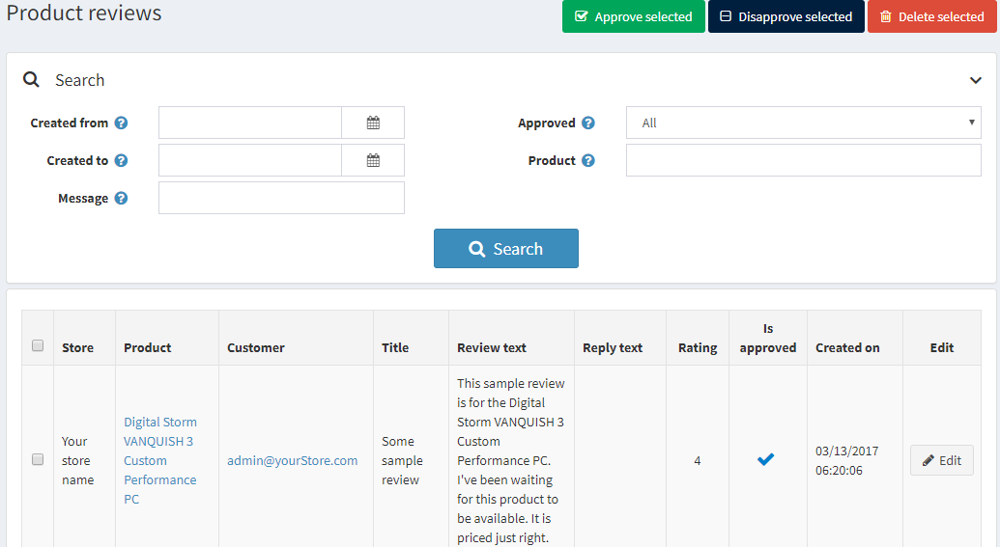
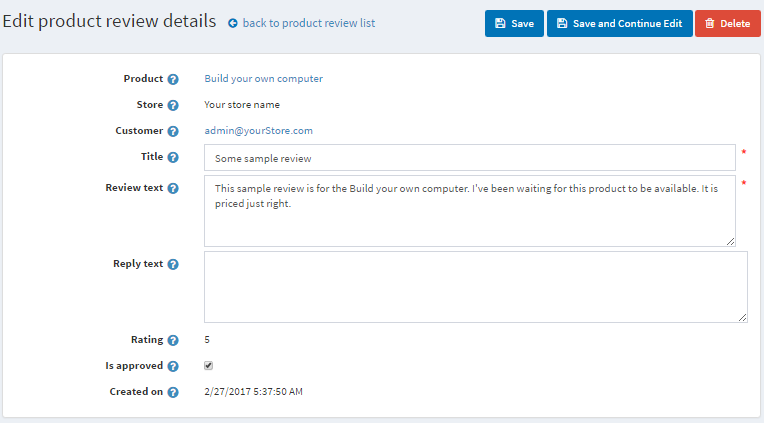

# Reseñas de productos

Las reseñas de productos son los comentarios de los clientes sobre un producto. Las reseñas también pueden incluir valoraciones.

En la tienda pública, las opiniones se muestran en la página de detalles del producto. Los clientes pueden escribir reseñas para diferentes productos. Una vez que se ha escrito una opinión y ha sido aprobada por el propietario de la tienda, otros clientes pueden definir si la opinión es útil o no haciendo clic en *Sí* o *No* al lado de la opinión.

> [!NOTA]
> 
> Por defecto, las reseñas deben ser aprobadas por el propietario de la tienda antes de que aparezcan en la tienda pública. Sin embargo, en caso de que el propietario de la tienda decida que las reseñas no tienen que ser aprobadas, este comportamiento por defecto puede ser cambiado. Para optar por no aprobar obligatoriamente las reseñas de productos, vaya a **Configuración → Ajustes → Ajustes del catálogo** y desmarque la opción **Las reseñas de productos deben ser aprobadas**.

## Gestión de las reseñas de productos

Para gestionar las reseñas de productos vaya a **Catálogo → Reseñas de productos**. Aparecerá la ventana *Revisiones de productos*, como se indica a continuación:

### Búsqueda de reseñas

Puede buscar reseñas por:
- Rango de fechas utilizando los campos **Creado desde** y **Creado hasta**. En los campos Creado desde y Creado hasta, introduzca el intervalo de fechas para su búsqueda. También puede hacer clic en el calendario desplegable y seleccionar el intervalo de fechas deseado.
- **Mensaje**. Se puede utilizar para encontrar una revisión por el título o una parte de su texto.
- Aprobado**. Se puede utilizar para encontrar una revisión por una propiedad "Aprobada".
- Producto**. Ordena y muestra las reseñas relacionadas con un producto en particular.
- Tienda**. Permite ver todas las reseñas de los productos de una tienda en particular. Este campo se muestra si tiene más de una tienda.

### Aprobar o desaprobar

Seleccione las reseñas que desea aprobar o desaprobar y haga clic en el botón **Aprobar seleccionados** o en el botón **Desaprobar seleccionados** según corresponda.

## Editar reseñas de productos

Para editar la reseña del producto, haga clic en **Editar** junto a la reseña. Aparecerá la ventana *Editar detalles de la reseña del producto*, como se indica a continuación:

- Ver el **Producto** para el que se ha añadido esta reseña. Después de hacer clic en este campo, se le redirigirá a la ventana de edición de los detalles del producto, donde podrá editar los detalles del producto.
- Ver la **Tienda** en la que se escribió esta reseña.
- Y el **Cliente** que creó la reseña. Después de hacer clic en este campo, será redirigido a la ventana de edición de los detalles del cliente donde puede editar los detalles.
- Puede editar el **Título** de la reseña.
- Así como su **Texto**.
- En el campo **Texto de respuesta** puede dejar una respuesta a la opinión, que será visible en la tienda pública debajo de la opinión.
- La **Calificación** muestra la calificación del cliente. No se puede editar.
- Marque la casilla **Es aprobada**, para aprobar la reseña.
- Creado el** muestra la fecha y la hora en que se creó la opinión.

## Tipos de reseñas

Si ha creado tipos de valoración personalizados, verá el panel *Tipos de valoración*:

En esta área, puede ver todas las opiniones adicionales sobre el producto actual. **Calificación** muestra la calificación de los clientes. Todas las columnas de la tabla no se pueden editar.

Para obtener más información sobre la configuración de las revisiones, haga clic en ver el [Product reviews](xref:es/running-your-store/catalog/catalog-settings#product-reviews) and [Review types](xref:es/running-your-store/catalog/catalog-settings#review-types) chapters.

## Tutorials

- [Managing product reviews](https://www.youtube.com/watch?v=TBOpCoEAMnU&feature=youtu.be)
- [Managing product review types](https://youtu.be/Ts7_T9sd1Do)
