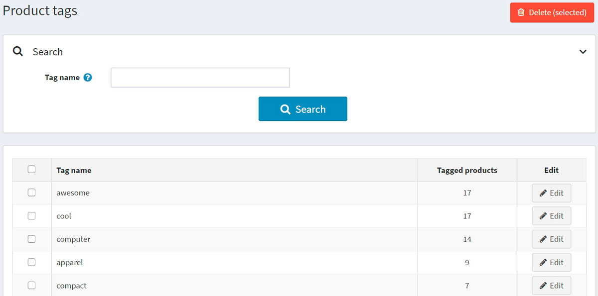
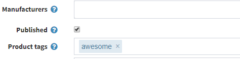

# Etiquetas de productos

Las etiquetas de los productos son palabras clave para la identificación de los productos. Se utilizan para clasificar los productos por una determinada característica y para permitir una búsqueda específica y limitada de productos.
Por ejemplo, si vendes ropa y quieres crear etiquetas para camisetas, puede ser "camiseta", "algodón", "polo", etc.

Para editar las etiquetas de productos que se muestran en la tienda pública, vaya a **Catálogo → Etiquetas de productos**..

En la página de etiquetas de productos, puede ver cuántos productos tienen una determinada etiqueta en la columna **Productos etiquetados**. Puede editar la etiqueta haciendo clic en el botón **Editar** que aparece al lado. O también puede eliminar las etiquetas seleccionándolas y haciendo clic en el botón **Borrar (seleccionado)**.

## Añadir etiquetas a los productos

Puede añadir etiquetas en la página de detalles del producto al añadir o editar un producto.

Introduzca las etiquetas separándolas por comas. Una vez creadas las etiquetas, pueden utilizarse también para otros productos. Cuantos más productos estén asociados a una etiqueta concreta, mayor será su aspecto en el área de *Etiquetas populares*, que se muestra en la barra lateral de la página del catálogo:

## Configuración de las etiquetas de los productos

La siguiente sección describe la configuración de las etiquetas de los productos: Etiquetas](xref:es/running-your-store/catalog/catalog-settings#tags).

## Ver también

* [Categorías de productos](xref:es/running-your-store/catalog/categories)
* [Añadir productos](xref:es/running-your-store/catalog/products/add-products)