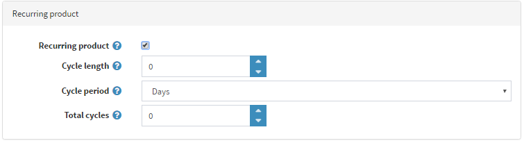

# Productos recurrentes

El tipo de producto recurrente se utiliza normalmente para suscripciones o productos con planes de pago a plazos. Si su producto es recurrente, marque la casilla correspondiente en el panel *Producto recurrente*.

Defina los siguientes detalles:

- **Longitud del ciclo**. Es un periodo de tiempo en el que la orden recurrente puede repetirse.
- Periodo del ciclo** en *Días*, *Semanas*, *Meses* o *Años*. Define las unidades en las que se medirá el periodo de tiempo.
- **Ciclos totales** es el número de veces que el cliente recibirá el producto recurrente.

Puede definir un ciclo recurrente a cualquier producto para que el sistema pueda crear automáticamente pedidos repetitivos. En este caso, cada vez que haya que realizar el pago, el sistema utilizará los datos de pago del pedido inicial para los siguientes pedidos recurrentes. Además, los gastos de envío originales se aplicarán a los pedidos posteriores.

> [!NOTE]
> 
> Al menos uno de los módulos de pago activos debe admitir los pagos recurrentes.

## Ver también

- [Métodos de pago](xref:es/getting-started/configure-payments/payment-methods/index)
