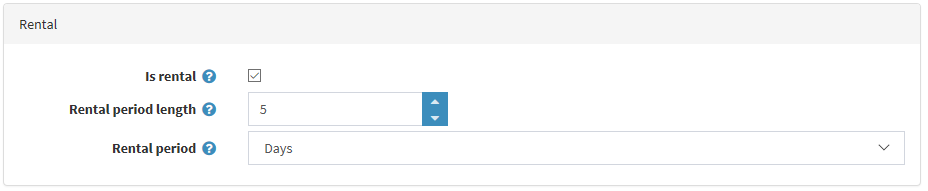

# Productos de alquiler

La funcionalidad de productos de alquiler es útil cuando se quiere crear un sitio web que permita a los clientes reservar habitaciones y hoteles. Esta función también se puede utilizar para un sitio web que ofrece ropa como vestidos de novia, material de camping, juguetes para niños y más para alquilar.

## Ejemplo

Supongamos que desea crear un sitio web que ofrece vestidos de novia en alquiler. 

¿Qué funcionalidad será útil en este caso?

- Una de las funcionalidades más importantes es permitir a los clientes elegir el *periodo de alquiler*. En nopCommerce, se permite elegir la fecha de inicio y la fecha de finalización, como en la captura de pantalla de abajo:
	

- nopCommerce también permite al administrador de la tienda elegir *periodo de alquiler* y *duración del periodo de alquiler*. Por ejemplo, usted quiere dar el vestido de novia en alquiler durante 3 días como mínimo. En este caso un cliente verá lo siguiente en la página de detalles del producto:
	

- Utilice los atributos *checkout* para permitir que el cliente especifique la hora de devolución cuando un transportista debe recoger el vestido:
	
	Más información sobre los atributos de la caja [here](xref:es/running-your-store/order-management/checkout-attributes).

Más información sobre los atributos de la caja

## Configurar un producto de alquiler

Para crear un producto de alquiler, vaya a **Catálogo → Productos**. Haga clic en **Añadir nuevo**, rellene los campos comunes del producto y marque la casilla correspondiente en el panel *Alquiler*.

Defina los siguientes detalles:

- **Longitud del periodo de alquiler** es la longitud del ciclo de alquiler, periodo mínimo de facturación. El precio se especifica para este periodo.
- Periodo de alquiler** en *Días*, *Semanas*, *Meses* o *Años*. Define las unidades en las que se medirá el periodo de alquiler.

Al comprar productos de alquiler, los clientes tienen que especificar el periodo de alquiler en la tienda pública. El importe a pagar se calcula automáticamente.

## Tutoriales

- [Gestión de productos de alquiler](https://www.youtube.com/watch?v=tOaC6hOILZY&list=PLnL_aDfmRHwsbhj621A-RFb1KnzeFxYz4&index=24)
