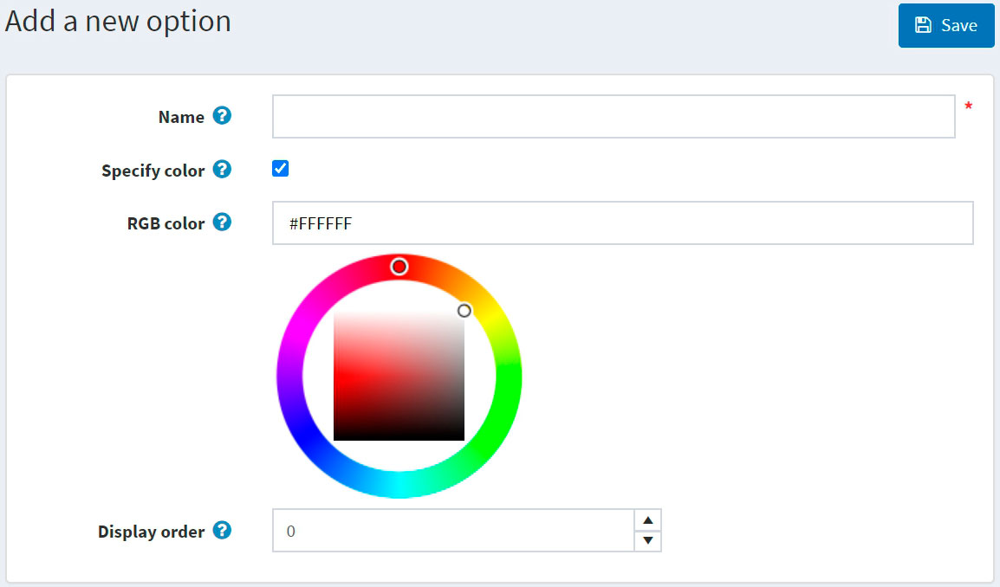

# Atributos de las especificaciones

Los atributos de especificación son similares a los [atributos del producto](xref:es/running-your-store/catalog/products/product-attributes), sin embargo, sólo se utilizan con fines informativos (visibles en la página de detalles del producto) y para filtrar productos en la página de detalles de la categoría. No definen el precio del producto ni pueden utilizarse para el seguimiento del inventario.

## Ejemplo
Supongamos que tiene una tienda de informática online. ¿Qué ayuda a un cliente a tomar una decisión? 

- Proporcionar a un cliente información completa y descriptiva sobre sus productos. A pesar de que usted llene la descripción corta y completa de la computadora determinada, permitir que el cliente vea la característica del producto donde se reflejan sus detalles más importantes: 
	

	Esta tabla puede mostrarse en la página de detalles del producto si selecciona el campo **Mostrar en la página del producto** cuando [añadir un atributo de especificación a un producto](xref:es/running-your-store/catalog/products/add-products#specification-attributes).

- Permita a sus clientes buscar ordenadores utilizando la función de filtro. Digamos que podemos buscar en su tienda por color, tamaño de pantalla, tipo de CPU y memoria. Entonces la página de la categoría tendrá el siguiente aspecto:
	

	Seleccione el campo **Permitir filtrado** cuando [añadir un atributo de especificación a un producto](xref:es/running-your-store/catalog/products/add-products#specification-attributes) para permitir el filtrado por este atributo para el producto determinado.

- Incluya la funcionalidad "Comparar productos" en su tienda. Esta función también utiliza atributos de especificación. Para su tienda de informática, la página "Comparar productos" tendrá el siguiente aspecto:
	

	Para activar la funcionalidad "Comparar productos" vaya a **Configuración → Ajustes → Ajustes del catálogo**. En el panel *Comparar productos* marque la casilla **'Comparar productos' habilitada**.

La siguiente sección describe cómo crear atributos de especificación. Tenga en cuenta que después de crear una lista de atributos de especificación tendrá que añadir los atributos de especificación a los productos uno por uno. Aprenda a añadir atributos de especificación a los productos en la sección [Añadir productos - Atributos de especificación](xref:es/running-your-store/catalog/products/add-products#specification-attributes) sección.

## Crear un atributo de especificación

> [!NOTE]
> 
> Por defecto, no hay atributos de especificación precreados en nopCommerce.

Para ver y editar una lista de atributos de especificación, vaya a **Catálogo → Atributos → Atributos de especificación**.

En esta página puede eliminar los atributos de las especificaciones seleccionándolos y haciendo clic en el botón **Borrar(seleccionado)**.

Haga clic en **Añadir nuevo** para añadir un nuevo atributo. Aparece la ventana *Añadir un nuevo atributo de especificación*, como se indica a continuación:

En el panel *Información del atributo*, introduzca:
- El **Nombre** del atributo de especificación.
- El **número de orden de visualización**.

Haga clic en **Guardar y continuar editando** para pasar al panel de edición de *Opciones*. 

### Añadir una nueva opción

Haga clic en el botón **Añadir una nueva opción** del panel *Opciones* para crear una nueva opción de atributo de especificación. Aparecerá la ventana *Añadir una nueva opción*, como se indica a continuación:

Defina las siguientes opciones:
- El **Nombre** de la opción del atributo de especificación.
- Marque la casilla **Especificar color** para elegir el color que se utilizará en lugar del nombre del texto de la opción (se mostrará como un "cuadrado de color").
	- Elija el **color RGB** que se mostrará a los clientes.
- El **número de pedido**.

Haga clic en **Guardar** para guardar los detalles de la opción.

La siguiente captura de pantalla muestra las opciones ya añadidas:

### Utilizado por los productos

Si ha aplicado el atributo de especificación a los productos, puede ver la lista de estos productos en el panel *Usado por los productos*.:

## See also

- [Añadir productos](xref:es/running-your-store/catalog/products/add-products)
- [Atributos del producto](xref:es/running-your-store/catalog/products/product-attributes)
- [Tutorial de YouTube: Gestión de los atributos de las especificaciones](https://www.youtube.com/watch?v=YmD_vHqWzQw&index=11&list=PLnL_aDfmRHwsbhj621A-RFb1KnzeFxYz4)
