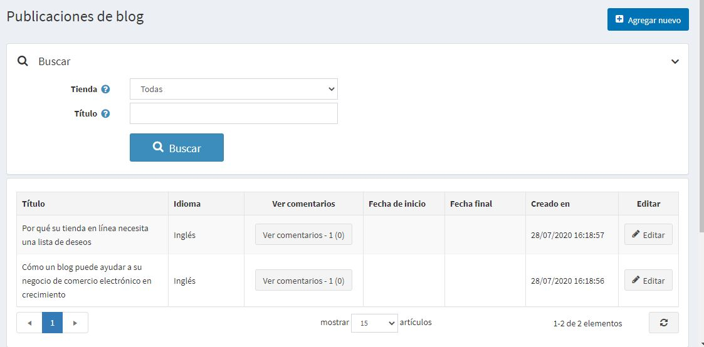
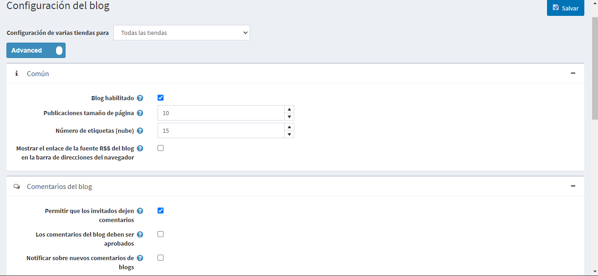

# Blog

Un blog es una gran manera de conectar con sus clientes actuales, manteniéndolos informados sobre las últimas ofertas de productos o educándolos, así como para encontrar nuevos clientes.

Para gestionar las entradas del blog vaya a **Gestión de contenidos → Entradas del blog**.

## Añadir una nueva entrada en el blog

Haz clic en **Agregar nuevo** y rellena la información sobre una nueva entrada del blog.

### Información
En el panel *Info* define los siguientes detalles de la entrada del blog:
* Si más de un idioma está habilitado, en la lista desplegable **Idioma**, seleccione el idioma de esta entrada del blog. Los clientes sólo verán las entradas del blog para el idioma seleccionado.
* Introduzca el **Título** de esta entrada del blog.
* Introduzca el texto de **Cuerpo** de esta entrada del blog.
* Puede especificar la **Visión general del cuerpo** si desea que sólo una parte del texto completo sea visible en la página principal del blog, donde se enumeran todas las entradas del blog.
* Introduzca **Tags** para que se muestre en la página del blog en la tienda pública. Las etiquetas son palabras clave con las que esta entrada del blog también puede ser identificada. Introduzca una lista separada por comas de las etiquetas que se asociarán a esta entrada del blog. Cuantas más entradas del blog estén asociadas a una etiqueta en particular, mayor será su tamaño en el área de "Etiquetas populares", que se muestra en la barra lateral de la página del blog.
   

* Selecciona la casilla **Permitir comentarios**, para permitir a los clientes añadir comentarios a esta entrada del blog.
* Seleccione la casilla **Incluir en el mapa del sitio** para incluir la entrada del blog en el mapa del sitio.
* Introduzca **Fecha de inicio** y **Fecha de fin** para mostrar esta entrada del blog en Tiempo Universal Coordinado (UTC).

 > [!NOTE]
 > 
 > Puedes dejar estos campos vacíos si no quieres definir las fechas de inicio y fin de las entradas del blog.

- Elija las tiendas en el campo **Limitado a las tiendas** para habilitar esta entrada del blog sólo para tiendas específicas. Deje el campo vacío en caso de que esta funcionalidad no sea necesaria.
  > [!NOTE]
  >
	> Para poder utilizar esta función, debe desactivar la siguiente configuración: **Configuración del catálogo → Ignorar las reglas de "límite por tienda" (en todo el sitio)**. Lea más sobre la funcionalidad de multi-tienda [here](xref:es/getting-started/advanced-configuration/multi-store).

Mientras edita una entrada de blog existente o después de hacer clic en el botón **Guardar y continuar editando** para una nueva, puede hacer clic en el botón **Previsión** en la parte superior derecha para ver cómo la entrada del blog aparecerá en el sitio.

### SEO
En el panel *SEO* define los siguientes detalles de la entrada del blog:

- Defina el **Nombre de la página de búsqueda amigable para el motor**. Por ejemplo, introduce "las mejores noticias" para que tu URL sea "http://yourStore.com/the-best-news". Deja este campo vacío para generarlo automáticamente basado en el título de la entrada del blog.
- Anula el título de la página en el campo **Título Meta** (el título por defecto es el título de la entrada del blog).
- Ingresa **Meta keywords** - palabras clave meta de la entrada del blog para ser añadidas al encabezado de la entrada del blog. Es una lista breve y concisa de los temas más importantes de la página.
- Introduce **Descripción Meta** para ser añadida al encabezado de la entrada del blog. La etiqueta de meta descripción es un resumen breve y conciso del contenido de la página.

## Administrar los comentarios del blog

Para gestionar los comentarios del blog seleccione **Gestión de contenidos → Comentarios del blog**.

Use el botón **Aprobar seleccionados** para aprobar los comentarios seleccionados y el botón **Desaprobar seleccionados** para desaprobarlos.
También puedes editar o eliminar un comentario del blog. Si lo borra, este comentario será eliminado del sistema.

## Configuración del blog

Puede gestionar los ajustes del blog en **Configuración → Ajustes → Ajustes del blog**. Esta página está disponible en 2 modos: *avanzado* y *básico*.

Esta página permite la configuración de varias tiendas, lo que significa que se pueden definir los mismos ajustes para todas las tiendas, o diferir de una tienda a otra. Si desea gestionar la configuración de una tienda determinada, elija su nombre en la lista desplegable de configuración de varias tiendas y marque todas las casillas de verificación necesarias en el lado izquierdo para establecer un valor personalizado para ellas. Para obtener más detalles, consulte [Multi-store](xref:es/getting-started/advanced-configuration/multi-store).

### Común

Defina los siguientes ajustes *comunes*:
*Selecciona la casilla **Blog enabled**, para activar la funcionalidad de blog en tu tienda.
* En el campo **Tamaño de la página de entradas**, establece el número de entradas por página.
* En el campo **Número de etiquetas (nube)**, introduce el número de etiquetas que aparecen en la nube de etiquetas.
* Selecciona la casilla **Mostrar el enlace del feed RSS del blog en la barra de direcciones del navegador**, para mostrar el enlace del feed RSS del blog en la barra de direcciones del navegador.

### Comentarios del blog

Defina los siguientes ajustes de *comentarios de blog*:
* Seleccione la casilla de verificación **Permitir a los invitados dejar comentarios**, para permitir a los usuarios no registrados añadir comentarios al blog.
* Seleccione la casilla de verificación **Los comentarios del blog deben ser aprobados** si los comentarios del blog deben ser aprobados por el administrador.
* Active la casilla de verificación **Notificar sobre los nuevos comentarios del blog**, para notificar al propietario de la tienda sobre los nuevos comentarios del blog.
* Seleccione la casilla de verificación **Comentarios de blog por tienda** para mostrar los comentarios de blog escritos en la tienda actual solamente.

Haga clic en **Guardar**.

> [!NOTE]
>
> Puedes habilitar el CAPTCHA para los comentarios del blog por motivos de seguridad. Para obtener más información, vaya a la página [CAPTCHA](xref:es/getting-started/advanced-configuration/security-settings#captcha) section.