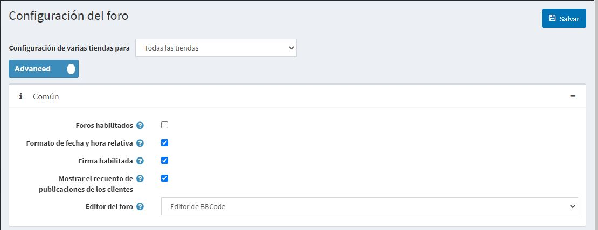
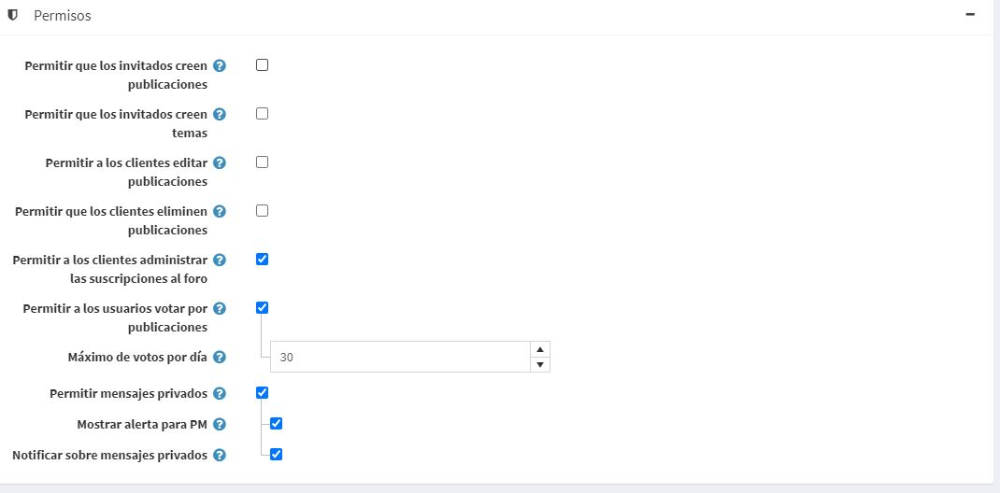
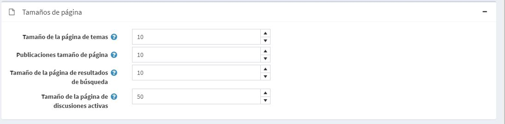

# Foros

Un foro es un sitio de discusión en línea donde la gente puede mantener conversaciones en forma de mensajes publicados. Un foro puede contener varios subforos, cada uno de los cuales tiene varios temas.

> [!NOTE]
> 
> En nopCommerce, los foros están desactivados por defecto. Para habilitar los foros, ve a **Configuración → Configuración → Configuración de los foros** y marca la casilla **Foros habilitados**. El enlace "Foros" debe aparecer en el menú de la tienda pública (menú superior o pie de página en el tema por defecto).

Para gestionar los grupos de foros y los foros (dentro de los grupos de foros) vaya a **Gestión de contenidos → Foros**.

## Agregar un nuevo grupo del foro

Haz clic en el botón **Añadir nuevo grupo del foro**.

- Definir un nuevo grupo del foro **Nombre**.
- En el campo **Orden de visualización**, introduce el orden de visualización del grupo del foro. Un valor de 1 representa la parte superior de la lista

Haga clic en **Save**.

## Agregar un nuevo foro

- En la lista desplegable **Grupo de foros**, seleccione el grupo de foros requerido.
- Introduce el **Nombre** del nuevo foro.
- Introduce la **Descripción** del nuevo foro.
- Selecciona el **Orden de presentación** del grupo del foro. Un valor de 1 representa la parte superior de la lista

Haga clic en **Save**.

Para ver un ejemplo de cómo deberían funcionar los foros, vaya a <http://www.nopcommerce.com/boards/>.

## Configuración del foro

Para acceder a la configuración del foro vaya a **Configuración → Configuración → Configuración del foro**. Esta página está disponible en 2 modos: *avanzado* y *básico*.

Esta página permite la configuración de varias tiendas, lo que significa que se puede definir la misma configuración para todas las tiendas, o diferir de una tienda a otra. Si desea gestionar la configuración de una tienda determinada, elija su nombre en la lista desplegable de configuración de varias tiendas y marque todas las casillas de verificación necesarias en el lado izquierdo para establecer un valor personalizado para ellas. Para obtener más detalles, consulte [Multi-store](xref:es/getting-started/advanced-configuration/multi-store).

### Common

Defina los siguientes ajustes del foro en el panel *Común*:
- Habilita los foros marcando la casilla **Foros habilitados**.
- Selecciona la casilla **Formato de fecha y hora relativa** para habilitar la fecha y hora relativa (por ejemplo, hace 2 horas, hace 1 día).
- Puedes dar la oportunidad de especificar las firmas de los clientes marcando la casilla de verificación **Firma habilitada**.
- Seleccione la casilla de verificación **Mostrar recuento de puestos de clientes** para habilitar la visualización del número de puestos creados por un cliente.
- En la lista desplegable **Editor del foro**, selecciona el tipo de editor del foro que se va a utilizar:
  - Caja de texto simple.
  - Editor de BBCode.
  > [!NOTA]
  > 
  > No se recomienda cambiar el tipo de editor del foro en el entorno de producción.

### Permisos

Defina los siguientes ajustes del foro en el panel de *Permisos*:
- **Permitir a los invitados crear mensajes**.
- **Permitir a los invitados crear temas**.
- **Permitir a los clientes editar los mensajes**.
- **Permitir a los clientes borrar mensajes**.
- **Permitir a los clientes administrar las suscripciones del foro**.
- Marque la casilla **Permitir a los usuarios votar por los mensajes** para habilitar la votación.
  - El campo **Máximo de votos por día** establece un número de votos que cada usuario puede hacer por día si la configuración anterior está habilitada.
- Habilita los mensajes privados marcando la casilla **Permitir mensajes privados**. Si está habilitada, las siguientes dos configuraciones estarán visibles:
  - Marque la casilla **Mostrar alerta para PM** para activar la ventana emergente de alerta si se reciben nuevos mensajes privados.
  - Marque la casilla **Notificar sobre mensajes privados** si un cliente debe ser notificado por correo electrónico sobre nuevos mensajes privados.

### Page sizes

Defina los siguientes ajustes del foro en el panel *Tamaño de la página*:
- **Tamaño de la página de los temas** - el tamaño de la página para los temas de los foros, por ejemplo, "10" temas por página.
- **Tamaño de la página de mensajes** - el tamaño de la página para los mensajes en los temas, por ejemplo, '10' mensajes por página.
- **Tamaño de la página de resultados de búsqueda** - el tamaño de la página para los resultados de búsqueda, por ejemplo, '10' resultados por página.
- **Tamaño de la página de debates activos** - el tamaño por página para los debates activos, por ejemplo, '10' resultados por página.

### Alimentadores

Defina los siguientes ajustes del foro en el panel *Feeds*:
- Selecciona la casilla **Fuentes del foro habilitados** para habilitar los canales RSS de cada foro.
- En el campo **Cuenta de canales del foro** establece el número de temas que se incluirán en cada canal.
- Selecciona la casilla de verificación **Feed de debates activos habilitados** para habilitar los feeds RSS de los temas de debate activos.
- En el campo **Suministro activo de debates** establezca el número de debates que se incluirán en el suministro de "Debates activos"..

## Tutoriales

- [Gestión de foros en nopCommerce](https://www.youtube.com/watch?v=wW2QvC4WA_8)