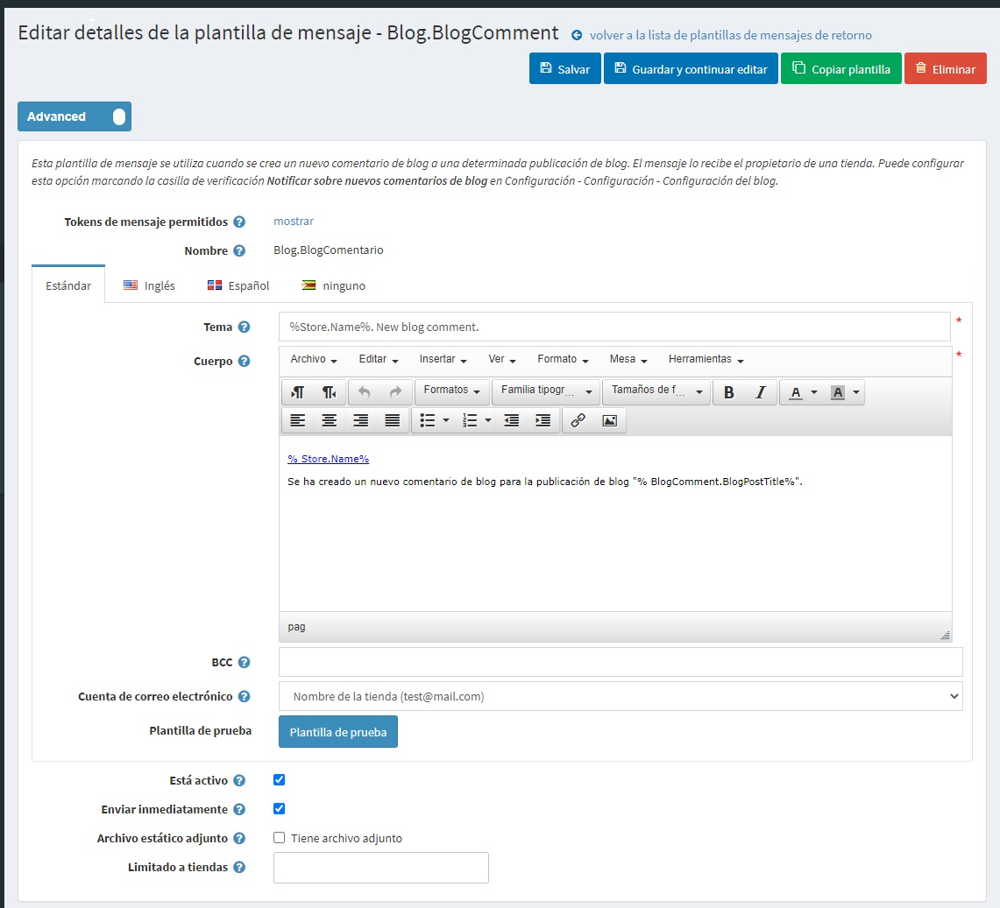

# Plantillas de mensajes

Las plantillas de mensajes definen el diseño, el contenido y el formato de los mensajes automatizados enviados desde su tienda. Se denominan correos electrónicos transaccionales porque cada uno está asociado a un tipo específico de transacción.

Existen varias plantillas de mensajes disponibles en nopCommerce de forma predeterminada para notificar a los usuarios sobre el estado de los pedidos, etc. Para acceder a las plantillas de mensajes vaya a **Gestión de contenidos → Plantillas de mensajes**.

Para buscar las plantillas de mensajes que se utilizaron en una determinada tienda, seleccione un nombre de la tienda en la lista.

## Editar una plantilla de mensaje

Encuentra la plantilla de mensaje que quieres editar y haz clic en **Editar**. Aparecerá la ventana *Editar detalles de la plantilla de mensajes*, de la siguiente manera:

If you have more than one language installed select the required **language tab**.

> [!TIP]
> 
> Por defecto, en el sistema sólo se utiliza el idioma inglés. Se pueden gestionar los idiomas en **Configuración → Idioma**. Lea más acerca de los idiomas en nopCommerce en el [Localización](xref:es/getting-started/advanced-configuration/localization) section.

Edite los detalles de la plantilla de mensajes de la siguiente manera:
- Editar el **Sujeto** del mensaje. Puede incluir fichas en el asunto. Puede ver la lista con todas las fichas permitidas en la parte superior de la página.
- Edite el **Cuerpo** del mensaje.
- En el campo **BCC**, introduzca los destinatarios de la copia ciega de este mensaje de correo electrónico si es necesario.
- En la lista desplegable **Cuenta de correo electrónico**, seleccione la cuenta de correo electrónico utilizada para enviar esta plantilla de mensaje.
- Puede probar esta plantilla de mensaje haciendo clic en el botón **Test template**. Al hacer clic, se muestra el *Enviar correo electrónico de prueba*, de la siguiente manera:
	
	Introduce tu correo electrónico en el campo **Enviar correo electrónico a**, rellena las fichas con algunos valores de prueba y luego haz clic en el botón **Enviar**..
	
> [!TIP]
> 
> Las cuentas de correo electrónico están configuradas en **Configuración → Cuentas de correo electrónico**. Lea más sobre esto en el [Emails accounts](xref:es/getting-started/email-accounts) section.

- Seleccione la opción **Está activo** para indicar que este mensaje debe ser enviado.
- Marque la casilla de verificación **Enviar inmediatamente** si quiere que este correo electrónico se envíe inmediatamente.
	- Si la casilla de verificación anterior está desmarcada, se muestra el campo **Retrasar envío**.
- Marque la casilla de verificación **Archivo estático** para subir un archivo que se adjuntará a cada correo electrónico enviado.
- Seleccione las tiendas en el campo **Limitado a tiendas** si la categoría se vende en tiendas específicas. Deje el campo vacío en caso de que esta funcionalidad no sea necesaria.
  > [!NOTE]
  >
	> Para poder utilizar esta función, debe desactivar la siguiente configuración: **Configuración del catálogo → Ignorar las reglas de "límite por tienda" (en todo el sitio)**. Lea más sobre la funcionalidad de multi-tienda [here](xref:es/getting-started/advanced-configuration/multi-store).

Click **Save**.

> [!NOTE]
> 
> Para crear una copia completa de la plantilla del mensaje, haga clic en **Copiar plantilla** en la parte superior derecha. Esto es útil si tienes varias tiendas configuradas y quieres crear plantillas distintas para cada una de tus tiendas.

## Ver también

- [Cuentas de correo electrónico](xref:es/getting-started/email-accounts)
- [Idiomas](xref:es/getting-started/advanced-configuration/localization)

## Tutoriales

- [Añadir condiciones en las plantillas de mensajes](https://www.youtube.com/watch?v=5chrb1yH1v4&feature=youtu.be)