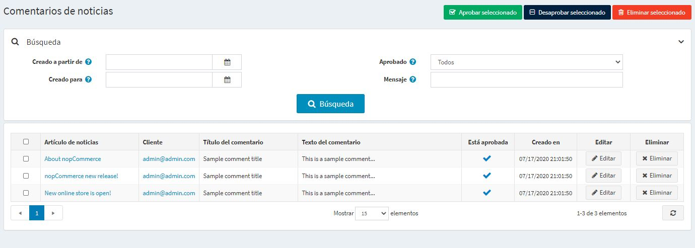
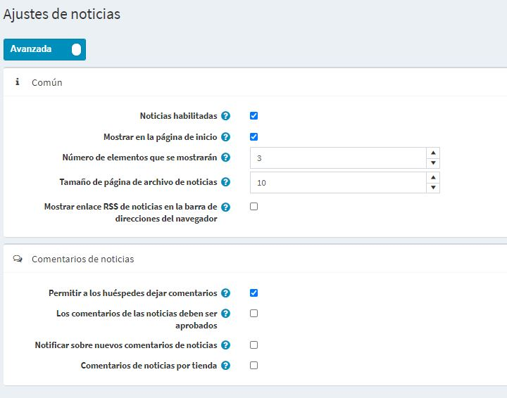

# Noticias

nopCommerce te permite publicar noticias en tu tienda. Puede haber noticias importantes como la última información de nopCommerce, las actualizaciones de tu empresa y así sucesivamente.

Las noticias se muestran en tu tienda en la página de inicio o en el menú de pie de página del sitio.

Para gestionar las noticias vaya a **Gestión de contenidos → News itmes**. La lista de todas las noticias se muestra como sigue:

## Añadiendo noticias

Para añadir una nueva noticia pulse el botón **Editar** y rellene la información sobre la noticia. 

### Info

In the *Info* panel define the following news item details:
- If more than one language is enabled, from the **Language** dropdown list, select the language of this news item. Customers will only see news for their selected language.
- Enter the **Title** of this news item. For example: "The launch of our new nopCommerce store".
- In the **Short description** field, enter an abstract of this news item. This is the text your visitors will see on the news list in the public store.
- In the **Full description** field, enter the text of this news item.
- Select the **Allow comments** checkbox, to enable customers to add comments to the news item.
* Enter **Start date** and **End date** for displaying this news item in Coordinated Universal Time (UTC).

 > [!NOTE]
 > 
 > You can leave these fields empty if you do not want to define news item start and end dates.

 - Elija las tiendas en el campo **Limitado a las tiendas** para habilitar esta noticia sólo para tiendas específicas. Deje el campo vacío en caso de que esta funcionalidad no sea necesaria.
  > [!NOTE]
  >
	> Para poder utilizar esta función, debe desactivar la siguiente configuración: **Configuración del catálogo → Ignorar las reglas de "límite por tienda" (en todo el sitio)**. Lea más sobre la funcionalidad de multi-tienda [here](xref:es/getting-started/advanced-configuration/multi-store).

- Selecciona la casilla **Publicado**, para publicar esta noticia en tu tienda.

Mientras editas una noticia existente o después de hacer clic en el botón **Guardar y continuar editando** para una nueva, puedes hacer clic en el botón **Previsión** en la parte superior derecha para ver cómo aparecerá la noticia en el sitio.

### SEO
En el panel *SEO* define los siguientes detalles de la noticia:

- Defina el **Nombre de la página de búsqueda amigable para el motor**. Por ejemplo, introduce "las mejores noticias" para que tu URL sea "http://yourStore.com/the-best-news". Deja este campo vacío para generarlo automáticamente en base al título de la noticia.
- Anula el título de la página en el campo **Título de Meta** (el título por defecto es el título de la noticia).
- Introduzca **Meta keywords** - palabras clave meta de la noticia para ser añadidas al encabezado de la noticia. Es una lista breve y concisa de los temas más importantes de la página.
- Introduzca **Descripción Meta** para ser añadida al encabezado de la noticia. La etiqueta de meta descripción es un resumen breve y conciso del contenido de la página.

## Gestionar los comentarios de las noticias

Para gestionar los comentarios de las noticias, vaya a **Gestión de contenidos → Comentarios de noticias**.

Use el botón **Aprobar seleccionados** para aprobar los comentarios seleccionados y el botón **Desaprobar seleccionados** para desaprobarlos.
También puede editar o eliminar un comentario. Si borra este comentario será eliminado del sistema

## Ajustes de las noticias

Puede gestionar los ajustes de las noticias en **Configuración → Ajustes → Ajustes de las noticias**. Esta página está disponible en 2 modos: *avanzado* y *básico*.

Esta página permite la configuración de varias tiendas, lo que significa que se pueden definir los mismos ajustes para todas las tiendas, o diferir de una tienda a otra. Si desea administrar la configuración de una tienda determinada, elija su nombre en la lista desplegable de configuración de varias tiendas y marque todas las casillas de verificación necesarias en el lado izquierdo para establecer un valor personalizado para ellas. Para obtener más detalles, consulte [Multi-store](xref:es/getting-started/advanced-configuration/multi-store).

### Común

Defina los siguientes ajustes *comunes*:
* Seleccione la casilla de verificación **News enabled**, para activar la funcionalidad de noticias en su tienda.
* Marque la casilla **Mostrar en la página de inicio** para mostrar las noticias en la página de inicio de su tienda.
* Introduce el **Número de artículos a mostrar** en la página de inicio.
* Introduzca el **Tamaño de la página del archivo de noticias**. Es un número de noticias que se muestran en una página.
* Marque la casilla **Mostrar el enlace del canal RSS de noticias en la barra de direcciones del navegador** para activar el enlace del canal RSS de noticias en la barra de direcciones del navegador de los clientes.

### Comentarios de noticias

Defina los siguientes ajustes de *Comentarios de noticias*:
- Seleccione la casilla de verificación **Permitir a los invitados dejar comentarios**, para permitir a los usuarios no registrados añadir comentarios a las noticias.
- Seleccione la casilla de verificación **Los comentarios de las noticias deben ser aprobados** si los comentarios de las noticias deben ser aprobados por el administrador.
- Seleccione la casilla de verificación **Notificar sobre nuevos comentarios de noticias**, para notificar al propietario de la tienda sobre nuevos comentarios de noticias.
- Seleccione la casilla **Comentarios de noticias por tienda**, para mostrar los comentarios de noticias escritos en la tienda actual solamente.

Haga clic en **Guardar**.

## Tutoriales

- [Managing news in nopCommerce](https://www.youtube.com/watch?v=ztLlRXvBQK4)