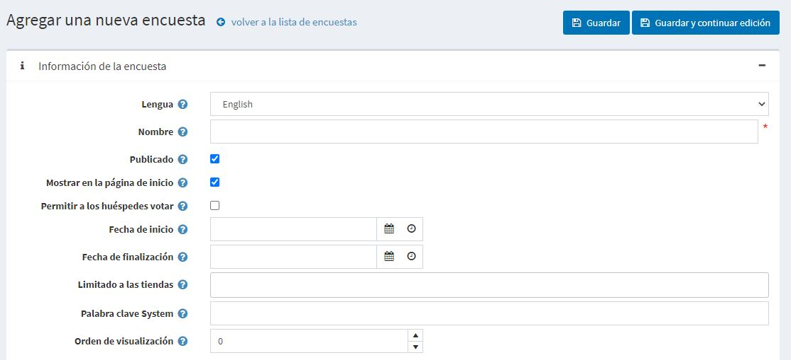

# Encuestas

La funcionalidad de las encuestas en nopCommerce te permite hacer tu sitio de comercio electrónico más interactivo. Hay muchas maneras de usar las encuestas para un sitio de comercio electrónico. Una forma popular es usarlas como una corta encuesta de satisfacción del cliente. A la gente le gusta que le pidan una opinión y esta es una buena oportunidad para ver cómo te va como comerciante en línea.

La encuesta en la página principal del tema de Deafult Clean nopCommerce se ve como:

To view all the polls and add new ones go to **Content management → Polls**.

Para buscar encuestas que se utilizaron en una tienda determinada, seleccione un nombre de la tienda de la lista.

## Añadiendo encuestas

Para añadir una nueva encuesta, haga clic en el botón **Añadir nuevo** en la parte superior derecha.

### Información de la encuesta
Defina los siguientes detalles para la nueva encuesta:
- Si se habilita más de un idioma, en la lista desplegable **Idioma**, seleccione el idioma de esta encuesta. Los clientes sólo verán las encuestas para el idioma seleccionado.
- Ingrese el **Nombre** descriptivo de esta encuesta. Este es el texto que verán los clientes. Por ejemplo, "¿Qué piensas de nuestra tienda?".
- Marque la casilla **Publicado** para activar esta encuesta.
- Marque la casilla **Mostrar encuestas en la página de inicio** si quiere mostrar la encuesta en la página de inicio.
- Marque la casilla **Permitir a los invitados votar** para permitir a los invitados no registrados votar por la encuesta.
- Introduce la **Fecha de inicio** y la **Fecha de fin** en Tiempo Universal Coordinado (UTC).
  > [!NOTA]
  > 
  > Puede dejar estos campos vacíos si no quiere definir las fechas de inicio y fin de las noticias.

- Elija los almacenes en el campo **Limitado a los almacenes** para habilitar esta encuesta sólo para almacenes específicos. Deje el campo vacío en caso de que esta funcionalidad no sea necesaria.
  > [!NOTA]
  >
	> Para poder usar esta función, tienes que desactivar la siguiente configuración: **Configuración del catálogo → Ignorar las reglas de "límite por tienda" (en todo el sitio)**. Lea más acerca de la funcionalidad multi-tienda [aquí](xref:es/getting-started/advanced-configuration/multi-store).

- En el campo **Palabra clave del sistema** puede especificar dónde se mostrará la encuesta. Por ejemplo, LeftColumnPoll.
- Introduzca el **Orden de visualización** de la encuesta. Un valor de 1 representa la parte superior de la lista.

Haz clic en **Guardar y continuar editando** para pasar al panel de *Respuestas de la encuesta*.

### Respuestas de la encuesta

Llene la siguiente información de respuesta de la encuesta:
* El **Nombre** que se mostrará a un cliente.
* La **Orden de exhibición**. Un valor de 1 representa la parte superior de la lista.

Luego haga clic en el botón **Agregar nuevo registro** para guardar la respuesta.

La lista completa de respuestas puede verse de la siguiente manera:

Puedes entonces **Editar** los registros, si es necesario y **Borrarlos**.

## Tutorials

- [Managing polls in nopCommerce](https://www.youtube.com/watch?v=RJP45cUhuZQ)
