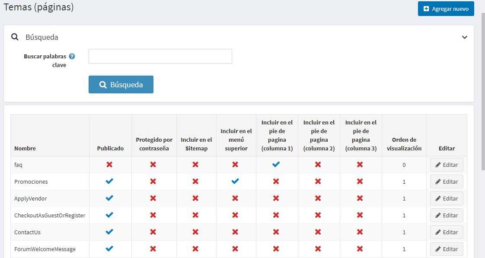

# Temas (páginas)

Los temas (páginas) son bloques de contenido de forma libre que pueden ser mostrados en su sitio, ya sea incrustados dentro de otras páginas o en una página propia. A menudo se utilizan para las páginas de preguntas frecuentes, páginas de políticas, instrucciones especiales, etc. Para crear una página personalizada, debe crear un nuevo tema e introducir el contenido de su página personalizada en la página de detalles del tema. El contenido puede escribirse para cada idioma por separado.

## Lista de temas

Para ver los temas vaya a **Gestión de contenidos → Temas (páginas)**.
Busca los temas en la lista de temas introduciendo el texto del tema en el campo **Palabras clave de búsqueda** (o una parte del texto del tema), o entre todos los temas de una determinada tienda.



## Añadiendo temas

Para añadir un nuevo tema vaya a **Gestión de contenidos → Temas (páginas)**.
Haga clic en **Agregar nuevo** y rellene la información sobre un nuevo tema.


### Info
En el panel de *Info* define los siguientes detalles del tema:
* Introduzca el **Título** del tema.
* Añade el contenido del tema usando el editor proporcionado en el campo **Body**.
* El campo **URL** está aquí sólo con fines informativos. Es la URL del tema en la tienda pública. Puedes editar esto editando el campo **Nombre de la página amigable para el motor de búsqueda** a continuación.

### Diplay
En el panel de *Diplay* define los siguientes detalles del tema:
* Marque la casilla **Publicado** para que este tema sea publicado.
* Puedes incluir este tema en el **menú superior**, en el **pie de página (columna 1)**, en el pie de página (columna 2), en el pie de página (columna 3) y en el **mapa del sitio**. Hágalo marcando la casilla correspondiente.
* Seleccione la casilla de verificación **Protegido por contraseña**, si este tema está protegido por contraseña. El campo **Contraseña** se muestra en la página del tema en la tienda pública. El cliente introduce una contraseña para acceder al contenido de este tema.
* En la lista desplegable **Roles de cliente** seleccione un rol o roles de cliente que puedan acceder a este tema.
  > [!NOTE]
  >
  > Para poder utilizar esta función, debe desactivar la siguiente configuración: **Configuración → Configuración del catálogo → Ignorar las reglas de ACL (sitewide)**. Lea más sobre la lista de control de acceso [here](xref:en/running-your-store/customer-management/access-control-list).

* En la lista desplegable **Limitado a las tiendas** seleccione las tiendas en las que se mostrará el tema.
  > [!NOTE]
  >
	> Para poder utilizar esta función, debe desactivar la siguiente configuración: **Configuración del catálogo → Ignorar las reglas de "límite por tienda" (en todo el sitio)**. Lea más sobre la funcionalidad de multi-tienda [here](xref:en/getting-started/advanced-configuration/multi-store).

*  Utilice el campo **Accesible cuando la tienda está cerrada** para que este tema sea accesible cuando la tienda esté cerrada.
* Selecciona este tema **Orden de visualización**. Por ejemplo, 1 representaría el artículo primero de una lista.
* Introduce el **Nombre del sistema** de este tema. 
  > [!NOTA]
  >
  > Es posible utilizar el mismo nombre de sistema para diferentes temas. Por ejemplo, se pueden crear dos temas diferentes con el mismo nombre de sistema y hacerlos accesibles para diferentes roles de clientes. Por ejemplo, los roles de cliente *Invitado* y *Registrado*. Esto significa que los invitados y los clientes registrados verán los diferentes contenidos del sitio. 

> [!NOTE]
>
> Mientras se edita el tema existente o después de hacer clic en el botón **Guardar y continuar editando** para uno nuevo, puedes hacer clic en el botón **Previsión** para ver cómo aparecerá el tema en el sitio.

### SEO
En el panel *SEO* define los siguientes detalles del tema:
* En el campo **Nombre de la página amigable para los motores de búsqueda**, introduzca el nombre de la página usada por los motores de búsqueda. Si no introduce nada, entonces el URL de la página web se forma utilizando el nombre de la página. Si ingresas *nombre de la página personalizada*, entonces se utilizará el siguiente URL: `http://www.yourStore.com/custom-seo-page-name`.
* En el campo **Título de Meta**, introduzca el título requerido. La etiqueta del título especifica el título de su página web. Es un código que se inserta en el encabezado de su página web y tiene el siguiente formato:

   ```html
   <head>
     <title>
        Creating Title Tags for Search Engine Optimization & Web Usability
      <title>
   </head>
   ```
* Introduzca la categoría requerida **Meta keywords**, que son una lista breve y concisa de los temas más importantes de su página. La etiqueta de palabras clave meta tiene el siguiente formato:

   ```html
   <meta name="keywords" content="keywords, keyword, keyword phrase, etc.">
   ```

* En el campo **Meta descripción**, introduzca una descripción de la categoría. La etiqueta de descripción meta es un resumen breve y conciso del contenido de su página. La etiqueta de la meta descripción tiene el siguiente formato:

   ```html
   <meta name="description" content="Brief description of the contents of your page.">
   ```

Click **Save**. The topic will be displayed in the public store.

## See also

- [SEO](xref:en/running-your-store/search-engine-optimization)

## Tutorials

- [Adding new topic template](https://www.youtube.com/watch?v=M-g4Ux2GCaY)
