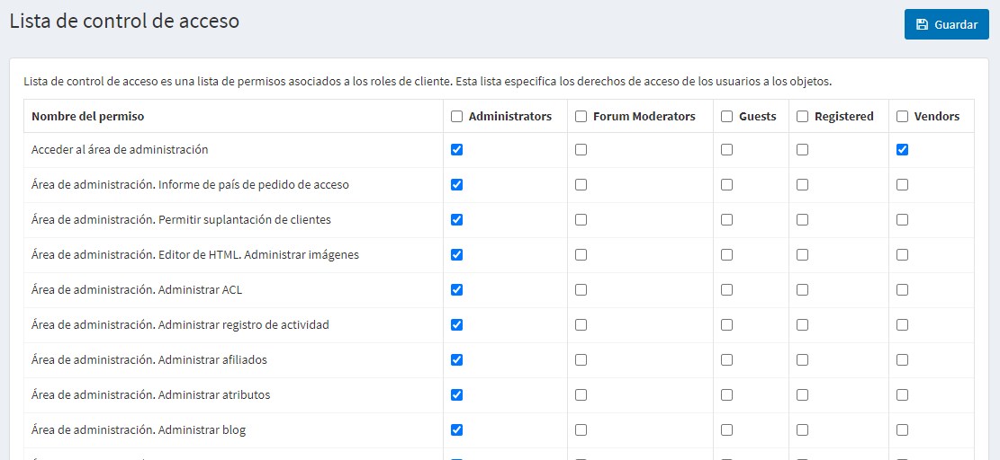

# Lista de control de acceso

La Lista de Control de Acceso (ACL) restringe o concede a los usuarios el acceso a ciertas áreas del sitio. Esta lista es administrada por administradores. Por lo tanto, el usuario debe tener derechos de administrador para poder acceder a ella. La lista de acceso tiene las siguientes características:

* La lista de control de acceso se basa en funciones, es decir, gestiona funciones como las de *administradores globales*, *gestores de contenidos*, etc. Esta lista de roles puede ser gestionada en la página **Clientes → Roles de clientes**. Para más detalles, véase [Customer roles](xref:es/running-your-store/customer-management/customer-roles)
* La lista de control de acceso aparece en el área de administración. Asegúrese de que el usuario es un administrador para poder acceder al ACL.
* Existen acciones de administrador predefinidas. Estas incluyen *Gestionar pedidos*, *Gestionar clientes* y mucho más.

Para gestionar una lista de control de acceso vaya a **Configuración → Lista de control de acceso**. Aparecerá la ventana *Lista de control de acceso*:

!

Selecciona los roles requeridos al lado de los elementos de *Permiso*. Los roles seleccionados tendrán acceso a las acciones seleccionadas en consecuencia.

Haga clic en **Guardar**.

> [!TIP]
> 
> Ejemplo: Necesitamos un papel llamado *Gestor de contenidos*. El *Gestor de contenidos* debe tener acceso a la gestión de nuevos productos y fabricantes, la edición de las reseñas en el sitio, los blogs, las campañas, y no tener acceso a los carritos de compra.
> Para hacer esto:
> 1. Crear un **Rol de cliente** llamado *Gestor de contenidos* en la página **Clientes → Roles de cliente**.
> 1. En el ACL marque la casilla de verificación junto a los siguientes permisos: *Acceso al área de administración, área de administración. Administrar el blog, área de administración. Gestionar campañas, área de administración. Gestionar foros, área de administración. Gestionar noticias, área de administración. Gestionar suscriptores de boletines de noticias, Tienda pública. Permitir la navegación, Tienda pública. Mostrar los precios*.
> 1. Guardar los cambios.
