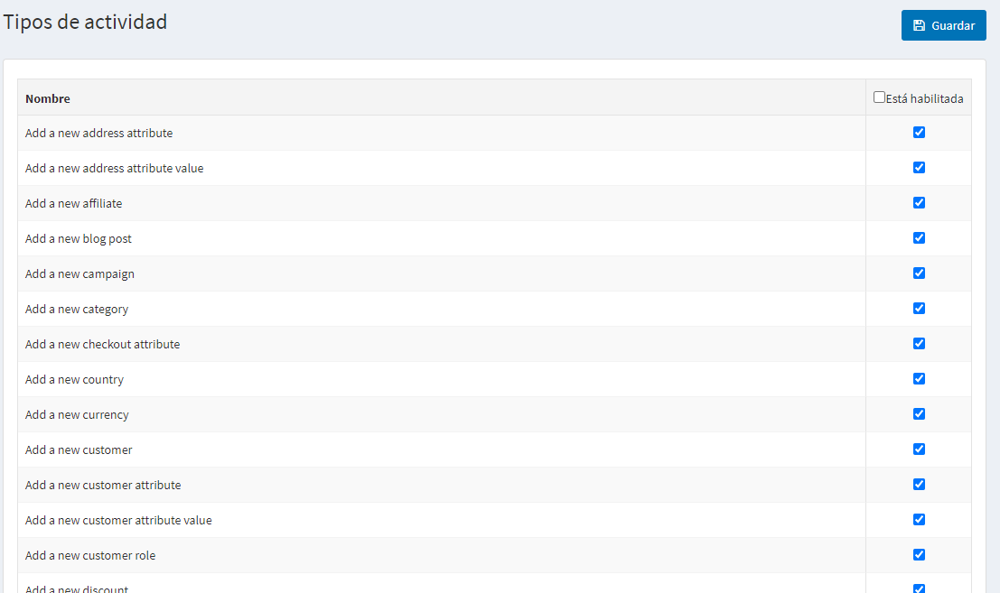
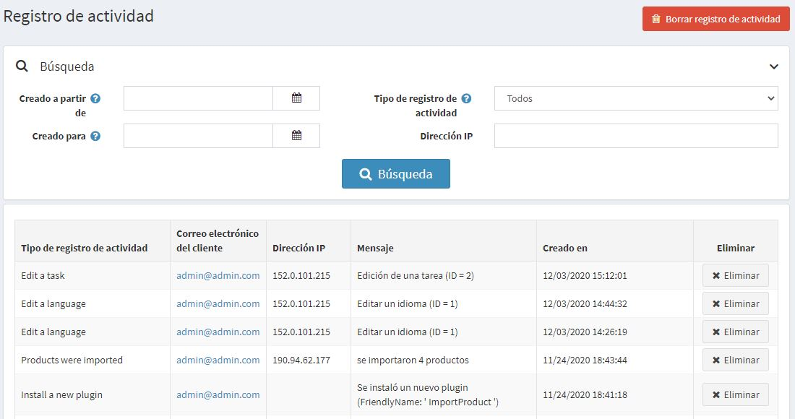

# Registro de actividad

El registro de actividad se utiliza para rastrear la actividad de los usuarios en el sistema. Por defecto, todos los *tipos de actividad* están habilitados para el seguimiento en nopCommerce. El dueño de la tienda puede desactivarlos desmarcando la casilla correspondiente. La mayoría de los tipos de actividad listados son sólo para el administrador, y registran las acciones en el área de administración. Sin embargo, algunos son para la tienda pública y registran las acciones de los compradores (como, por ejemplo, añadir al carrito/lista de deseos, hacer un pedido, etc.).

## Tipos de actividad

Para habilitar/deshabilitar los tipos de actividad, vaya a **Clientes → Tipos de actividad**.

Marque la casilla de verificación **Is enabled** junto al tipo de actividad que desea activar. Luego haz clic en **Save** en la parte superior derecha.

## Registro de actividad

Para buscar registros de actividad, vaya a **Clientes → Registro de actividad**.

!

Defina los criterios de búsqueda, usando uno o más de los siguientes campos:
- Para buscar por intervalo de fechas, introduzca el intervalo de fechas en los campos **Creado desde** y **Creado hasta**. Alternativamente, puede hacer clic en el calendario desplegable y seleccionar los rangos de fechas requeridos.
- **Tipo de registro de actividad** para la actividad del cliente.
- **Dirección IP** para la búsqueda de clientes por dirección IP.

Puede borrar el elemento de registro de actividad determinado haciendo clic en el botón **Borrar** que está a su lado o puede borrar todo el registro de actividades haciendo clic en el botón **Borrar registro de actividad** en la parte superior derecha.