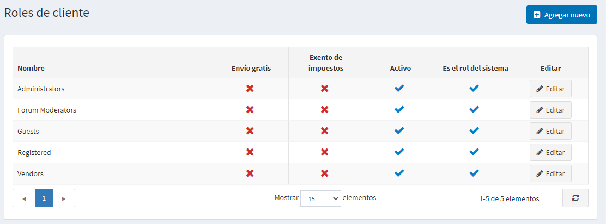
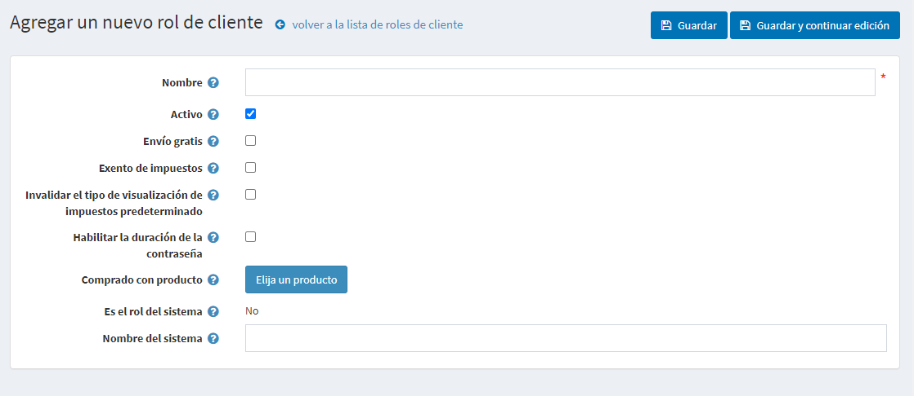

# Roles de los clientes

Los roles de los clientes en nopCommerce le permiten formar grupos de usuarios de su tienda web. Puedes crear varios grupos como administradores de la tienda, compradores, [vendedores](xref:en/running-your-store/vendor-management), y otros. También puede conceder a estos grupos ciertos derechos, como descuentos en los precios y otros estatus especiales (como exención de impuestos, envío gratuito y más) utilizando la [lista de control de acceso](xref:es/running-your-store/customer-management/access-control-list).

Para gestionar los roles de los clientes vaya a **Customers → Customer roles**. La ventana *Roles de los clientes* se muestra de la siguiente manera:

Haga clic en **Agregar nuevo** para agregar un nuevo rol de cliente. Aparecerá la ventana *Agregar un nuevo rol de cliente*:

Defina la siguiente información:
* **Nombre** del rol de cliente.
* Marque el **Activo** para hacer este rol activo.
* Marque la casilla **Envío gratuito**, para permitir a los clientes con este rol obtener envío gratuito en sus pedidos.
* Marque la casilla **Exento de impuestos** para que los clientes con este rol puedan hacer compras libres de impuestos.
* Marque la casilla de verificación **Anular el tipo de visualización de impuestos predeterminados** y seleccione en la lista desplegable **Tipo de visualización de impuestos predeterminados** uno de los tipos de impuestos:
  * *Incluyendo los impuestos*
  * * Excluyendo los impuestos *
* Marque la casilla **Habilitar la vida útil de la contraseña**, para obligar a los clientes a cambiar sus contraseñas después de un tiempo determinado.
* **Comprado con el producto**. Marque el botón **Elegir producto** para elegir un producto especial. Un cliente se añade a este rol de cliente una vez que este producto es comprado (pagado). 
  > [!NOTE]
  >
  > En caso de reembolso o cancelación de un pedido, debes quitar manualmente a un cliente de este papel.

* **Es el papel del sistema**. Esta configuración muestra si este rol se utiliza en el código. Está predefinido y no puede ser modificado.
* **Nombre del sistema** del rol del cliente.

Haga clic en **Save**.

## Tutoriales

* [Overview of customer roles](https://www.youtube.com/watch?v=3vdIDNIYFIQ)
* [Recovering back a deleted admin user](https://www.youtube.com/watch?v=D45WkrbaA38)
