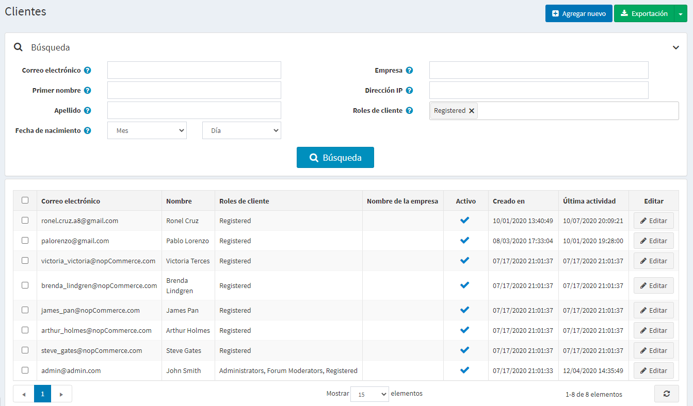
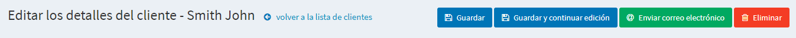
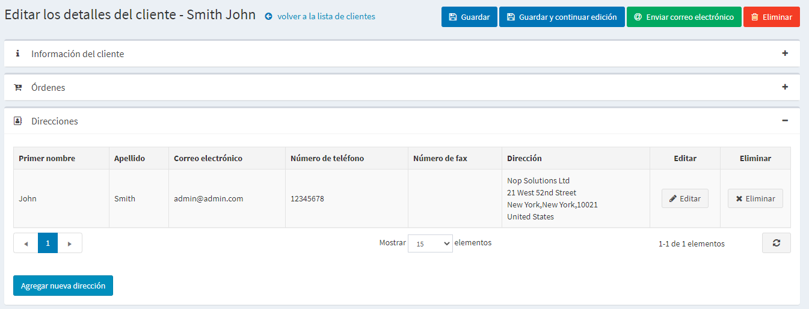

# Gestionar los clientes...

La lista de clientes contiene los detalles de todos los clientes existentes, así como permite añadir nuevos. En nopCommerce, los clientes incluyen a todos los usuarios, como administradores, vendedores y compradores. Para gestionar los clientes, vaya a **Clientes → Clientes**. Se mostrará la siguiente ventana:

Para buscar clientes, en la ventana *Clientes* introduzca uno o más de los siguientes criterios de búsqueda:

- **Envíe un correo electrónico a**.
- **Nombre de usuario**, if enabled in the [ajustes del cliente](xref:es/running-your-store/customer-management/customer-settings).
- **Nombre**.
- **Apellido**.
- **Fecha de nacimiento**, if enabled in the [ajustes del cliente](xref:es/running-your-store/customer-management/customer-settings).
- **Empresa**, if enabled in the [ajustes del cliente](xref:es/running-your-store/customer-management/customer-settings).
- **Teléfono**, if enabled in the [ajustes del cliente](xref:es/running-your-store/customer-management/customer-settings).
- **Código postal**, if enabled in the [ajustes del cliente](xref:es/running-your-store/customer-management/customer-settings).
- **Dirección IP**.
- **Customer roles** - puede seleccionar uno o más roles de clientes para ser mostrados.

> [!NOTE]
> 
> Puede exportar los datos del cliente a un archivo externo haciendo clic en **Exportar a XML (todos)** o **Exportar a Excel (todos)**. Puede exportar los datos de los clientes seleccionados a un archivo externo haciendo clic en **Exportar a XML (seleccionado)** o **Exportar a Excel (seleccionado)**.

A continuación, haga clic en el botón **Búsqueda**.

## Añadir un nuevo cliente
Para añadir un nuevo cliente, en la ventana de *Clientes* haga clic en **Añadir nuevo**.
Aparecerá la ventana *Añadir un nuevo cliente*. Defina los siguientes detalles del cliente:

## Información del cliente
El panel de *Información del cliente* permite introducir la información personal y de cuenta de los clientes, por ejemplo, cambiar una contraseña, asignar/eliminar roles de cliente.

Puede editar los siguientes campos:
- **Dirección de correo electrónico**.
- **Contraseña**.
- **Nombre**.
- **Apellido**.
- **Género**.
- **Fecha de nacimiento**.
- **Nombre de la empresa**.
- **Está exento de impuestos** indica si el cliente está exento de impuestos.
- Elija las tiendas apropiadas en el **Boletín** multiselección para suscribir al cliente a un boletín de noticias de la tienda.
- **Roles del cliente** - uno o múltiples roles del cliente. Tenga en cuenta que cualquier rol que necesite ingresar al sistema (por ejemplo, administrador, vendedor) debe tener el rol de cliente "Registrado" entre otros. Puede configurar roles de cliente en la sección [Roles de cliente](xref:es/running-your-store/customer-management/customer-roles).
- En la lista desplegable **Gerente de proveedor**, si es necesario, seleccione un proveedor asociado a esta cuenta de cliente. Una vez asociado, este cliente podrá iniciar sesión en el portal del proveedor seleccionado y gestionar sus productos y pedidos. Tenga en cuenta que si tiene un proveedor asociado con este cliente, asegúrese de que este registro de cliente se encuentre en la lista [Proveedores](xref:es/ejecución de su tienda/gestión de proveedores).
- Marque la casilla de verificación **Activo**, para activar el cliente.
- **Comentario del administrador** - comentarios del administrador para uso interno, si es necesario.

Haga clic en el botón **Guardar** para guardar los cambios o haga clic en el botón **Guardar y continuar editando** para proceder a más información del cliente. En este caso verá los paneles recién añadidos en la página de detalles del cliente.

También verá los botones **Enviar correo electrónico**, **Enviar mensaje privado** (si [foros](xref:es/ejecución de su tienda/gestión de contenidos/foros) está activado) y **Borrar**.

Después de hacer clic en el botón **Enviar correo electrónico**, se mostrará la ventana *Enviar correo electrónico* que permite al propietario de la tienda enviar un correo electrónico al cliente. Después de hacer clic en el botón **Enviar mensaje privado** se mostrará la ventana *Enviar mensaje privado* que permite enviar un mensaje al cliente. Para utilizar la mensajería privada, permita los mensajes privados en [forum settings](xref:es/running-your-store/content-management/forums). 

## Ordenes
En el panel de "Pedidos" puede ver los detalles de los pedidos de los clientes.

## Direcciones
En el panel de *Direcciones* puede ver, editar y crear nuevas direcciones del cliente.

Haga clic en el botón **Añadir nueva dirección** para añadir una nueva dirección de cliente. Rellene los campos correspondientes y haga clic en **Guardar**. La nueva dirección se añadirá al cliente.

## Carro de compras actual y lista de deseos
En el panel de *Carro de la compra actual y lista de deseos* puedes ver el carro de la compra y la lista de deseos del cliente.

## Registro de actividad
En el panel *Registro de actividad* puede ver el registro de actividad del cliente. Vea cómo gestionar las clases de actividad en el [Activity log - Activity types](xref:es/running-your-store/customer-management/activity-log#activity-types) section.

## Hacer el pedido (imitar)
En el panel de *Place order (suplantar)* los dueños de las tiendas pueden crear pedidos para sus clientes sin tener que tener la información de la contraseña. Esto es útil para los clientes que no quieren registrarse, o para los sitios grandes que usan CSR para hacer pedidos por teléfono. 

El panel contiene el botón **Poner pedido**. Después de hacer clic en este botón será redirigido a la tienda pública. Seleccione los productos que el cliente quiere, añádalos al carrito exactamente como lo haría en la tienda pública, luego utilice el botón **Checkout** para proceder al proceso de compra habitual y luego haga clic en el enlace **Finalizar sesión** en la parte superior de la página para finalizar esta sesión.

## Suscripciones de vuelta al stock
En el panel *Suscripciones de vuelta al stock* vea los productos a los que el cliente se ha suscrito.

## Puntos de recompensa
En el panel de *Puntos de recompensa* los propietarios de las tiendas pueden añadir puntos de recompensa al cliente o ver su historial de uso de puntos de recompensa. Este panel es visible cuando el programa de puntos de recompensa está activado. Consulte la sección [Puntos de recompensa](xref:es/running-your-store/promotional-tools/reward-points) para obtener más información.

### Agregar (reducir) puntos

Puntos de recompensa (estático/gestión de clientes/puntos de recompensa de clientes.png)

En este panel:
- Introduzca la cantidad de **Puntos**. Para reducir los puntos introduzca un valor negativo.
- En el campo **Validez de los puntos** especifique el número de días en que los puntos concedidos serán válidos (sólo para la cantidad de puntos positivos). 
- Ingrese el **Mensaje** o comentario.
- Marque la casilla **Activar puntos inmediatamente** si desea que los clientes puedan utilizar los puntos de recompensa justo después de haberlos ganado. Si no ha marcado esta casilla, aparecerá una opción más:
- Si la casilla anterior está desmarcada, en el campo **Activar puntos de recompensa** especifique el período (número de días/horas) tras el cual se activarán los puntos de recompensa.

## Ver también

- [Funciones del cliente](xref:es/running-your-store/customer-management/customer-roles)
- [Proveedores](xref:es/running-your-store/vendor-management)

## Tutoriales

- [Gestión de clientes en nopCommerce](https://www.youtube.com/watch?v=DOl-g-NNFEM&list=PLnL_aDfmRHwsbhj621A-RFb1KnzeFxYz4&index=1)
- [Reasignación de una dirección de correo electrónico eliminada](https://www.youtube.com/watch?v=lqmrWJdXZEE&t=1s)
- [Resumen del modo de suplantación de identidad](https://www.youtube.com/watch?v=KQi-CDVawJ4)
