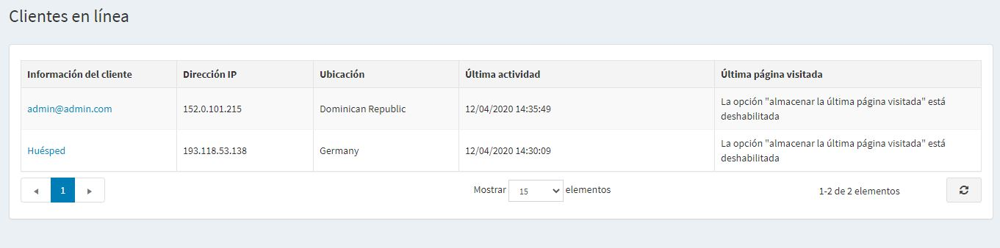

# Clientes en línea

La sección de clientes en línea permite a los propietarios de las tiendas ver los clientes que estuvieron en línea en los últimos 20 minutos. Esta información es útil para los propietarios de la tienda ya que muestra la última página visitada y ayuda a decidir las acciones necesarias para convertir a los visitantes en compradores.

Para acceder a esta ventana, vaya a **Clientes → Clientes en línea**.

La ventana de *Clientes en línea* incluye las siguientes columnas:

- **Información del cliente**, puede ver y editar la información del cliente haciendo clic en el enlace.
- **Dirección IP** - dirección IP actual del cliente
- **Localización** - Dirección IP de la localización del cliente.
- **Última actividad** - fecha y hora en que el cliente en línea se conectó por última vez.
- **Última página visitada** - la página que el cliente visitó la última vez.

> [!NOTE]
>
> Para ver la última página visitada necesita habilitar el ajuste **Almacenar la última página visitada** en la página **Configuración → Configuración → Configuración del cliente** (panel *Cuenta*).

Esta página incluye datos de GeoLite2 creados por MaxMind, available from [http://www.maxmind.com](http://www.maxmind.com)
