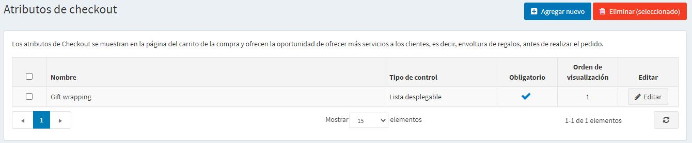
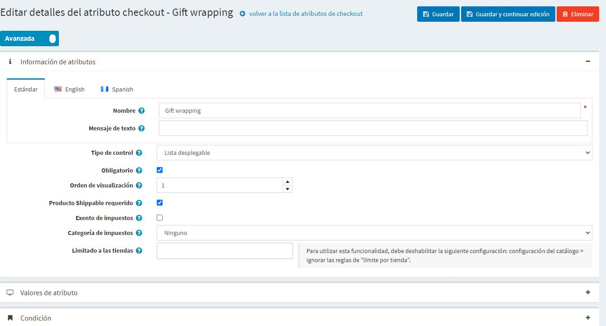

# Atributos de la compra

Los atributos de la compra representan información adicional del pedido que se recoge durante la etapa final del proceso de compra.

> [!TIP]
> 
> Utilizando los atributos de la caja, los propietarios de las tiendas pueden especificar, por ejemplo, si un producto comprado requiere envoltorio para regalo o una manipulación cuidadosa como en el caso de los bienes frágiles.

Los atributos de pago se muestran en la página del carro de la compra y permiten a los usuarios seleccionarlos, si es necesario, antes del proceso de pago.

Para configurar o editar los atributos del proceso de pago, vaya a **Catálogo → Atributos → Atributos del proceso de pago**.

Puede seleccionar los atributos de la caja y hacer clic en el botón **Borrar (seleccionado)** para borrarlos.

## Agregar un nuevo atributo de checkout

Para crear un nuevo atributo de salida, haga clic en **Agregar nuevo**. Se mostrará la ventana *Agregar un nuevo atributo de checkout*, como se indica a continuación:

Esta página está disponible en dos modos: **avanzado** y **básico**. Cambie al modo básico que muestra los únicos campos principales o utilice el modo avanzado que muestra todos los campos disponibles.

En el panel *Información de atributos*, defina la siguiente información:

- **Nombre** - el nombre del atributo.
- **Text prompt** - una pregunta o un comentario que se mostrará en el área de pago en la página del carrito de compras.
- En la lista desplegable **Tipo de control**, seleccione el método requerido para mostrar el valor del atributo: *Lista desplegable*, *Lista de botones de radio*, *Checkboxes*, *Textbox*, etc.
  > [!NOTE]
  > 
  > Las listas desplegables, las listas de radio, las casillas de verificación y los cuadros de color requieren que el dueño de la tienda defina valores (como Verde, Azul, Rojo y así sucesivamente). Los tipos de control *Textbox* y *Date picker* no requieren que el dueño de la tienda defina valores ya que se pedirá a los clientes que llenen estos campos de cuadro de texto. Además, para algunos tipos de control, se pueden especificar reglas de validación. Por ejemplo: para el atributo *Textbox*, puede definir la **Longitud mínima**, **Longitud máxima** y **Valor por defecto**. Para el atributo *Subir archivos*, puede definir la **Extensión de archivo permitida** y **Tamaño máximo del archivo (KB)**.

- Marque la casilla de verificación **Requerido** si se requiere la selección de un valor de atributo antes de completar el proceso de compra.
- **Orden de visualización**: muestra el número de orden del atributo de la caja.
- Marque la casilla de verificación **Se requiere producto para envío** en caso de que este atributo sólo deba mostrarse para el producto que debe enviarse.
- Marque la casilla de verificación **Exento de impuestos** para indicar que no se aplicarán impuestos a este atributo del proceso de compra.
- En caso de que se aplique el impuesto, en la lista desplegable **Categoría de impuestos**, seleccione la categoría de impuestos del atributo de pago.
- **Limitado a tiendas** permite limitar el atributo a una o más tiendas. 
  > [!NOTE]
  >
	> Para poder usar esta función, tienes que desactivar la siguiente configuración: **Configuración del catálogo → Ignorar las reglas de "límite por tienda" (en todo el sitio)**. Lea más acerca de la funcionalidad multi-tienda [aquí](xref:es/getting-started/advanced-configuration/multi-store).

Haga clic en **Guardar y continuar editando** para pasar al panel de *Valores de los atributos* (si es aplicable).

### Añadir un nuevo valor de atributo de salida

En el panel *Valores de los atributos*, haga clic en **Agregar un nuevo valor de salida** para crear un nuevo valor de atributo.

En la ventana *Añadir un nuevo valor de compra*, defina la siguiente información:

- **Nombre** - el nombre del valor del atributo.
  > [!TIP]
  > 
  > Por ejemplo, *Sí* o *No*, para preguntas como "¿Requieres un manejo de cuidados frágiles"?

- **Ajuste de precios** añadirá el importe introducido a una suma total de compra en caso de que se seleccione el valor de atributo.
- **Ajuste de peso** cambiará el peso de un pedido por el monto ingresado en caso de que se seleccione el valor de atributo.
- Marque la casilla de verificación **Pre-seleccionado** para indicar que el valor de atributo está preseleccionado para un cliente.
- **Display order** - muestra el número de orden del valor de atributo.

Puede **Editar** y **Borrar** los valores de atributo haciendo clic en los botones correspondientes junto a los atributos en el panel *Valores de atributo*.

## Agregar una condición

En el panel *Condición*, el dueño de la tienda puede especificar una condición para que el atributo de la caja sea visible (dependiendo de otros atributos). El atributo condicional sólo aparece si se selecciona un atributo anterior.

Haga clic en **Save**. El nuevo atributo se mostrará en la página del carrito de la compra en la tienda pública.

## Tutoriales

- [Adding checkout attributes](https://www.youtube.com/watch?v=sJcZP1qjHmY&list=PLnL_aDfmRHwsbhj621A-RFb1KnzeFxYz4&index=3)
- [Overview of conditional checkout attributes](https://www.youtube.com/watch?v=z3UiXgK8Jgo&list=PLnL_aDfmRHwsbhj621A-RFb1KnzeFxYz4&index=18)
