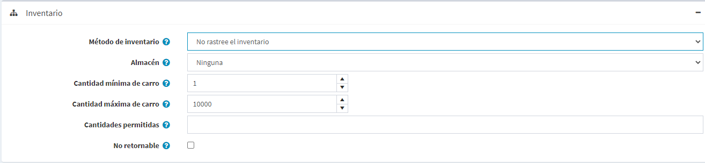

# Gestión de inventario

La gestión de inventarios es un sistema de control del nivel de existencias. En el nopCommerce consiste en establecer el inventario y hacer un seguimiento de las existencias bajas.

Para configurar el inventario, ir a **Catálogo → Productos → Editar un producto**. En la ventana *Editar detalles del producto*, ve al panel *Inventario*. En este panel puede elegir uno de los tres métodos de inventario:
1. [Don't track inventory](#dont-track-inventory)
1. [Track inventory](#track-inventory)
1. [Track inventory by product attributes](#track-inventory-by-product-attributes)

En las siguientes secciones veremos la diferencia entre estos métodos.

## No rastrear el inventario
Es posible que algunos productos no requieran un seguimiento del inventario. Por ejemplo, los servicios, los bienes de segunda mano o los productos hechos a medida. En este caso, el propietario de una tienda puede optar por no hacer el seguimiento, eligiendo la opción *No hacer el seguimiento del inventario* en el campo **Método de inventario**. 

En este caso, el dueño de la tienda puede definir:
- **Almacén** que será usado cuando se calculen las tarifas de envío. Lea más en el capítulo [Almacenes](xref:es/getting-started/configure-shipping/advanced-configuration/warehouses).
- **Cantidad mínima de la cesta** es una cantidad permitida en la cesta de la compra de un cliente, por ejemplo, fijada en 3 para permitir que los clientes compren sólo 3 o más de este producto.
- La cantidad máxima de compra** es la cantidad permitida en la cesta de la compra de un cliente, por ejemplo, fijada en 5 para que los clientes sólo puedan comprar 5 de este producto.
- En el campo **Cantidades permitidas**, introduzca una lista separada por comas de las cantidades a las que quiere que se restrinja este producto. En lugar de un cuadro de texto de cantidad que les permite introducir cualquier cantidad, recibirán una lista desplegable de los valores que introduzca aquí.
- Marque la casilla de verificación **No retornable** si este producto no es retornable. En este caso, el cliente no podrá presentar una solicitud de devolución.

## Rastrear el inventario
En caso de que se requiera el seguimiento del inventario, el dueño de la tienda puede seleccionar un **Método de inventario** entre dos opciones: *Seguir el inventario* (por producto) o *Seguir el inventario por los atributos del producto*. La opción *Seguimiento de inventario* es para aquellos que no tienen variantes de productos, y simplemente necesitan saber cuántos artículos quedan. En esta sección describiremos la opción *Inventario de seguimiento*.
Una vez elegida esta opción, la sección se amplía mostrando nuevos campos:

Prepare el inventario, como sigue:
* **Cantidad de stock** es la cantidad total. Se reduce cada vez que se envía un pedido.
* Elija el **Warehouse** que se utilizará cuando se calculen las tarifas de envío. Puede administrar los almacenes en la página **Configuración → Envío → Almacenes**. Para más detalles, consulte la página [Almacenes](xref:es/getting-started/configure-shipping/advanced-configuration/ warehouses).
* Marque la casilla de verificación **Multiples almacenes** si desea apoyar el envío y la gestión de inventario de múltiples almacenes. De esta forma, podrá gestionar el inventario por almacén:
  
    Haga clic en **Use** en la fila apropiada si quiere usar este almacén para el producto.
    * Introduzca el **Cantidad de stock** que es la cantidad total. Se reduce cada vez que se envía un pedido.
    * Ingrese la **Cantidad reservada** que es la cantidad de producto que se ordena pero no se envía o se agrega a un envío todavía.
    * La **Cantidad planificada** es la cantidad de producto que se ordena y ya se agrega a un envío pero no se envía todavía.

* Para evitar que los clientes hagan pedidos y descubran que el producto está agotado, puedes tomar ciertas acciones. Marque la casilla de verificación **Display availability**, para mostrar la disponibilidad de stock en la tienda pública.
  * Si es necesario, marque la casilla de verificación **Visualizar cantidad de stock**, para permitir a los clientes ver la cantidad de stock de un producto en la página de detalles del producto (esta casilla de verificación sólo se muestra cuando la casilla de verificación **Visualizar disponibilidad** está marcada). La siguiente captura de pantalla muestra lo que un cliente verá en la tienda pública:
      
      

* En el campo **Cantidad mínima de existencias**, introduzca un valor mínimo, bajo el cual se tomarán medidas adicionales.
* En la lista desplegable **Baja actividad de existencias**, seleccione la medida que se adoptará cuando la cantidad de existencias caiga por debajo del valor mínimo de cantidad de existencias, de la siguiente manera:
  * **Nada**: los propietarios de las tiendas pueden seguir optando por no realizar ninguna acción. Esto significa que los clientes pueden seguir pidiendo productos.
  * ** **Desactivar el botón de compra**: el botón de compra se desactiva cuando las existencias son bajas. Por lo tanto, los clientes no pueden comprar este producto pero pueden seguir viéndolo en la tienda.
  * **Unpublish**: el producto ya no es visible en la tienda. Se utiliza cuando el producto va a ser detenido por completo.

* En el campo **Notificar para la cantidad abajo**, introduzca un valor bajo el cual se enviará un correo electrónico de notificación al administrador.
* Los propietarios de las tiendas pueden establecer **Ordenes de reserva**, es decir, pedidos que no pueden
