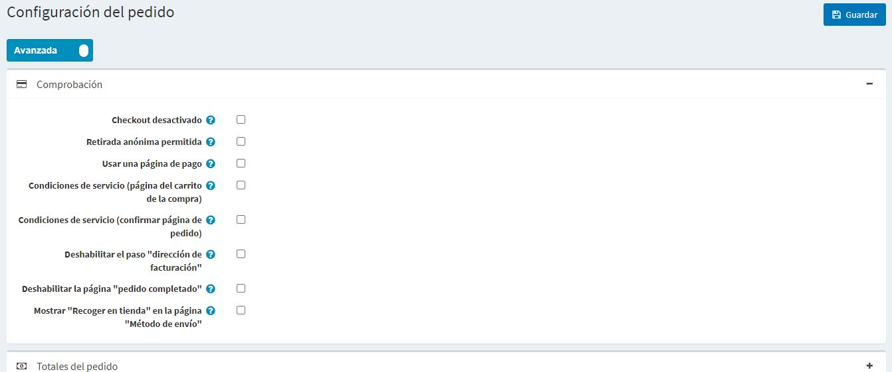
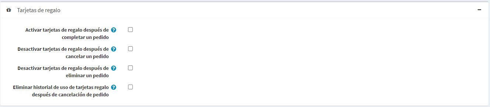

# Configuración de la orden.

Para definir los ajustes del orden, vaya a **Configuración → Ajustes → Ajustes del orden**. Aparecerá la ventana *Configuración del pedido*. 

Esta página permite la configuración de varias tiendas, lo que significa que se pueden definir los mismos ajustes para todas las tiendas o que pueden ser diferentes de una tienda a otra. Si desea administrar la configuración de una tienda determinada, elija su nombre en la lista desplegable de configuración de varias tiendas y marque todas las casillas de verificación necesarias en el lado izquierdo para establecer un valor personalizado para ellas. Para obtener más detalles, consulte [Multi-store](xref:es/getting-started/advanced-configuration/multi-store).

En esta ventana se pueden definir los siguientes ajustes de orden:

## Pagar en
Defina los siguientes ajustes en el panel *Checkout*:

* **Checkout desactivado**, para desactivar el proceso de compra.
* **Compra anónima permitida**, para permitir a los clientes comprar productos sin registrarse/registrarse.
* Para **Utilizar el checkout de una página**, que es una sola página web que sus clientes utilizarían para comprar un producto o un servicio de usted.
* **Ordenar totales en la pestaña de información de pago** para mostrar una lista de productos y los totales de los pedidos en la pestaña de información de pago (una página de pago).
* Requerir que los clientes acepten los **Términos de servicio** antes de procesar el pedido (**en la página del carrito de compras**).
* Requerir que los clientes acepten los **Términos de servicio** antes de procesar el pedido (**en la página de confirmación del pedido**).
* Para **Deshabilitar el paso "Dirección de facturación" durante el proceso de compra. La dirección de facturación se rellenará previamente y se guardará utilizando los datos de registro predeterminados (no se puede utilizar con la opción de pago para invitados seleccionada). En la página **Configuración → Configuración → Configuración del cliente** asegúrese de que los campos de dirección apropiados que no se puedan rellenar previamente no sean necesarios (o estén desactivados).
* Para **Desactivar la página "Pedido completado "**, para redirigir automáticamente al cliente a la página de detalles del pedido después de realizarlo.
* Para **Mostrar "Recogida en tienda" en la página de "Método de envío "** o en la página de dirección de envío.

## Los totales de la orden
Defina los siguientes ajustes en el panel *Totales del pedido*.:

* **Min order sub-total amount**. No se emitirán órdenes por debajo de esta cantidad.
* Para **Calcular "Monto mínimo del subtotal de la orden" incluyendo los impuestos**. En este caso, se calculará un subtotal de pedidos incluyendo el impuesto al validar **Campo de cantidad mínima de subtotal de pedidos** especificado en el paso anterior.
* **Importe total mínimo del pedido**. No se emitirán pedidos por debajo de este importe.
* Para **Autoactualizar los totales de los pedidos** para que los totales de los pedidos se actualicen automáticamente al editar un pedido en el área de administración (actualmente en pruebas BETA).

## Común
Defina los siguientes ajustes en el panel *Común*.:

* El contador de **Order ID**. Esto es útil si quieres que tus pedidos empiecen en un número determinado. Esto afecta sólo a las órdenes creadas después. El valor debe ser mayor que el ID de pedido máximo actual.
* En la **Máscara de número de orden** puede crear un número de orden personalizado. Por ejemplo, comience con {AAAA} - año de la fecha de creación de una orden.
* **Se permite el re-ordenamiento** para permitir a los clientes re-ordenar. El mecanismo de reordenación añade automáticamente al carro de la compra todos los artículos que estaban en un pedido anterior.
* Para **Completar el pedido cuando se entrega**, para establecer el estado del pedido en "Completo" sólo cuando su estado de envío es "Entregado". De lo contrario, el estado "Enviado" será suficiente.
* Para **Exportar pedidos con productos**.
* **Permitir a los administradores comprar productos marcados como "Call for price "**, para permitir a los administradores (en modo de suplantación) comprar productos marcados como "Call for price".

## Factura en PDF
Defina los siguientes ajustes en el panel de *Factura PDF*.:

* **Para adjuntar la factura en PDF (correo electrónico de "pedido realizado")**.
* **Para adjuntar una factura en PDF (correo electrónico de "pedido pagado")**.
* **Para adjuntar una factura en PDF (correo electrónico de "pedido realizado")**.

> [!TIP]
>
> Aprende a configurar el PDF en el [PDF settings](xref:es/getting-started/advanced-configuration/pdf-settings) chapter.

## Tarjetas de regalo
Defina los siguientes ajustes en el panel *Tarjetas de regalo*:

* **Activar las tarjetas de regalo después de completar un pedido**, para activar las tarjetas de regalo relacionadas cuando se complete un pedido.
* **Desactivar tarjetas de regalo después de cancelar un pedido**, para desactivar las tarjetas de regalo relacionadas cuando se cancela un pedido.
* **Desactivar las tarjetas de regalo después de la eliminación de un pedido**, para desactivar las tarjetas de regalo relacionadas cuando se elimina un pedido.
* **Borrar el historial de uso de tarjetas de regalo después de la cancelación de un pedido**, para borrar el historial de uso de tarjetas de regalo después de la cancelación de un pedido.

En el panel *Configuración de las solicitudes de devolución* puede configurar las solicitudes de devolución. Para obtener más detalles, consulte el [Return request settings](xref:es/running-your-store/order-management/return-requests#return-request-settings) section.
## Configuración de la solicitud de devolución

## Ver también

* [Orders](xref:es/running-your-store/order-management/orders)
* [Return requests](xref:es/running-your-store/order-management/return-requests)
* [PDF settings](xref:es/getting-started/advanced-configuration/pdf-settings)
