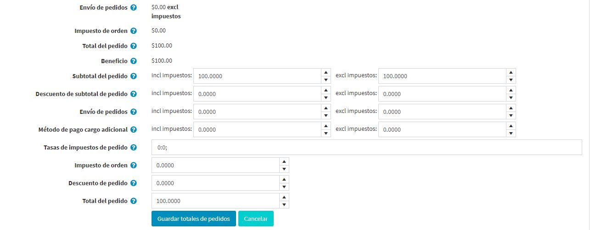
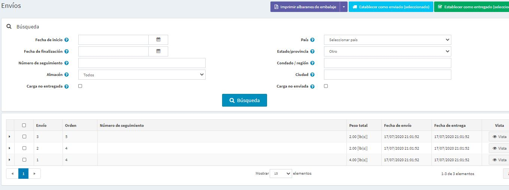

# Ordenes

Para ver y gestionar los pedidos, vaya a **Ventas → Pedidos**. La página de pedidos lista todos los pedidos actuales. Después de que un cliente completa una transacción, un nuevo pedido aparece en la página de pedidos.

El área superior de la página permite al propietario de la tienda buscar pedidos. Introduzca criterios de búsqueda específicos y utilice diversos filtros para encontrar cualquier pedido realizado en la tienda. Cuando se realiza cualquier búsqueda, los resultados de la misma se muestran en la mitad inferior de la pantalla. Puede hacer clic en **Ver** para ver los detalles del pedido.

## Busque las órdenes
Para buscar órdenes, introduzca uno o más de los siguientes criterios de búsqueda:

* **Fecha de inicio** y **Fecha de fin** para definir un período de creación de órdenes.
* **Warehouse** para cargar los pedidos con productos de un almacén determinado.
* **Producto** - introducir un nombre de producto
* **Estados de orden** - seleccione uno de los siguientes: *Todos*, *Pendientes*, *Procesando*, *Completos*, *Cancelados*.
* **Estados de pago** - seleccione un estado de pago específico para buscar: *Todo*, *Pendiente*, *Autorizado*, *Pagado*, *Reembolsado parcialmente*, *Reembolsado*, *Viado*.
* **Estados de envío** - seleccione un estado de envío específico para buscar por: *Todos*, *Envío no requerido*, *Todavía no enviado*, *Envío parcial*, *Envío*, *Entregado*.
* **Store** - establece una tienda específica en la que se hicieron los pedidos.
* **Vendedor** - buscar por un vendedor específico. Verá pedidos con productos de un proveedor específico.
* **Número de teléfono de facturación** - número de teléfono del cliente.
* **Dirección de correo electrónico de facturación** - dirección de correo electrónico del cliente.
* **Apellido de facturación** - apellido del cliente.
* **País de facturación** - país del cliente.
* **Método de pago** - establecer un método de pago específico que se utilizó durante el proceso de compra.
* **Notas de pedido** - buscar en las notas de pedido. Dejar vacío para cargar todos los pedidos.
* **Ir directamente al pedido #** - introducir el número de pedido y hacer clic en **Ir** para mostrar el pedido requerido.

> [!NOTE]
> 
> Puede exportar los pedidos a un archivo externo haciendo clic en el botón **Exportar** en la parte superior de la página. Después de hacer clic en el botón **Exportar** verá el menú desplegable que le permite **Exportar a XML (todos encontrados)** o **Exportar a XML (seleccionado)** y **Exportar a Excel (todos encontrados)** o **Exportar a Excel (seleccionado)**..

## Detalles del pedido
Para ver la información completa del pedido, haga clic en **Ver** al lado del pedido en la lista.

Haga clic en el botón **Factura (PDF)** en la esquina superior derecha para generar una factura del pedido en PDF. Haga clic en **Borrar** si desea eliminar el pedido.

### Información

En el panel **Info** el dueño de una tienda puede realizar lo siguiente:
* Ver el **Orden #** que es un número de orden único.
* Ver el **Creado el** - la fecha/hora en que el pedido fue hecho/creado.
* Ver el **Cliente** que hizo el pedido.
* Ver el **Estado del pedido**. El estado del pedido será *Completado* sólo una vez que el estado del pago se establezca como *Pagado* y el estado del envío se establezca como *Entrega*. El estado del pedido se puede cambiar manualmente haciendo clic en el botón **Cambiar estado**. Sin embargo, esta opción se recomienda sólo para usuarios avanzados porque todas las acciones apropiadas (como el ajuste del inventario, el envío de correos electrónicos de notificación, los puntos de recompensa, la activación/desactivación de la tarjeta de regalo, etc.) deben realizarse manualmente en este caso.
* **Cancelar pedido**. Se mostrará un mensaje de confirmación, haga clic en **Sí** para eliminar el pedido del sistema.

> [!NOTE]
> 
> Cuando un cliente utiliza el método de pago manual de la tarjeta de crédito, que permite almacenar la información de la tarjeta de crédito en la base de datos, aparece un botón **Editar tarjeta de crédito**. Si se utiliza un método de pago diferente, este botón no será visible.

* Ver el **Subtotal del pedido**, **Envío del pedido**, **Impuesto del pedido**, **Total del pedido**, **Ganancia**. Si hace clic en el botón **Editar totales del pedido** podrá editar los totales del pedido como en la siguiente captura de pantalla:
	

* Vea el **Método de pago** utilizado para este pedido.
* Ver el **Estado del pago**. Podría ser uno de los siguientes: *Pendiente*, *Autorizado*, *Pagado (capturado)*, *Reembolsado*, *Reembolsado parcialmente*, o *Viado*.
	> [!NOTE]
	> 
	> No todas las pasarelas de pago soportan todos estos estados. Lea más sobre los métodos de pago en el [Payment methods](xref:es/getting-started/configure-payments/payment-methods/index) chapter.

	Si el estado del pago es *Autorizado* los botones correspondientes estarán disponibles para **Voidar** y **Capturar** el pedido. **Captura** se utiliza para recoger los fondos del cliente. **Void** cancela una orden que no ha sido capturada. 
	
	Si el estado del pago es *Pendiente*, el propietario puede pulsar **Marcar como pagado** para indicar que se ha emitido un pago para la orden. 
	
	Si el estado del pago es *Pagado* los botones **Reembolso** y **Reembolso parcial** estarán disponibles. Después de hacer clic en el botón **Reembolso** se mostrará una ventana de confirmación. Después de hacer clic en el botón **Reembolso parcial** se mostrará la ventana *Reembolso parcial*. Esta ventana permite al propietario reembolsar parte del total del pedido, de la siguiente manera:

	
	
* Vea la **Tienda** en la que se hizo este pedido.
* Ver la **Guía de pedidos** mostrada para uso interno.
* Ver la **Dirección IP del cliente** que un cliente utilizó al hacer el pedido.
 
### Facturación y envío
En el **Panel de facturación y envío**, vea y edite la información de facturación y envío, si es necesario. 

* Ver la **Dirección de facturación** y **Dirección de envío**. Opcionalmente, puede hacer clic en el enlace **Ver dirección en Google maps** para localizar la dirección de envío requerida. Haz clic en el botón **Editar** para editar las direcciones de facturación o de envío.
* Ver y editar el **Método de envío** si es necesario.
* Ver el **Estado del envío**.

> [!NOTE]
> 
> Los propietarios de las tiendas pueden crear varios envíos por pedido. Si crea un envío pero no envía todos los productos, entonces el estado del envío de un pedido es **Parcialmente enviado**. Una vez que se envían todos los productos, el estado cambia a **Envío**. Una vez que todos los envíos son entregados, el estado cambia a **Entrega**.

* View the list of **Shipments**. 
	
	Click **View** beside the shipment to view its details. The shipment information window will be displayed: 
	

	**El botón "Añadir envío" permite crear varios envíos por pedido y es visible cuando hay al menos un producto no enviado en el pedido. Haga clic en el botón **Agregar envío** para añadir un nuevo envío al pedido y verá la ventana **Agregar un nuevo envío al pedido**.: 
		
		
	* En el campo **Número de rastreo**, introduzca el número de rastreo del envío. El número de seguimiento permite a sus clientes y a usted comprobar el progreso de un envío a través del teléfono o del sistema online, operado por su agente de transporte (la oficina de correos, o un servicio de mensajería privado como FedEx o UPS). Cuando un envío pasa por ciertos puntos de su ruta, es identificado por el sistema de agentes de envío, y la base de datos de rastreo se actualiza con la nueva información de ubicación y tiempo.
	* Rellene el campo **Admin comentario** si es necesario.
	* Marque la casilla de verificación **Envío** para marcar el envío como enviado utilizando la fecha actual.
	* Si la casilla de verificación anterior está marcada, la casilla de verificación **Entregado** está disponible. Marque esta casilla de verificación para marcar el envío como entregado utilizando la fecha actual.
	* En el panel **Productos enviados**: en la columna **Cantidad a enviar**, ingrese la cantidad requerida del artículo de pedido específico a enviar.

### Productos
En el panel de **Productos** el dueño de la tienda puede:
* **Ver la información del producto**, incluyendo el precio, la cantidad y el precio total.
* Hacer clic en el enlace **Nombre del producto** para ver la página de detalles del producto. Si un producto se puede descargar, haz clic en **Reiniciar** para restablecer el número de descargas o **Cargar archivo de licencia**. Además, cuando el *Tipo de activación de descarga* de un producto se establece en *Manual*, un administrador tiene la opción de hacer clic en **Activar** para habilitar la descarga del producto desde el sitio o **Desactivar** para deshabilitar la descarga del producto desde el sitio.
* **Editar** el producto **Precio**, **Cantidad**, **Descuento** y **Total**.
* **Delete** a product from the system.
	
* Haga clic en **Agregar producto**. Seleccione el producto de la lista. Luego, en la ventana *Agregar un nuevo producto a pedido* encuentre el producto requerido. Luego proceda a llenar los valores requeridos y haga clic en **Agregar producto**. No olvide actualizar los totales del pedido después de añadir un nuevo producto al pedido.
	

### Notas de pedido
En el panel **Order notes**, el dueño de la tienda puede ver las notas que se añadieron al pedido con fines informativos, borrarlas y añadir otras nuevas. Una nota puede contener un **Archivo adjunto** y puede ser **Mostrada a un cliente** en la tienda pública.

## See also

* [Adding products](xref:es/running-your-store/catalog/products/add-products)
* [Shipments](xref:es/running-your-store/order-management/shipping-management)
* [YouTube tutorial on managing orders](https://www.youtube.com/watch?v=z6TUJOO3gVg&index=5&list=PLnL_aDfmRHwsbhj621A-RFb1KnzeFxYz4)
