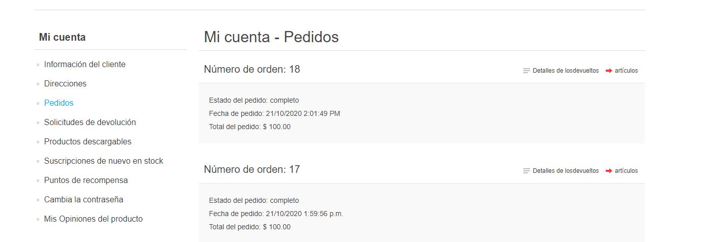
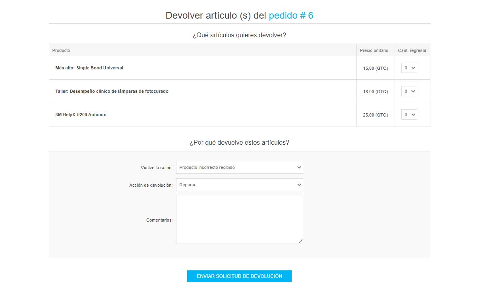
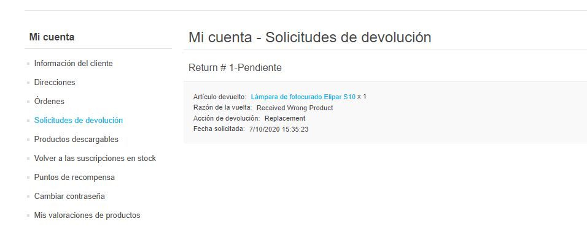
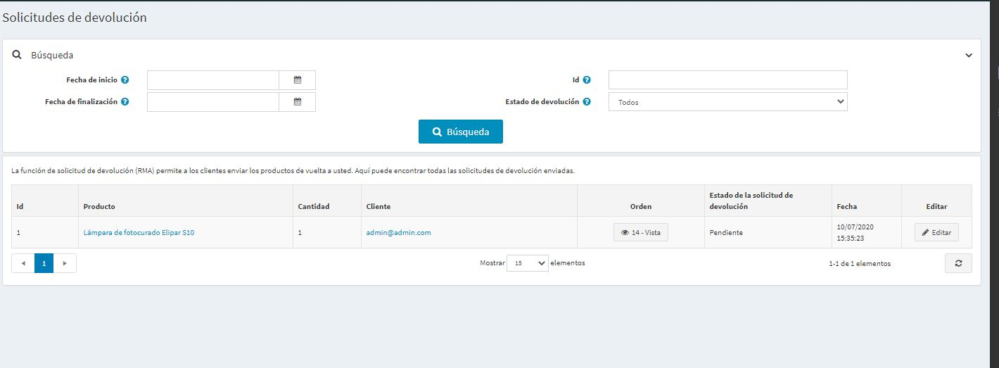
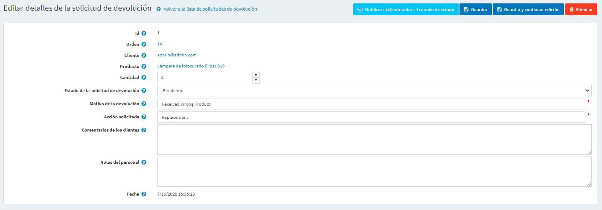

# Solicitudes de devolución

La función de solicitud de devolución permite a los clientes solicitar la devolución de artículos previamente comprados. Estas también se conocen como solicitudes de RMA. Esta opción sólo está disponible para los pedidos completados. La configuración de las solicitudes de devolución se gestiona en **Configuration → Settings → Order settings** en el panel *Return request settings*.

Para habilitar las solicitudes de devolución marque la casilla de verificación **Habilitar el sistema de devolución**.
Cuando esta opción está habilitada, se muestra un botón **Return item(s)** para los pedidos completados en la página de detalles del pedido en la tienda pública.

Para pasar a la sección de configuración de las solicitudes de devolución, haga clic en [here](#return-request-settings).

En las siguientes secciones describiremos cómo la funcionalidad de la solicitud de devolución puede ser utilizada por sus clientes y cómo gestionar las solicitudes de devolución en el área de administración.

## Presentar una solicitud de devolución
Para presentar una solicitud de devolución, el cliente tendría que seguir los siguientes pasos:

1. En la tienda pública, vaya a la ventana *Mi cuenta* y haga clic en **Ordenes**. Se mostrará la siguiente página: 

1. Haga clic en el botón **Return Item(s)** al lado del pedido completado que debe ser devuelto. Aparecerá la ventana *Devolver artículo(s) del pedido #*, como se muestra en el siguiente ejemplo: 
  
    * **La lista desplegable "Qty to return" permite seleccionar el número de artículos a devolver.
    * **Return reason** lista desplegable permite seleccionar la razón para solicitar la devolución. Por ejemplo, producto equivocado pedido, producto equivocado recibido y más. Lea [below](#return-request-settings) cómo gestionar las razones de la devolución.
    * **La lista desplegable "Acción de retorno" permite seleccionar la acción de retorno requerida. Por ejemplo, reparar el producto, reemplazar el producto, emitir un crédito y así sucesivamente. Lea [below](#return-request-settings) cómo manejar las acciones de retorno.
    * Utilice la opción **Subir un archivo** si desea adjuntar algunos documentos o imágenes adicionales a su solicitud. 
	    > [!NOTE]
	    >
	    > Esta opción sólo está disponible cuando la casilla de verificación **Permitir subir archivos** está marcada. Lee [below](#return-request-settings) how to set this up.

    * En el campo **Comentarios**, un cliente puede introducir un comentario opcional con fines informativos.
1. Después de usar la función de solicitud de devolución, el cliente puede ver las solicitudes de devolución creadas y sus estados desde la página *Mi cuenta* de la tienda pública, haciendo clic en **Solicitudes de devolución**: 
  

## Gestionar las solicitudes de devolución
El dueño de la tienda puede ahora gestionar esta solicitud de devolución en el área de administración.

Para ver y editar las solicitudes de devolución, vaya a **Ventas → Solicitudes de devolución**. Todas las solicitudes de devolución se mostrarán de la siguiente manera:

Haga clic en **Editar** junto a la solicitud de devolución, se muestra la ventana *Editar detalles de la solicitud de devolución*.:

El administrador de la tienda está autorizado a hacerlo:
* Ver la solicitud de devolución **ID**.
* Ver la **Orden #**. Al hacer clic en el número de pedido se redirige a la página de detalles del pedido asociado.
* Ver el **Cliente**. Al hacer clic en el correo electrónico del cliente se le redirige a la página de detalles del cliente asociada.
* Ver el **Producto**. Al hacer clic en el nombre del producto, se redirecciona a la página de detalles del producto asociado.
* Introduzca la **Cantidad** del producto devuelto.
* Seleccione el **Estado de la solicitud de devolución**:  
  * *Pendiente*
  * *Recibido*
  * *Retorno autorizado*
  * *Artículo(s) reparado(s)*
  * *Artículo(s) reembolsado(s)*
  * *Solicitud rechazada*
  * *Cancelado*

* En el campo **Razón de la devolución**, edite la razón de la devolución, si es necesario.
* En el campo **Acción solicitada**, edite la acción solicitada, si es necesario.
* En el campo **Comentarios del cliente**, edite el comentario introducido por el cliente, si es necesario.
* En el campo **Notas del personal**, introduzca una nota opcional con fines informativos. Estas notas no se mostrarán a un cliente.
* Ver la **Fecha** en que se presentó la solicitud de devolución.

> [!NOTE]
> 
> Haga clic en el botón **Notificar al cliente sobre el cambio de estado** para enviar un correo electrónico al cliente informando sobre el cambio de estado de la solicitud de devolución. 

## Configuración de la solicitud de devolución
Para definir la configuración de la solicitud de devolución, vaya a **Configuración → Configuración → Configuración de la solicitud**. 

Esta página permite la configuración de varias tiendas, lo que significa que se pueden definir los mismos ajustes para todas las tiendas o que pueden ser diferentes de una tienda a otra. Si desea administrar la configuración de una tienda determinada, elija su nombre en la lista desplegable de configuración de varias tiendas y marque todas las casillas de verificación necesarias en el lado izquierdo para establecer un valor personalizado para ellas. Para obtener más detalles, consulte [Multi-store](xref:es/getting-started/advanced-configuration/multi-store).

Go to the *Return request settings* panel:

En este panel se puede definir:
* Para **Habilitar el sistema de devoluciones**, para permitir a sus clientes presentar solicitudes de devolución de artículos comprados.
* En el campo **Máscara del número de solicitud de devolución** especificar el número de solicitud de devolución personalizado si es necesario.
* **Número de días que la solicitud de devolución está disponible**, para establecer el número de días que el enlace de solicitud de devolución estará disponible en el área de clientes.
  > [!TIP]
  > 
  > Por ejemplo, si el dueño de la tienda permite devoluciones dentro de los 30 días posteriores a la compra, este campo se fijará en 30. Cuando el cliente entra en el sitio web y mira "Mi cuenta", los pedidos completados antes de 30 días no tendrán un botón de **Devolución de artículo(s)**.

* Marque la casilla de verificación **Permitir la carga de archivos** si desea permitir la carga de archivos (imágenes, por ejemplo) al presentar una solicitud de devolución. Esta opción es especialmente útil para los clientes que han tenido algunos problemas con sus pedidos, como la recepción de artículos dañados o productos equivocados, etc.

### Razones de la solicitud de devolución
Este panel representa una lista de razones que un cliente puede elegir al presentar una solicitud de devolución.

Haga clic en **Agregar nuevo** para añadir un nuevo motivo de solicitud. La ventana *Añadir nuevo motivo de solicitud de devolución* se mostrará como sigue:

Introduzca el motivo de la solicitud de devolución **Nombre** y **Número de orden de visualización** (1 representa el primer elemento de la lista). Haga clic en **Guardar** para guardar los cambios.

### Acciones de solicitud de devolución
Este panel representa una lista de acciones que un cliente puede elegir al presentar una solicitud de devolución.

Haga clic en **Agregar nuevo** para agregar una nueva acción de solicitud. La ventana *Agregar nueva acción de solicitud de devolución* se mostrará, de la siguiente manera:

Introduzca la acción de solicitud de devolución **Nombre** y **Número de orden de visualización** (1 representa el primer elemento de la lista). Haga clic en **Save** para guardar los cambios.

## Ver también

* [YouTube tutorial: managing return requests](https://www.youtube.com/watch?v=VqF2GZ2ip_0&list=PLnL_aDfmRHwsbhj621A-RFb1KnzeFxYz4&index=17)
* [Order settings](xref:es/running-your-store/order-management/order-settings)
* [Orders](xref:es/running-your-store/order-management/orders)