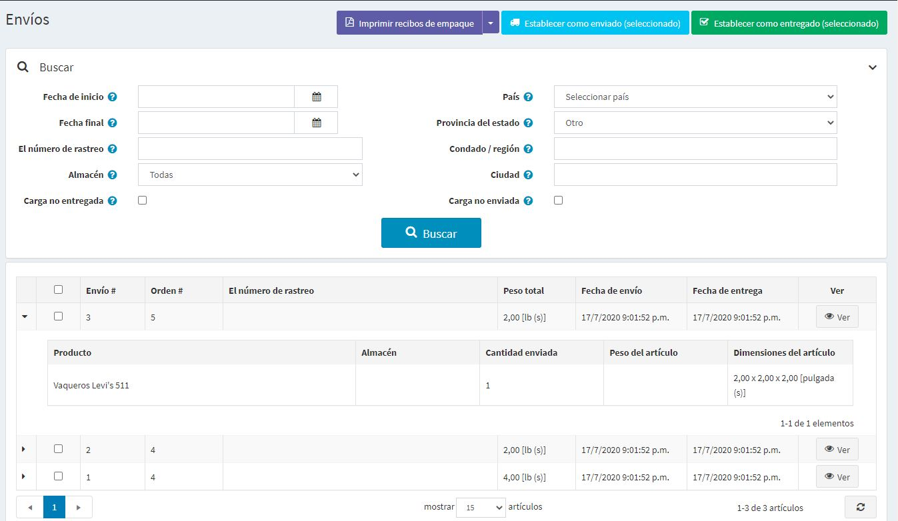
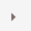
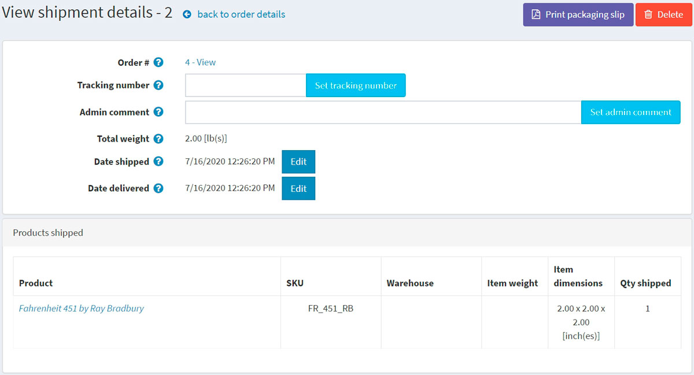

# La gestión del envío

Para buscar y ver los envíos vaya a **Ventas → Envíos**.

## Lista de envíos

El área superior de la página permite buscar un envío por diferentes criterios de búsqueda:

* **Fecha de inicio** y **Fecha de fin** para los envíos creados entre estas fechas.
* Ingrese el **Número de rastreo** si desea encontrar envíos con un cierto número de rastreo.
* Seleccione el **Almacén** para los envíos enviados desde un almacén específico.
* Haga clic en la casilla de verificación **Cargar no entregado** si no desea cargar artículos ya entregados.
* Utilice **País, Estado/Provincia, Condado/Región, Ciudad** para buscar por un destino de envío.
* Haga clic en la casilla de verificación **Carga no enviada** si no desea cargar artículos ya enviados.

Seleccione ciertos envíos a **Set as shipped (seleccionado)** o **Set as delivered (seleccionado)**. También puede **Imprimir recibos de embalaje (seleccionado)** o **Imprimir recibos de embalaje (todos)** para imprimir los recibos de embalaje.

En la lista de envíos, el propietario de una tienda puede ver todos los artículos de un envío haciendo clic en  en la primera columna del envío.

## Detalles del envío

Si se pulsa en **Ver**, se abrirá la ventana *Ver detalles del envío*, como sigue:

En esta ventana puedes:

* Proceder a la orden.
* Establecer un **Número de seguimiento** para el envío.
* Agregar un **Comentario de la administración** para uso interno.
* Ver el **Peso total del envío**.
* Marcar el envío como **Envío**.
* Editar la **Fecha de envío**.
* Marque el envío como **Entregado**.
* Editar la **Fecha de entrega**.
* **Imprimir la hoja de embalaje**.
* **Borra** el envío.

## Configuración del envío

Para configurar el envío visite la sección [Configurar envío](xref:es/getting-started/configure-shipping/index).

## Ver también

* [Pedidos](xref:es/running-your-store/order-management/orders)
* [Añadir productos](xref:es/running-your-store/catalog/products/add-products)
