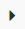
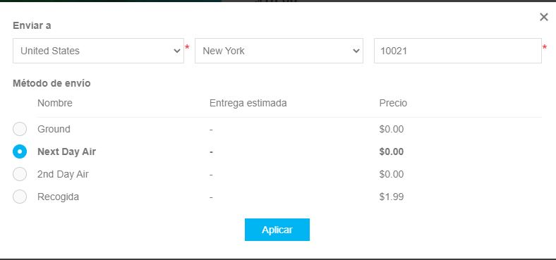

# Carritos de compras y listas de deseos

La sección "Carritos de compra y listas de deseos" permite a los propietarios de las tiendas ver todos los carritos de compra y las listas de deseos existentes de todos los clientes y de todas las tiendas en una página. Para acceder a esta página vaya a **Ventas → Carros de compra y listas de deseos**.

En el área de *Búsqueda* en la parte superior de la página, seleccione el **Tipo de carro de compras** deseado: *Carro de compras* o *Lista de deseos*.

Puede ampliar los productos haciendo clic en el siguiente icono en la primera columna: .

Desde la lista, puede proceder a la página de detalles del cliente haciendo clic en el enlace del cliente. También puede visitar la página de edición de detalles del producto haciendo clic en el nombre del producto o eliminar el producto de la cesta haciendo clic en el botón **Borrar**..

## Carro de la compra

Seleccione el *Carro de la compra* de la lista desplegable **Tipo de carro de la compra** en el **Ventas → Carros de la compra y listas de deseos** y haga clic en **Buscar** para ver la lista de carros de la compra. Esta lista contiene todos los productos que fueron colocados en los carritos, pero no comprados.

La siguiente captura de pantalla muestra cómo un cliente ve la página de un carrito de compras en la tienda pública:

Taquí hay algunos elementos en la página del carrito de compras. Algunos de ellos pueden ser desactivados si es necesario:
1. El botón **Actualizar la cesta de la compra** permite al cliente cambiar la cantidad de un producto introduciendo el número apropiado en el campo **Cantidad** o eliminar un producto marcando la casilla **Quitar**.
1. The button **Continue shopping** allows a customer to proceed to the catalog.
1. 2. The button **Estimate shipping** allows a customer to estimate the shipping. After clicking this button, the following pop-up window will be displayed:
  
  In this window, the customer can enter the shipping address and see the appropriate shipping options.
  You can disable the shipping estimate in the shopping cart page by unchecking the **Shipping estimate enabled (cart page)** checkbox in the **Setup → Settings** page.
1. You can see the **Gift wrapping** dropdown in the shopping cart screenshot provided above. This is an attribute of the checkout process. Read more about how to manage payment attributes in the [Checkout attributes](xref:en/running-your-store/order-management/checkout-attributes) capitulo.
1. La sección **Código de descuento** permite a un cliente introducir un código de descuento. Puede desactivarlo desmarcando la casilla **Mostrar caja de descuento** en la página **Configuración → Ajustes → Ajustes del carro de la compra**. Lea más sobre los descuentos en la sección [Discounts](xref:en/running-your-store/promotional-tools/discounts) chapter.
1. La sección de **Tarjetas de regalo** permite a un cliente usar una tarjeta de regalo. Puede desactivarla desmarcando la casilla **Mostrar tarjeta de regalo** en la página **Configuración → Ajustes → Configuración de la cesta de la compra**. Lea más sobre las tarjetas de regalo en el [Gift cards](xref:en/running-your-store/promotional-tools/gift-cards) capitulo.
1. En la sección de totales del carrito de compras un cliente ve la tarifa de envío. Lea cómo configurar el envío en la[Configure shipping](xref:en/getting-started/configure-shipping/index) sección. 
1. En la misma sección un cliente ve la información de los impuestos. Lea cómo configurar los impuestos en el [Configure taxes](xref:en/getting-started/configure-taxes/index) sección. 
1. En la misma sección un cliente ve cuántos puntos de recompensa se ganarán. Lea cómo configurar los puntos de recompensa en la [Reward points](xref:en/running-your-store/promotional-tools/reward-points) secció
1. 
1. .
1. En la misma sección un cliente ve las condiciones del servicio. Puede desactivarlo desmarcando la casilla de verificación **Términos de servicio (página del carrito de compras)** en la página **Configuración → Ajustes → Ajustes del pedido**.. 

> [!NOTE]
>
> En caso de que no quieras permitir que un cliente añada un determinado producto a un carrito de la compra, marca la casilla de verificación **Deshabilitar botón de compra** en el panel *Precios* de la página de edición del producto. Lee más acerca de cómo añadir un producto en el [Add products](xref:en/running-your-store/catalog/products/add-products) chapter.

> [!NOTE]
> 
> Check out our [marketplace](http://www.nopcommerce.com/marketplace) para los plugins que ayudan a manejar los carros abandonados y recuperar las ventas perdidas.

## Lista de deseos

Seleccione la opción *Lista de deseos* de la lista desplegable **Tipo de carrito de compras** en la página **Ventas → Carritos de compras y listas de deseos** y haga clic en **Buscar** para ver las listas de deseos.

Una lista de deseos es una lista de productos que un cliente puede compartir con sus amigos o guardar para transferirla al carrito más tarde. Si se habilita la adición de una lista de deseos para un producto, el botón **Agregar a la lista de deseos** aparece en la página de detalles del producto en la tienda pública. Cuando se añade un producto de diferentes variantes a una lista de deseos, todas las variantes elegidas por un cliente se incluyen en la lista de deseos.

> [!TIP]
> 
> Por ejemplo, si un cliente añade la misma camisa, pero en 2 colores diferentes, cada camisa aparece como un artículo separado en la lista de deseos. En caso de que el cliente añada el mismo producto a la lista de deseos varias veces, el producto aparece sólo una vez, pero con una cantidad actualizada que refleja el número de veces que se ha añadido el producto.

La siguiente captura de pantalla ilustra cómo un cliente ve una página de la lista de deseos en la tienda pública:

Hay algunos elementos en la página de la lista de deseos:
1. El botón **Actualizar lista de deseos** permite a un cliente cambiar la cantidad de un producto introduciendo el número apropiado en el campo **Cantidad** o eliminar un producto marcando la casilla **Quitar**.
1. El botón **Agregar al carrito** permite a un cliente agregar los productos seleccionados al carrito.
1. 2. El botón **Envía a un amigo** permite a un cliente enviar la lista de deseos a un amigo por correo electrónico. Puede desactivarlo desmarcando la casilla de verificación **Permitir a los clientes enviar sus listas de deseos por correo electrónico** en la página **Configuración → Configuración → Configuración del carrito de compras**.
1. La **Lista de deseos URL para compartir** permite a un cliente compartir la lista de deseos.

> [!NOTE]
>
> En caso de que no quieras permitir que un cliente añada un determinado producto a una lista de deseos, marca la casilla de verificación **Deshabilitar el botón de la lista de deseos** en el panel *Precios* de la página de edición del producto. Lee más sobre cómo añadir un producto en la sección [Add products](xref:en/running-your-store/catalog/products/add-products) chapter.

## Configuración de la cesta de la compra y la lista de deseos

Para cambiar los ajustes del carrito de compras y de la lista de deseos vaya a la página **Configuración → Ajustes → Ajustes del carrito de compras**.

Esta página permite la configuración de varias tiendas, lo que significa que se pueden definir los mismos ajustes para todas las tiendas o que pueden ser diferentes de una tienda a otra. Si desea administrar los ajustes de una tienda determinada, elija su nombre en la lista desplegable de configuración de varias tiendas y marque todas las casillas de verificación necesarias en el lado izquierdo para establecer un valor personalizado para ellas. Para obtener más detalles, consulte [Multi-stovvre](xref:en/getting-started/advanced-configuration/multi-store).

### Common 
In the *Common* panel you can define:

* Para **Mostrar caja de descuento** mostrando la caja del cupón de descuento en la página del carrito de compras.
* Para **Mostrar caja de tarjeta de regalo** mostrando la caja de tarjeta de regalo en la página del carrito de compras.
* Para **Permitir la edición del artículo del carrito**, para permitir a los clientes editar los artículos del carrito. Esta característica es útil cuando los productos tienen valores introducidos por los clientes.
* **Máximo de artículos del carrito de compras** - el número máximo de productos que se pueden añadir al carrito de compras.
* Seleccione la casilla de verificación **Carros compartidos entre tiendas** para compartir carros de compra (y listas de deseos) entre tiendas.
* Para **Mostrar imágenes de productos en el carrito**, para mostrar imágenes de productos en los carritos de compras de las tiendas.
* Para **Mostrar carro después de añadir un producto**, para mostrar la página del carro de compras inmediatamente después de añadir un producto al carro. Cuando esta casilla de verificación se desmarca, el cliente permanecerá en la página donde el producto fue agregado al carrito.
* **Número de ventas cruzadas** que desea mostrar en la página de pago del carrito de compras en la tienda pública. Introduzca 0, si no quiere mostrar las ventas cruzadas.

### Mini carrito de compras
En el panel del *Mini carrito de compras* puedes definir:

* Para **Mostrar el mini-carro de compras** - un menú desplegable, que aparece en la esquina superior derecha de la ventana principal, al pasar el cursor sobre el enlace "Carro de compras", como se muestra a continuación: 
  
  Para **Mostrar el mini-carro de compras** - un menú desplegable, que aparece en la esquina superior derecha de la ventana principal, al pasar el cursor sobre el enlace "Carro de compras", como se muestra a continuación.

### Lista de deseos
En el panel de la *Lista de deseos* se puede definir:

* **Máximo de artículos de la lista de deseos** - el número máximo de productos diferentes que se pueden añadir a la lista de deseos.
* Para **Mostrar imágenes de productos en la lista de deseos**, para mostrar imágenes de productos en las listas de deseos de los clientes.
* Para **Permitir a los clientes enviar su lista de deseos** a sus amigos. Cuando este campo está habilitado, se muestra el siguiente campo:
  * **Permitir a los clientes enviar su lista de deseos** a sus amigos.
* Para permitir que los artículos "agotados" se añadan a la lista de deseos.
* Seleccione la casilla de verificación **Mover artículos de la lista de deseos al carrito** para mover los productos de la lista de deseos al carrito cuando haga clic en el botón "Añadir al carrito". De lo contrario, se copian.
* Para **Mostrar la lista de deseos después de agregar un producto**, para mostrar la página de la lista de deseos inmediatamente después de que se agregue un producto a la lista de deseos. Cuando se desmarca esta casilla de verificación, el cliente permanecerá en la página donde se añadió el producto a la lista de deseos.

## Ver también

* [Orders](xref:en/running-your-store/order-management/orders)
* [Promotional tools](xref:en/running-your-store/promotional-tools/index)

## Tutoriales

* [Overview of wishlists in nopCommerce](https://www.youtube.com/watch?v=9EN7oZSwIVE)
