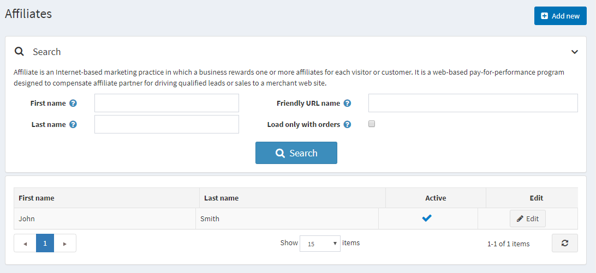

# Afiliados

La comercialización de afiliados es una práctica de comercialización basada en Internet en la que los afiliados son recompensados por el tráfico del sitio web generado (cada visitante o cliente). Es un programa de pago por rendimiento basado en la web diseñado para compensar a los socios afiliados por impulsar clientes potenciales cualificados o ventas desde sus sitios web a un sitio web de comercio.

Los afiliados son terceros que remiten clientes a su sitio. El software nopCommerce puede hacer un seguimiento de esas referencias para que el administrador de la tienda pueda determinar la comisión que se pagará a los afiliados. Una vez que a un cliente se le asigna un ID de afiliado, cada pedido que realiza también se etiqueta con ese ID.

 En nopCommerce, el enlace de un socio afiliado tiene el siguiente aspecto: `http://www.yourstore.com/?AffiliateID=N` (donde N es un ID de afiliado). El dueño de la tienda también puede especificar el campo del nombre de la *URL amistosa* con fines de marketing: `http://www.yourstore.com/?affiliate=your_friendly_name_here`. Esta URL se muestra cuando visita la página de detalles del afiliado. Cuando se hace clic en este hipervínculo desde el sitio del afiliado, nopCommerce busca un parámetro de cadena de consulta de ID de afiliado.

## Agregar un nuevo afiliado

Para añadir un afiliado vaya a **Promociones → Afiliados** y haga clic en **Añadir nuevo**.

Define los detalles de la filial:

- Seleccione la casilla de verificación **Activo**, para activar el afiliado.
- **Nombre**.
- **Apellido**.
- **Correo electrónico**.
- **Nombre de la empresa**.
- Seleccione el **País** de la lista desplegable.
- Si el país seleccionado es EE.UU., especifique también el **Estado/provincia**.
- **Condado/región**.
- **Ciudad**.
- **Dirección 1**.
- **Dirección 2**.
- **Código postal**.
- **Número de teléfono**.
- **Número de fax**.
- En el campo **Comentario de la administración**, puede introducir un comentario o información opcional para uso interno.
- Puede especificar el **Nombre de la URL amigable** que es un enlace de URL amigable de afiliado con fines de marketing o puede dejar este campo vacío, entonces se utilizará la URL por defecto. De forma predeterminada, los socios afiliados tienen URL: `http://www.yourstore.com/?AffiliateID=N` (donde N es un ID de afiliado).

Si haces clic en **Guardar y continuar editando** verás dos paneles más donde puedes comprobar la efectividad de este afiliado:

* El panel *Clientes afiliados* muestra una lista de todos los clientes afiliados.
* El panel de *Pedidos afiliados* muestra una lista de todos los pedidos afiliados. Cuando un cliente afiliado hace un pedido, puedes ver el pedido en este panel.

## Ver también

- [Order management](xref:es/running-your-store/order-management/index)
- [Customer management](xref:es/running-your-store/customer-management/index)

