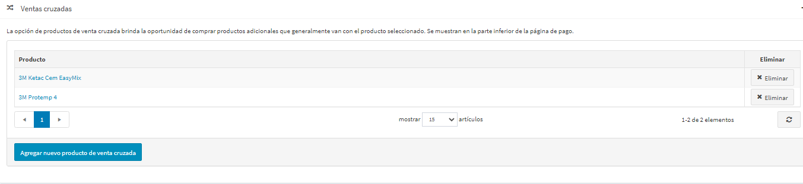
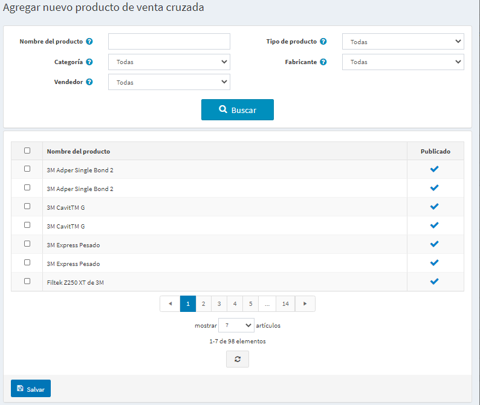
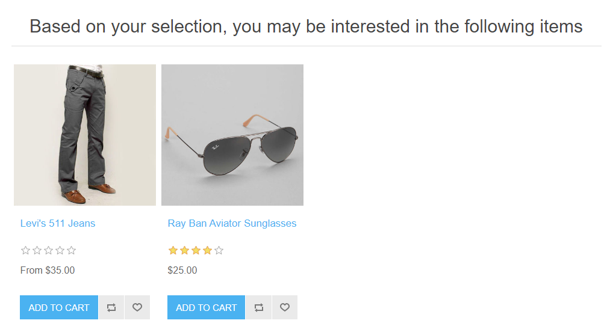
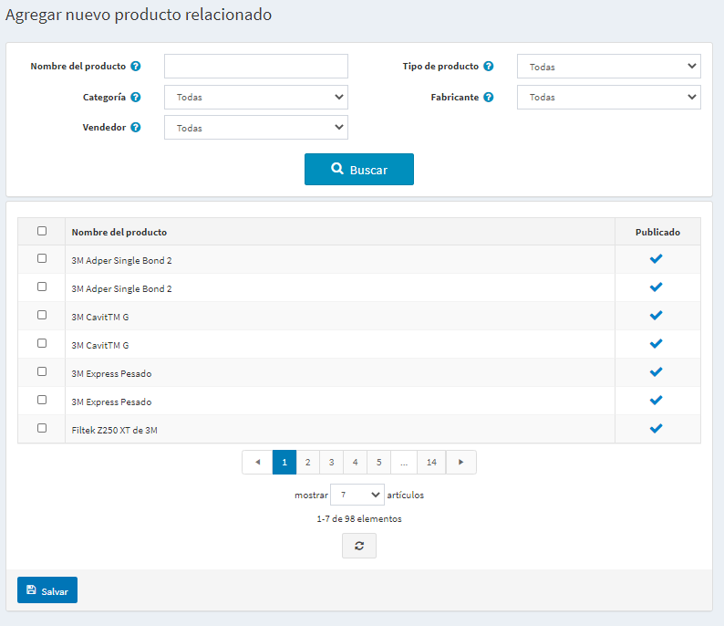

# Ventas cruzadas y productos relacionados

Las "ventas cruzadas" y los "productos relacionados" son herramientas de marketing en nopCommerce que pueden utilizarse para ofrecer a sus clientes productos adicionales que les puedan gustar en función de su comportamiento de compra (ver y añadir al carrito determinados productos). También es una buena oportunidad para que usted venda algunos productos. Puedes usar ambas herramientas simultáneamente.

Puedes configurar las ventas cruzadas y los productos relacionados al crear o editar un producto en la página de edición de productos. Ve a **Catálogo → Productos**, selecciona un producto y haz clic en **Editar**. Busca los paneles de *Ventas cruzadas* y *Productos relacionados*.

> [!NOTE]
> 
> Necesitas guardar el producto antes de poder añadir ventas cruzadas y productos relacionados.

## Ventas cruzadas

La opción de "productos de venta cruzada" ofrece la oportunidad de vender productos adicionales que normalmente se compran con el producto seleccionado, sin embargo, se puede añadir cualquier producto de su catálogo incluso no complementario al producto del carrito. Las ventas cruzadas se muestran en la parte inferior de la página de pago. Por ejemplo, cuando su cliente está comprando un CPU, puede que necesite un monitor y algo más. Puede añadir un número ilimitado de productos de venta cruzada a un producto.

### Añadir nuevas ventas cruzadas

Haga clic en **Agregar nuevo producto de venta cruzada** y elija el/los producto/s del catálogo. Puede utilizar los siguientes criterios: **Nombre del producto**, **Categoría**, **Vendedor**, **Tienda**, **Tipo de producto** y **Fabricante** para encontrar un producto fácilmente.

Después de haber elegido el producto de venta cruzada y haberlo guardado, puede comprobar cómo se mostrarán las ventas cruzadas en la página de compra:

## Productos relacionados

La opción de productos relacionados ofrece la oportunidad de anunciar y vender otros productos a sus clientes junto con el elegido. Estos productos se muestran debajo del producto seleccionado en la página de detalles del producto. Puedes añadir un número ilimitado de productos relacionados a un producto.

### Añadir nuevos productos relacionados

Haga clic en **Agregar nuevo producto relacionado** y elija el/los producto/s del catálogo. Puede utilizar los siguientes criterios: **Nombre del producto**, **Categoría**, **Vendedor**, **Tienda**, **Tipo de producto** y **Fabricante** para encontrar un producto fácilmente.

Después de haber elegido el producto relacionado y haberlo guardado, puedes comprobar cómo se mostrarán los productos relacionados en la página de detalles del producto:
[Related products on the product details page](_static/cross-sells-and-related-products/rel-product-on-the-prod-det-page.png)

## Ver también

- [Añadir productos](xref:es/running-your-store/catalog/products/add-products)
- [Tier prices](xref:es/running-your-store/promotional-tools/tier-prices)

## Tutoriales

- [Entender las ventas cruzadas en nopCommerce](https://www.youtube.com/watch?v=J_6OlVarIFc)
- [Gestión de productos relacionados](https://www.youtube.com/watch?v=FGuozvhyqYE&t=6s)
