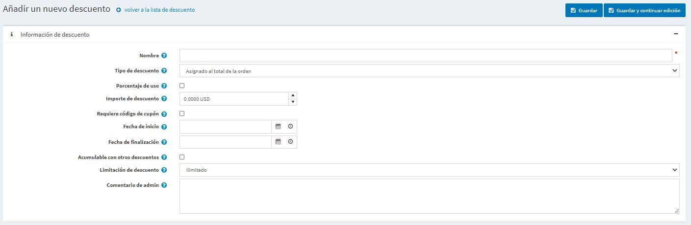
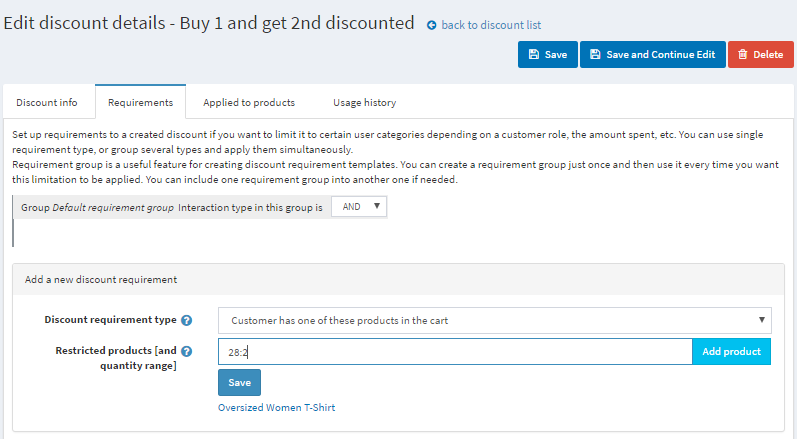

# Descuentos

En nopCommerce puede utilizar los descuentos para permitir el acceso a ofertas especiales. Se pueden aplicar a determinadas categorías, productos, al importe total, etc. Usted puede utilizar diferentes requisitos disponibles fuera de la caja y a través de plugins de [nopCommerce marketplace](http://www.nopcommerce.com/marketplace) para aplicar a sus descuentos.

Los productos en nopCommerce pueden tener cualquier número de descuentos adjuntos. En caso de que se apliquen varios descuentos, nopCommerce calculará automáticamente el mejor precio posible para el cliente basándose en todos los descuentos disponibles y en las afiliaciones a grupos.

La forma más común de utilizar los descuentos es un código de cupón. El código de cupón lo introduce el cliente en la página del carrito de la compra justo antes de pasar por caja.

Para ver la lista de descuentos vaya a la página **Promociones → Descuentos**:

La zona superior de la página le permite buscar un descuento por diferentes criterios de búsqueda:

- **Fecha de inicio** y **Fecha de finalización** para los descuentos creados entre estas fechas.
- Tipo de descuento**.
- Código del cupón**.
- **Nombre del descuento** es el nombre completo del descuento o una parte del mismo.

> [!NOTE]
> 
> Por defecto, no hay descuentos disponibles en nopCommerce, así que puede crearlos desde cero y seguir su propia estrategia de marketing.

## Añadir un nuevo descuento

Para añadir un nuevo descuento vaya a **Promociones → Descuentos** y haga clic en **Añadir nuevo**.

- Introduzca el **Nombre** del descuento.
- En la lista desplegable **Tipo de descuento**, asigne el descuento a la opción requerida, como sigue:
  - *Asignado al total del pedido*: estos descuentos se aplican a todo el pedido del cliente (total del pedido).
  - *Asignado a productos*: después de crear este descuento, el propietario de la tienda puede asignar este descuento a un producto en la página de detalles del producto o añadir productos en el panel *Aplicado a productos* que se mostrará a continuación después de guardar el nuevo descuento.
  - *Asignado a categorías*: después de crear este descuento, el propietario de la tienda puede asignar este descuento a una categoría en la página de edición de la categoría o añadir categorías en el panel *Aplicado a categorías* que se mostrará más abajo después de guardar el nuevo descuento. Esto permite que el descuento se aplique a todos los productos de esta categoría.
    - Si se selecciona el campo **Aplicado a subcategorías** se mostrará para permitir aplicar este descuento a las subcategorías.
  - *Asignada a fabricantes*: después de crear esta rebaja, el propietario de la tienda puede asignar esta rebaja a un fabricante en la página de edición del fabricante o añadir el fabricante en el panel *Aplicada a fabricantes* que se mostrará a continuación después de guardar la nueva rebaja. Esto permite que el descuento se aplique a todos los productos de este fabricante.
  - *Asignado al envío*: estos descuentos se aplican a los gastos de envío.
  - *Asignado al subtotal del pedido*: estos descuentos se aplican al valor del subtotal del pedido.

- Marque la casilla **Utilizar porcentaje** si desea aplicar un descuento porcentual.
  - Si la casilla anterior está marcada se mostrará el campo **Porcentaje de descuento**.
  - También puede establecer el **Importe máximo de descuento**. Deje este campo vacío para permitir cualquier cantidad de descuento. Si utiliza el tipo de descuento *Asignado a productos*, se aplicará a cada producto por separado.

- O puede aplicar el **Importe de descuento** al pedido o al SKU.
- Marque la casilla **Requiere código de cupón** para que el cliente pueda proporcionar un código de cupón para que se aplique el descuento.
  - Después de marcar la casilla aparece la opción **Código de cupón**. En este campo se puede introducir el código del cupón requerido. Esto permite a los clientes introducir este código de cupón durante la compra para aplicar el descuento.
    > [!NOTE]
    > 
    > Un cliente puede aplicar un número ilimitado de códigos de cupón a un mismo pedido si le conviene.

- Si desea especificar la **fecha de inicio** y la **fecha de finalización** de su descuento, selecciónelas en el campo de calendario en Tiempo Universal Coordinado (UTC).
- La opción **Cumulable con otros descuentos** permite a los clientes utilizar varios descuentos al mismo tiempo. Si está marcada, este descuento puede ser utilizado con otros simultáneamente. 
  > [!NOTE]
  >
  > Esta característica sólo funciona para los descuentos con el mismo tipo de descuento. En este momento, los descuentos con tipos distintos ya son acumulativos.

- También puede limitar el número de veces que se utilizará el descuento. En la lista desplegable **Limitación del descuento**, seleccione la limitación deseada con respecto al descuento:
  - *Sin límite*.
  - *Sólo N veces*: seleccione esta opción e introduzca el número de veces que estará disponible este descuento.
  - *N veces por cliente*: seleccione esta opción e introduzca el número de veces que este descuento estará disponible para un cliente.

- En el campo **Cantidad máxima con descuento** (sólo visible cuando el **Tipo de descuento** está configurado como *Asignado a productos*, *categorías* o *fabricantes*) especifique la cantidad máxima de productos que puede ser descontada. Se puede utilizar para escenarios como "compre 2 y reciba 1 gratis". 
- Introduzca el **Comentario del administrador** si es necesario. No es visible para los clientes.

Haga clic en **Guardar** para guardar los cambios o haga clic en **Guardar y continuar editando** para proceder a editar otros paneles.

## Añadir requisitos de descuento

Después de crear el descuento se permite añadir requisitos de descuento si quiere que se apliquen algunas reglas específicas al descuento. 
Configure los requisitos si quiere limitar el descuento a ciertas categorías de usuarios en función de un rol de cliente, la cantidad gastada, etc. Puede utilizar un solo tipo de requisito, o agrupar varios tipos y aplicarlos simultáneamente.

Para añadir requisitos de descuento vaya al panel de *Requisitos*:

Para añadir un nuevo requisito seleccione el **tipo de requisito de descuento** de la lista desplegable.

- Hay un tipo de requisito disponible en nopCommerce: *Debe ser asignado a un rol de cliente*. Esto le permite configurar descuentos para ciertos grupos de clientes (roles). Otros requisitos están disponibles como plugins en nuestro [marketplace](https://www.nopcommerce.com/es/extensions?searchterm=discount+requirement&category=discounts-promotions).

- Además, puede crear un grupo de requisitos para tratar requisitos complejos con múltiples reglas. El grupo de requisitos es una función útil para crear plantillas de requisitos con descuento. Puede crear un grupo de requisitos una sola vez y luego utilizarlo cada vez que quiera que se aplique esta limitación. Puede incluir un grupo de requisitos en otro si es necesario. 
  Los requisitos se establecen mediante una lógica booleana. Por ejemplo, si quiere que el descuento se asigne a un rol de cliente concreto o en caso de que un cliente haya gastado una cantidad determinada. Estos requisitos y otros están disponibles como plugins en nuestro [marketplace](https://www.nopcommerce.com/es/extensions?searchterm=discount+requirement&category=discounts-promotions).

Puedes establecer un número ilimitado de grupos de requisitos, uno dentro de otro. Por ejemplo, un caso más complejo, cuando quieres que tus clientes obtengan un descuento si son vendedores y han gastado una determinada cantidad o si son moderadores del foro y ponen un determinado producto en el carrito al mismo tiempo.

Cuando los clientes aplican un descuento al pasar por caja, éste se muestra de la siguiente manera:

## Common type of discounts

### Black Friday sale

El Black Friday es siempre el día después de Acción de Gracias. Es una campaña de descuentos bastante común, casi todas las tiendas en línea tienen una venta de Viernes Negro.

- Nombre** - puede introducir cualquier nombre, es sólo interno.
- **Tipo de descuento** - aquí es del tipo *Asignado al subtotal* cuando se aplica un descuento a todo el importe del pedido antes de que se añadan todos los gastos (como los gastos de envío y los impuestos). Es relevante aquí porque queremos que todos los productos del carrito tengan un descuento.
- Podemos aplicar el descuento en % o simplemente introducir la cantidad en la moneda elegida. Aquí tenemos un 10%.
- El **Máximo de descuento** puede ser limitado también, así que incluso si la cantidad total de productos en el carrito será de 300$ un cliente sólo tendrá 10$ de descuento de todos modos.
- Este descuento requiere un **código de cupón**. Puede aplicar descuentos sin introducir códigos de cupón, pero no se recomienda teniendo en cuenta los propósitos de marketing. Los códigos de cupón le permiten comprobar los resultados de las campañas.
- A menudo los descuentos se basan en el tiempo. Aquí hemos introducido las fechas del fin de semana del Black Friday en los campos **Fecha de inicio** y **Fecha de finalización**.
- La opción **Cumulable con otros descuentos** permite a los clientes utilizar varios descuentos al mismo tiempo.
- La última opción es para el uso de la **Limitación del descuento**. Por ejemplo, este descuento se puede aplicar una vez por cliente.

### Compre un artículo y obtenga un 50% en el segundo

A menudo necesita vender más artículos de un determinado producto. En este caso, para animar a sus clientes a comprar varios artículos de ese producto, puede ofrecerles un descuento. Veamos cómo utilizar el descuento "Compre un artículo y obtenga el 50% en el segundo" en su tienda nopCommerce.

- El **Tipo de descuento** es *Aplicado a productos*. En el panel *Aplicado a productos* puedes añadirlos, aquí habrá una "Camiseta de gran tamaño". 
- Queremos que nuestros clientes obtengan un 50% de descuento en la segunda camiseta. 
- Este descuento se puede utilizar una vez por cliente, por lo que la **cantidad máxima de descuento** es 1.
- Puede establecer requisitos para la cantidad de productos en el panel de *Requisitos*. Añada un tipo de requisito *El cliente tiene todos estos productos* y añada la camiseta con una cantidad 2. Este tipo de requisito puede ser descargado como un plugin [aquí](https://www.nopcommerce.com/es/has-all-products-discount-requirement-rule).     Lea cómo instalar plugins en la sección [Plugins](xref:es/getting-started/advanced-configuration/plugins-in-nopcommerce).

Puede utilizar este escenario para establecer otro descuento popular: "Compre uno y llévese el segundo gratis" si establece un descuento del 100%.

## Ver también

- Más plugins sobre tipos de descuento y tipos de requisitos de descuento en [nopCommerce marketplace](http://www.nopcommerce.com/marketplace)
- Cómo [instalar plugins](xref:es/getting-started/advanced-configuration/plugins-in-nopcommerce)

## Tutoriales

- [Uso de descuentos en nopCommerce](https://www.youtube.com/watch?v=cAXxnV79dzw&index=7&list=PLnL_aDfmRHwsbhj621A-RFb1KnzeFxYz4)
- [Configuración de descuentos con lógica booleana](https://www.youtube.com/watch?v=gBtZG3OcjnQ)