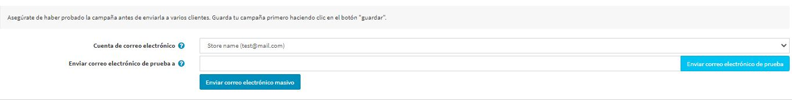

# Campañas de correo electrónico

Durante el registro, un cliente puede seleccionar la opción *Boletín* para recibir los boletines de su tienda. O es posible suscribirse a un boletín de noticias últimamente utilizando el formulario en el pie de página (en el tema predeterminado Clean nopCommerce). La otra forma de rellenar los suscriptores del correo electrónico es importar la lista de suscriptores de un archivo CSV externo a nopCommerce. También se puede exportar la lista de suscriptores a un archivo CSV externo de nopCommerce.

Consulta cómo gestionar los suscriptores del boletín informativo en la sección[Newsletter subscribers](#newsletter-subscribers) 

Utiliza tu lista de suscriptores para crear campañas de correo electrónico para llegar fácil y rápidamente al público objetivo sin necesidad de realizar actividades de marketing adicionales. Las campañas ayudan a promover la confianza y la lealtad a una empresa y, al mismo tiempo, a aumentar las ventas.

Hay varios ejemplos de campañas de marketing por correo electrónico que puede utilizar para su tienda: comience con un correo electrónico de bienvenida que agradezca la suscripción, envíe regularmente anuncios, noticias sobre su empresa, cupones para compras futuras y mucho más.

> [!NOTE]
> 
> No hay campañas disponibles por defecto, así que puedes crearlas desde cero para seguir tu propia estrategia de marketing.

Para gestionar las campañas vaya a **Promociones → Campañas**.

## Agregar una nueva campaña de correo electrónico

Para crear una nueva campaña haga clic en **Agregar nuevo**.

Define los siguientes detalles de la campaña:

- Campaña **Nombre**.
- **Sujeto** de la campaña.
- Introduzca el texto **Cuerpo** del correo electrónico que quiere enviar.
- En los **Tokens de mensaje permitidos** puedes ver la lista de tokens de mensaje permitidos que puedes usar en tu campaña de correo electrónico. Puedes verlos todos si haces clic en **Mostrar**.
- Introduce la **Fecha prevista de envío** y la hora.
- En la lista desplegable **Limitado a la tienda**, seleccione la tienda en la que los suscriptores recibirán este correo electrónico.
- En la lista desplegable **Limitado al papel del cliente**, seleccione los papeles de los suscriptores que recibirán este correo electrónico.

Haga clic en **Guardar** o **Guardar y continuar editando** para proceder a enviar su campaña.

## Envíe la campaña

Después de que la campaña se guarda, puedes enviar tu campaña a los clientes. Verás el nuevo panel en la parte superior de la página:

> [!NOTE]
>
> Asegúrate de haber probado la campaña antes de enviarla a varios clientes.

En primer lugar, envíe un correo electrónico de prueba para comprobar si todo se hace correctamente. Para ello, elija la **cuenta de correo electrónico** que se utilizará para enviar la campaña. Vea cómo crear una cuenta de correo electrónico en la sección [Cuentas de correo electrónico](xref:en/getting-start/email-accounts).

A continuación, introduzca su dirección de correo electrónico en el campo **Enviar correo electrónico de prueba a** y haga clic en **Enviar correo electrónico de prueba**.

Después de asegurarse de que todo está bien, envíe su campaña a los clientes usando el botón **Enviar correo electrónico masivo**.

## Suscriptores del boletín de noticias

Durante el registro, un cliente puede seleccionar la opción *Boletín* para recibir un boletín de noticias de su tienda:

O es posible suscribirse a un boletín de noticias últimamente usando el formulario en el pie de página (en el tema Default Clean nopCommerce):

La otra forma de rellenar los suscriptores de correo electrónico es importar la lista de suscriptores de un archivo CSV externo a nopCommerce. También puedes exportar la lista de suscriptores a un archivo CSV externo de nopCommerce.

Para exportar/importar suscriptores del boletín de noticias vaya a **Promociones → Suscriptores del boletín de noticias**.

Puede hacer clic en **Importar desde CSV** para importar listas de suscriptores en formato CSV. Asegúrate de que cada línea del archivo CSV tiene el siguiente formato: dirección_de_correo electrónico, is_activo, id_almacén (el parámetro id_almacén es opcional). Por ejemplo, `test@test.com, true`. Puedes hacer clic en **Exportar a CSV** para exportar la lista de suscriptores existente.

## Buscando los suscriptores

En la página de *Suscriptores del boletín* puede encontrar ciertos suscriptores utilizando los siguientes campos de búsqueda:
- Introduzca el **Email** del suscriptor a buscar, o deje este campo vacío para cargar todos los suscriptores del boletín de noticias registrados en el sistema.
- Especifique **Fecha de inicio** y **Fecha de finalización** cuando se suscribió un cliente.
- En la lista desplegable **Activo**, elegir entre los suscriptores *Activo* y *No activo* o cargar *Todos*.
- En la lista desplegable **Tienda**, elija la tienda.
- En la lista desplegable **Roles de cliente**, seleccione el rol de cliente.

Haga clic en **Búsqueda**.

## Tutoriales

- [Managing campaigns in nopCommerce](https://youtu.be/iW2m8LQyyWM)