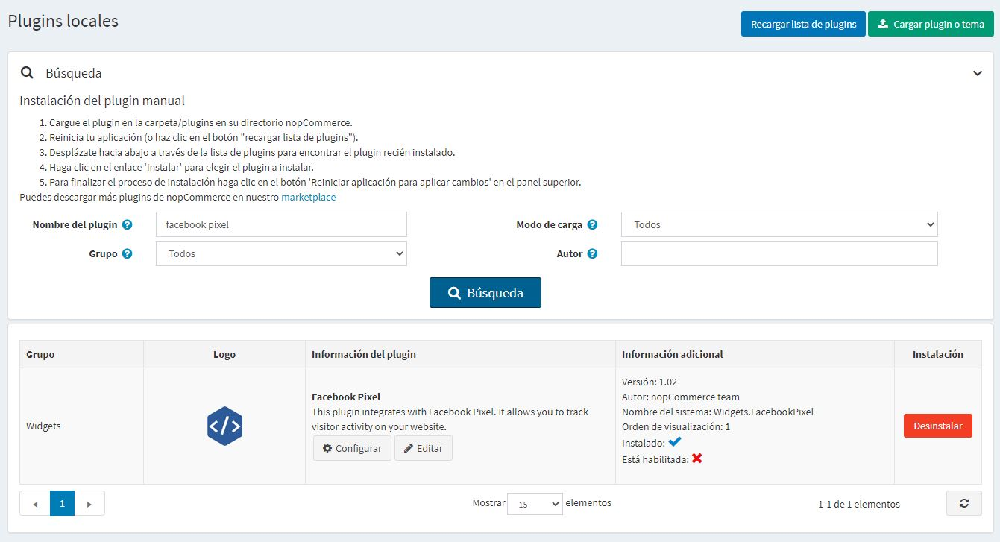
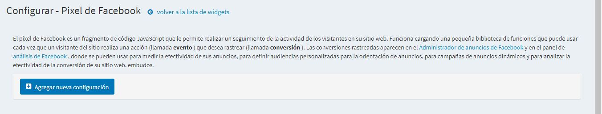
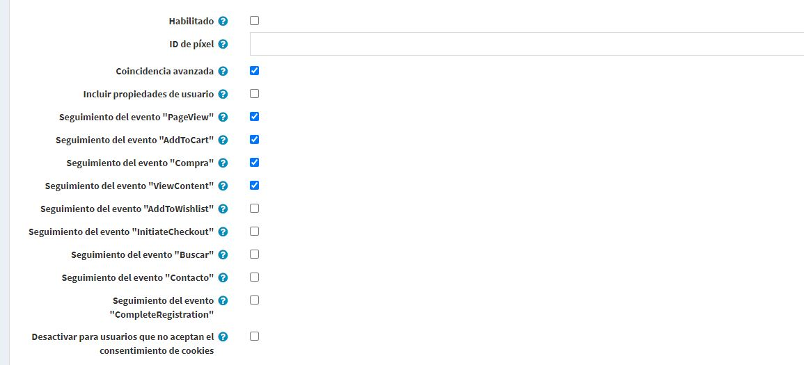
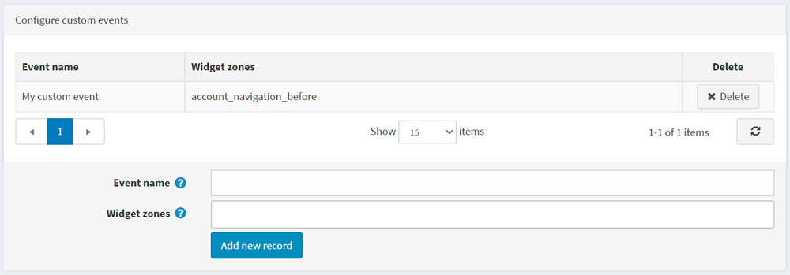

# Pixel plugin de Facebook

Esta sección describe cómo integrar el pixel de Facebook en su tienda.

## ¿Qué es el píxel de Facebook?

Pixel de Facebook te permite recibir información sobre las acciones realizadas en tu tienda para que tus anuncios de Facebook sean más relevantes para tu público. Facebook pixel puede ayudarte a entender el comportamiento de las personas que visitan tu tienda y qué estrategia publicitaria funciona mejor para alcanzar tus objetivos comerciales.

Las conversiones rastreadas aparecen en el [Administrador de anuncios de Facebook](https://www.facebook.com/adsmanager) y en el panel [Analítica de Facebook](https://business.facebook.com/analytics), donde se pueden utilizar para medir la eficacia de sus anuncios, definir audiencias personalizadas para la orientación de los anuncios, para campañas de anuncios dinámicos y para analizar la eficacia de los embudos de conversión de su sitio web.

## Lo que hace el plugin de píxeles de Facebook

El plugin de píxeles de Facebook para nopCommerce pega un fragmento de código JavaScript que le permite rastrear la actividad de los visitantes en su sitio web. Funciona cargando una pequeña librería de funciones que se utilizan cada vez que un cliente realiza una acción.

## Instalar y activar el plugin

El plugin de píxeles de Facebook es un plugin de nopCommerce listo para usar. Puedes encontrarlo aquí: **Configuración → Plugins locales**. Para encontrar el plugin más rápido usa el campo **Group** en el panel de búsqueda para filtrar los plugins por tipo de *Widgets*:

Instale el plugin usando el botón **Instalar** si está desinstalado. Luego actívelo haciendo clic en el botón **Editar**. Verá la ventana *Editar detalles del plugin* en este caso. Marque el plugin como habilitado usando la casilla de verificación **Está habilitado** y haga clic en el botón **Guardar**..

## Cómo configurar el plugin

1. Haga clic en el botón **Configurar**. Verás la ventana de la página *Configurar - Píxel de Facebook*:

1. Haga clic en el botón **Agregar nueva configuración**.
1. Rellene el siguiente formulario para configurar el plugin:

* Marque la casilla **Habilitado** para habilitar esta configuración de píxeles de Facebook.
* Introduzca su **Pixel ID** que puede encontrar en el [Administrador de Anuncios → Administrador de Eventos](https://business.facebook.com/events_manager). Si no has creado un pixel, [sigue estas instrucciones](https://www.facebook.com/business/help/952192354843755) para crear uno - todo lo que necesitas es el ID del pixel.
* **Advanced Matching**: si se marca, algunos de los datos del visitante (en el formato hash) serán recogidos por el Pixel de Facebook. Si implementa automáticamente el emparejamiento avanzado usando el Administrador de Eventos, desmarque esta opción.
* **Incluir propiedades del usuario**: marque para incluir *Propiedades del usuario*, datos sobre el usuario, en un píxel. Luego puedes ver las propiedades del usuario en el panel de control de Facebook Analytics en People → User Properties.

A continuación verás la lista de eventos. Los eventos estándar son acciones predefinidas de los visitantes que corresponden a actividades comunes relacionadas con la conversión, como la búsqueda de un producto, la visualización de un producto o la compra de un producto.

* **Track "PageView" event**: compruebe si está habilitado el seguimiento del evento estándar, cuando una persona aterriza en las páginas del sitio web.
* **Track "AddToCart" event**: compruebe si se habilita el seguimiento del evento estándar, cuando se añade un producto al carrito de la compra.
* ** **Seguimiento del evento "Compra "**: compruebe si está activado el seguimiento del evento estándar cuando se realiza un pedido.
* ** **Seguir el evento "ViewContent "**: compruebe si se ha activado el seguimiento del evento estándar cuando una persona llega a la página de detalles de un producto.
* **Seguir el evento "AddToWishlist "**: activar el seguimiento del evento estándar cuando se añade un producto a la lista de deseos.
* ** **Seguir el evento "InitiateCheckout "**: verificar para habilitar el seguimiento del evento estándar, cuando una persona entra en el flujo de salida antes de completar el flujo de salida.
* ** **Track "Search" event**: compruebe si está habilitado el seguimiento del evento estándar, cuando se realiza una búsqueda.
* ** **Seguir el evento "Contacto "**: comprobar si está activado el seguimiento del evento estándar, cuando una persona envía una pregunta a través del formulario de contacto.
* **Seguir el evento "Completar registro "**: activar el seguimiento del evento estándar, cuando se completa un formulario de registro..

> [!NOTE]
>
> Como parámetro adicional, algunos eventos incluyen SKU de productos o SKU de combinaciones de productos; asegúrese de que se rellenan correctamente en su catálogo.

* **Deshabilitar para los usuarios que no acepten el Consentimiento de la Cookie**: marque para deshabilitar el píxel de Facebook para los usuarios que no acepten el Consentimiento de la Cookie. Puede que lo desee si realiza negocios en países que están sujetos a la Regulación General de Protección de Datos (GDPR). También necesita activar la opción **DisplayEuCookieLawWarning** en la página **Configuration → Settings → General settings** para mostrar el Consentimiento de Cookies para los usuarios.

> [!NOTE]
>
> La Regulación General de Protección de Datos (GDPR) entró en vigor el 25 de mayo de 2018, y crea reglas de protección de datos consistentes en toda Europa. Las empresas que se anuncian con las compañías de Facebook pueden seguir utilizando las plataformas y soluciones de Facebook de la misma manera que lo hacen hoy en día.

## Configurar eventos personalizados

> [!NOTE]
>
> ¡Puedes ver este panel sólo después de haber creado y guardado la configuración actual!

Si los eventos estándar predefinidos no se adaptan a sus necesidades, puede realizar un seguimiento de sus propios eventos personalizados, que también se pueden utilizar para definir audiencias personalizadas para la optimización de los anuncios.
Puedes configurarlos a continuación. Especifique el nombre y elija las zonas de widgets en las que se realizará el seguimiento del evento personalizado. Si no sabes qué zona usar para tu evento personalizado, puedes preguntar sobre ello en nuestro [forums](https://www.nopcommerce.com/boards).

## Ver también

[What data does the Facebook pixel collect?](https://developers.facebook.com/docs/facebook-pixel/support#pixelcollect)
