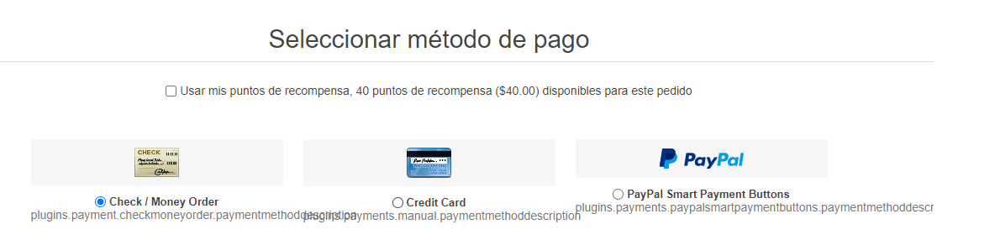

# Puntos de recompensa

La funcionalidad de "Puntos de recompensa" le permite crear e implementar un programa de lealtad para mejorar la experiencia del cliente y aumentar su lealtad. El programa "Puntos de recompensa" permite a los clientes ganar puntos por ciertas acciones que realizan en el sitio, como registrarse y hacer compras.

Los puntos de recompensa pueden ser utilizados como uno de los métodos de pago. Esta opción se muestra en el área de métodos de pago de la caja. Los puntos de recompensa intercambiables se pueden utilizar junto con otras opciones de pago como tarjetas de crédito, tarjetas de regalo y más.

Los puntos también pueden ser cancelados si un cliente cancela un pedido o envía una solicitud de devolución.

## Gestionar los puntos de recompensa

Para manejar el programa de puntos de recompensa vaya **Configuración → Ajustes → Puntos de recompensa**. Esta página está disponible en dos modos: *básico* y *avanzado*.

Esta página permite la configuración de varias tiendas, esto significa que se pueden definir los mismos ajustes para todas las tiendas, o diferir de una tienda a otra. Si desea gestionar la configuración de una tienda determinada, elija su nombre en la lista desplegable de configuración de varias tiendas y marque todas las casillas de verificación necesarias en el lado izquierdo para establecer un valor personalizado para ellas. Para obtener más detalles, consulte [Multi-store](xref:es/getting-started/advanced-configuration/multi-store).

Para configurar su programa de puntos de recompensa, defina estos ajustes:

## Común
- Marque la casilla **Habilitado**, para activar el programa de puntos de recompensa.
- En el campo **Tipo de cambio**, especifique el tipo de cambio de los puntos de recompensa. (1 punto - $1 etc.).
- En el campo **Puntos de recompensa mínimos a utilizar**, introduzca la cantidad mínima de puntos de recompensa requeridos, antes de que los clientes puedan utilizar sus puntos de recompensa. Introduzca 0, si no necesita definir esta configuración.
- Si especifica el campo **Máximo de puntos de recompensa a utilizar por pedido** los clientes no podrán utilizar más de X puntos de recompensa por un pedido. Ponga 0 si no desea utilizar este ajuste. 

## Ganar puntos de recompensa
- En el campo **Puntos por compras**, especifique el número de puntos concedidos por las compras.
- En el campo **Validez de los puntos por compras**, especifique el número de días en que serán válidos los puntos concedidos por las compras.
- En el campo **Total mínimo del pedido**, especifique el total mínimo del pedido (excluyendo los gastos de envío) para otorgar los puntos por las compras.
- En el campo **Puntos por registro**, especifique el número de puntos concedidos por el registro del cliente.
- En el campo **Validez de los puntos de registro**, especifique el número de días en que serán válidos los puntos concedidos por el registro.
- Marque la casilla de verificación **Activar los puntos inmediatamente** si desea que los clientes puedan utilizar los puntos de recompensa justo después de haberlos ganado. Si no marca esta casilla de verificación, aparecerá una opción más:
- En la casilla de verificación **Activación de puntos de recompensa** especifique el período (número de días/horas) tras el cual se activarán los puntos de recompensa.
- Marque la casilla de verificación **Mostrar cuánto se ganará** para mostrar a sus clientes cuántos puntos se ganarán. Será visible en la página de pago.
- Marque la casilla **Puntos acumulados para todas las tiendas** para acumular todos los puntos de recompensa en un solo saldo para todas las tiendas, de modo que puedan ser utilizados en cualquier tienda.
- En el campo **Tamaño de la página** establezca el tamaño de la página para el historial de puntos de recompensa en la página *Mi cuenta*.

Haga clic en **Save**.

> [!NOTE]
> 
> Los puntos de recompensa se aplican sólo a los usuarios registrados.

Cuando un cliente usa los puntos de recompensa al hacer la compra se ve así:

## See also

- [Managing reward points tutorial](https://www.youtube.com/watch?v=lE4-xDUKkd0&index=14&list=PLnL_aDfmRHwsbhj621A-RFb1KnzeFxYz4)
