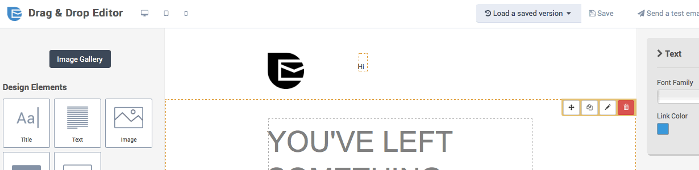
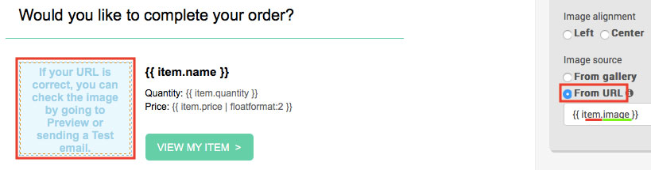
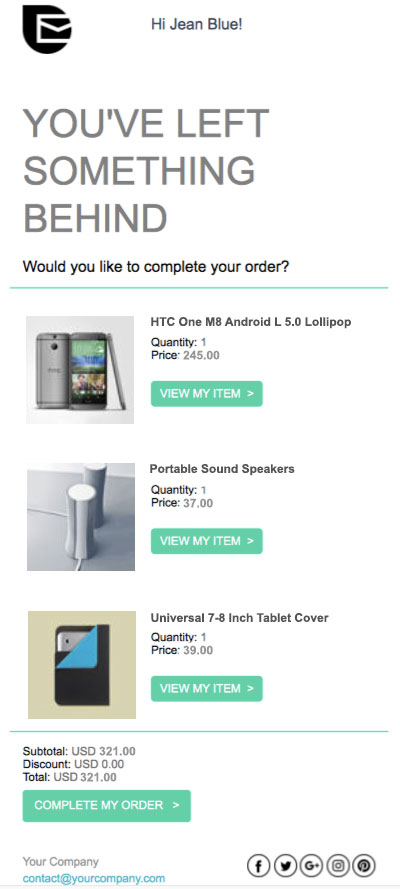

# Recuperar carros abandonados

En este tutorial, aprenderá a crear correos electrónicos de carritos abandonados y a configurar el flujo de trabajo para recuperar las ventas perdidas. También aprenderá qué datos de pedidos de nopCommerce son compatibles con la plataforma SendinBlue.

## Antes de empezar

Necesitará lo siguiente:
* Las credenciales de la cuenta de SendinBlue. Si no tiene una, [sign up for free](https://app.sendinblue.com/account/register/?utm_source=nopcommerce_plugin&utm_medium=plugin&utm_campaign=module_link). 
* Make sure that SendinBlue's [*New Template Language*](https://help.sendinblue.com/hc/en-us/articles/360000659260?utm_source=nopcommerce_plugin&utm_medium=plugin&utm_campaign=module_link) for emails is enabled on your account.
* Follow [these steps](xref:en/running-your-store/promotional-tools/sendinblue-integration/set-up-sendinblue-plugin) to set up the SendinBlue plugin.

## Crear una plantilla de correo electrónico de carrito abandonado

Primero, inicie sesión en su cuenta de SendinBlue y luego vaya a la plataforma de automatización > [Email Templates](https://my.sendinblue.com/camp/lists/template?utm_source=nopcommerce_plugin&utm_medium=plugin&utm_campaign=module_link). Click on the **New Template** button at the top right.

La plantilla de correo electrónico puede personalizarse con varios tipos de datos:

* [atributos de los contactos guardados en su lista de SendinBlue](#personalize-your-email-with-contact-attributes)
* [detalles del artículo abandonado](#personalize-your-email-with-the-abandoned-items-details)
* [detalles del carro abandonado](#personalize-your-email-with-the-abandoned-cart-details)

### Personalize your email with contact attributes

Empecemos por [personalización con atributos de contacto](https://help.sendinblue.com/hc/en-us/articles/360001008200?utm_source=nopcommerce_plugin&utm_medium=plugin&utm_campaign=module_link).

En el ejemplo siguiente, hemos incluido una personalización de:

* the recipient's first name using {{ contact.FIRSTNAME }}
* the recipient's last name using {{ contact.LASTNAME }}

> [!NOTE]
> FIRSTNAME and LASTNAME should be existing attributes in your SendinBlue account.

Ahora vamos a personalizar la plantilla de correo electrónico con las variables del pedido, como el nombre de los artículos dejados, sus imágenes, el precio, etc. Para ello, utilizaremos el *Lenguaje de la plantilla* para [insertar una lista dinámica](https://help.sendinblue.com/hc/en-us/articles/360000887379-Inserting-a-dynamic-list-in-the-Drag-Drop-editor-NEW-?utm_source=nopcommerce_plugin&utm_medium=plugin&utm_campaign=module_link).

### Personalice su correo electrónico con los detalles de los artículos abandonados

Las siguientes variables pueden incluirse directamente desde una lista dinámica dentro del contenido de su plantilla de SendinBlue:

| Items data | Insert this placeholder in your template |
| ------------- | ------------- |
| Name | {{ item.name }} |
| SKU | {{ item.sku }} |
| Category | {{ item.category }} |
| ID | {{ item.id }} |
| ID of the item variation | {{ item.variant_id }} |
| Name of the item variation | {{ item.variant_name }} |
| Price | {{ item.price }} |
| Quantity | {{ item.quantity }} |
| Storefront link of the purchased item | {{ item.url }} |
| Image | {{ item.image }} |

En el *Editor de arrastrar y soltar*, seleccione el bloque deseado que mostrará los elementos abandonados.

1. Haga clic en el icono del **lápiz** para editar los ajustes del bloque de diseño.
1. Habilite la opción de **lista dinámica**.
1. En el campo **parámetro**, escriba "elementos".
1. En el campo **variable**, escriba `item`.
1. Establezca el límite del número de artículos que se mostrarán. Por ejemplo, si quedan 5 artículos en el carrito y establece 3 como límite, sólo se mostrarán 3 artículos en el correo electrónico.

Ahora añada las variables a su plantilla de correo electrónico. En el ejemplo anterior, hemos añadido:
* `{{ item.name }}` - the name of the item
* `{{ item.quantity }}` - the quantity of the item
* `{{ item.price | floatformat: 2 }}` - the price of the item

To add the link of the item, select the **Call-To-Action (CTA)** button. On the right sidebar, under *Link*, type `{{ item.url }}`.

To add the image of the item, select the image. On the right sidebar, under *Image source*, choose *From URL* then type `{{ item.image }}`.

Una vez que su diseño esté completo, haga clic en el botón verde **Guardar y Salir**. A continuación, haga clic en el botón **Guardar y activar**.

### Personalice su correo electrónico con los detalles del carrito abandonado

Las siguientes variables pueden incluirse directamente en el contenido de su plantilla SendinBlue:

| Cart details | Insert this placeholder |
| ------------- | ------------- |
| Affiliation | {{ params.affiliation }} |
| Currency | {{ params.currency }} |
| Discount | {{ params.discount }} |
| Shipping | {{ params.shipping }} |
| Subtotal | {{ params.subtotal }} |
| Tax | {{ params.tax }} |
| Total before tax | {{ params.tax }} |
| Total | {{ params.total_before_tax }} |
| Link to cart | {{ params.url }} |

> [!NOTE]
> Los artículos que se muestren en la página de enlace al carrito serán diferentes en función del lugar desde el que se abra la sesión. Por ejemplo, digamos que un cliente está navegando desde su ordenador portátil. Si hace clic en el correo electrónico del carrito abandonado desde su teléfono, no se mostrará su carrito abandonado.

En el *Editor de arrastrar y soltar*, seleccione el bloque deseado que mostrará la información del carrito abandonado y luego añada las variables de pedido que desee.

Se recomienda formatear los números utilizando [floatformat](https://help.sendinblue.com/hc/en-us/articles/360000268730?utm_source=nopcommerce_plugin&utm_medium=plugin&utm_campaign=module_link#numbers). En el ejemplo siguiente, hemos añadido:

* `{{ params.currency }}` - the currency of the abandoned cart
* `{{ params.subtotal | floatformat: 2 }}` - the subtotal of the abandoned cart
* `{{ params.discount | floatformat: 2 }}` - the discount of the abandoned cart
* `{{ params.total | floatformat: 2 }}` - the total of the abandoned cart

Para añadir el enlace del carrito abandonado, seleccione el botón **Call-To-Action (CTA)**. En la barra lateral derecha, en *Enlace*, escriba `{{ params.url }}`.

Una vez que su diseño esté completo, haga clic en el botón verde **Guardar y Salir**. A continuación, haga clic en el botón **Guardar y activar**.

## Creación del flujo de trabajo del carrito abandonado

> NOTA
> Un cliente tiene que ser identificado por su dirección de correo electrónico para activar el flujo de trabajo, es decir, un cliente debe estar conectado a su cuenta en su tienda nopCommerce o introducir su dirección de correo electrónico durante el pago.

Navegue hasta el [Automation](https://automation.sendinblue.com/?utm_source=nopcommerce_plugin&utm_medium=plugin&utm_campaign=module_link) tab of your SendinBlue account.

Click on **+ CREATE A NEW WORKFLOW**, then select **Detailed Abandoned Cart** and follow the steps.

At the *Send an email* step, select the email template you have just created and activated from the dropdown list.

When your workflow is complete, click on **DONE** to save and activate it.

Feel free to read this tutorials to help you creating the workflow: 
* [Recovering abandoned carts: automatically send the emails (step 3)](https://help.sendinblue.com/hc/en-us/articles/360002761299?utm_source=nopcommerce_plugin&utm_medium=plugin&utm_campaign=module_link)

## Ejemplo

Digamos que el cliente Jean Blue jean.blue@sendinblue.com ha visitado su tienda pero se ha dejado los siguientes 3 artículos en el carrito.

Your template will look like this:

The email received by Jean Blue will look like this:

## Más información

* Más información
* [Enviar un correo electrónico de confirmación del pedido](xref:en/running-your-store/promotional-tools/sendinblue-integration/send-an-order-confirmation-email)