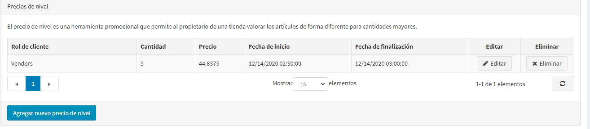
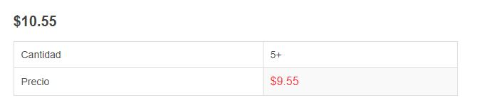

# Los precios de los pisos

Los precios escalonados son una herramienta de promoción que permite al dueño de una tienda ofrecer precios especiales cuando los clientes compran mayores cantidades de un producto en particular. Esta herramienta se utiliza típicamente en las ventas al por mayor, pero los minoristas también pueden aplicarla para incentivar a los compradores e impulsar más ventas.

Los precios por niveles se pueden aplicar a un producto en la página de edición del producto. Vaya a **Catálogo → Productos**, seleccione un producto al que desee añadir un precio de nivel y haga clic en **Editar**. Busque el panel de *Precios por niveles* para añadir un nuevo precio por niveles.

> [!NOTE]
> 
> Necesitas guardar el producto antes de poder añadir precios de nivel para la página del producto.

## Agregar precios de nivel

Haga clic en el botón **Agregar nuevo precio de nivel** para agregar un nuevo precio de nivel. Aparecerá la ventana *Agregar nuevo precio de la grada*.

- En los campos **Cantidad** y **Precio**, defina el precio aplicable a una determinada cantidad del producto.
- En caso de que tenga varias tiendas, en la lista desplegable **Tienda**, seleccione aquella en la que piensa aplicar los precios de nivel.
- En la lista desplegable **Relación de cliente**, seleccione la relación de cliente en base a la cual se definirá el precio de nivel, por ejemplo: *Todos* los clientes, *Registrados*, *Invitados*.
- En los campos **Fecha de inicio** y **Fecha de finalización** introduzca el período de disponibilidad de los precios de nivel. Deje estos campos vacíos si no son aplicables.

Haga clic en **Guardar**. La tabla de *Precios escalonados* se actualiza con los nuevos datos.

Ahora puede ver la página de detalles de los productos actualizada en la tienda pública:

Cuando un cliente añade una cierta cantidad de un producto a su carrito, el precio se cambia automáticamente para reflejar el descuento. 

## Tutoriales

- [Managing tier pricing](https://www.youtube.com/watch?v=ERE08UEDU58&t=10s)
