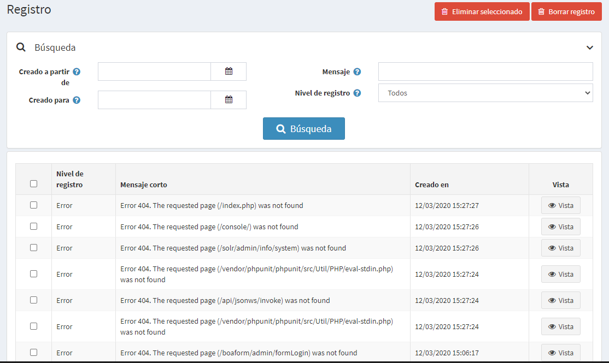
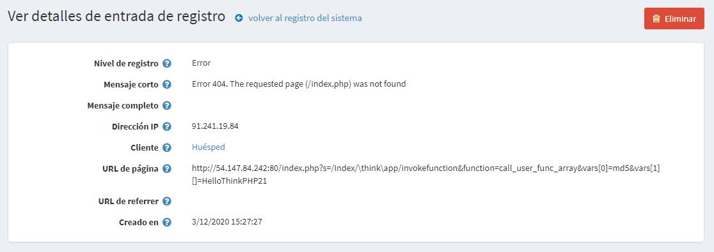

# Iniciar sesión

El informe de registro del sistema muestra una lista de todos los errores, advertencias y mensajes de información que se crearon en el sistema. Para ver el registro, vaya a **Sistema → Registro**. Se muestra la ventana *Registro*, de la siguiente manera:

Un elemento de registro incluye el tipo de registro, la descripción del error y la fecha. Puede hacer clic en el botón **Eliminar seleccionados** para eliminar los elementos de registro seleccionados o hacer clic en el botón **Borrar registro** para borrar todo el registro.

Para buscar el registro del sistema, ingrese una o más de la siguiente información:
  * En el campo **Creado a partir de**, seleccione la fecha de inicio de la búsqueda.
  * En el campo **Creado hasta**, seleccione la fecha de finalización de la búsqueda.
  * En el campo **Mensaje**, seleccione el mensaje o parte del mensaje para buscar.
  * En la lista desplegable **Nivel de registro**, seleccione el tipo de información de registro que se mostrará, de la siguiente manera:
  * *Todas*
  * *Depurar*
  * *Información*
  * *Advertencia*
  * *Error*
  * *Fatal*

Haga clic en **Buscar**. La ventana del sistema de registro se mostrará según los criterios de búsqueda.

## Ver detalles del registro del sistema

Al hacer clic en **Ver**, se muestran detalles adicionales del error que se produjo, de la siguiente manera:

[Puede hacer clic en **Eliminar** para eliminar un registro del sistema si es necesario.](https://www.youtube.com/watch?v=CNgTJZoWHTA)