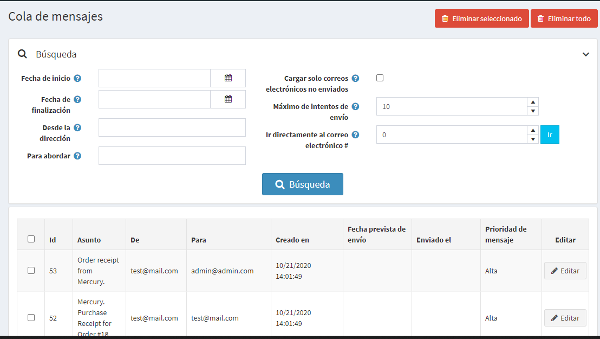
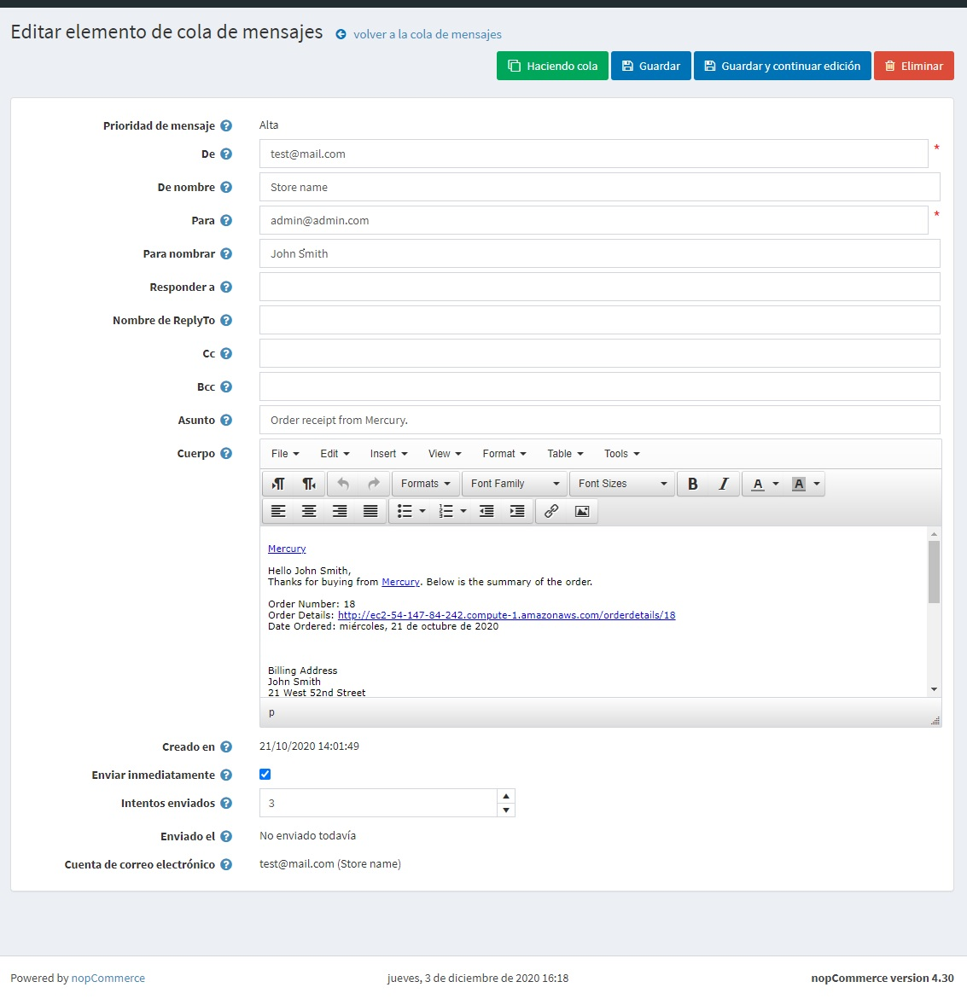

# Cola de mensajes

Los correos electrónicos no se envían inmediatamente en nopCommerce. Están en cola. La cola de mensajes contiene todos los correos electrónicos que ya se enviaron o aún no se enviaron.

Para cargar la cola de mensajes, en el menú **Sistema**, seleccione **Cola de mensajes**. Se muestra la ventana *Cola de mensajes*, de la siguiente manera:

Ingrese uno o más de los siguientes criterios para buscar mensajes:
  * En el campo **Fecha de inicio**, seleccione la fecha de inicio.
  * En el campo **Fecha de finalización**, seleccione la fecha de finalización.
  * En el campo **De dirección**, ingrese la dirección de origen de un mensaje.
  * En el campo **A la dirección**, ingrese la dirección de destino de un mensaje.
  * Marque la casilla de verificación **Cargar solo los correos electrónicos no enviados** para cargar solo los correos electrónicos que aún no se han enviado.
  * En el campo **Máximo de intentos de envío**, ingrese el número máximo de intentos para enviar un mensaje.
  * En el campo **Ir directamente al número de correo electrónico**, ingrese el número de correo electrónico y haga clic en **Ir** para mostrar el correo electrónico requerido.

Haga clic en **Buscar** para cargar la cola de mensajes que coincida con los criterios.

En esta página, puede hacer clic en el botón **Eliminar seleccionados** para eliminar los correos electrónicos seleccionados de la cuadrícula. Puede hacer clic en **Eliminar todo** para eliminar todos los correos electrónicos.

## Detalles del elemento de la cola de mensajes

Para ver los detalles del elemento de la cola de mensajes, haga clic en el botón **Editar** al lado del mensaje. Aparecerá la ventana *Editar elemento de la cola de mensajes*:

En esta ventana puede eliminar el mensaje haciendo clic en el botón **Eliminar**. O puede poner en cola el mensaje usando el botón **Solicitar**.

En esta página puede editar los siguientes detalles del mensaje:

* **De** la dirección de correo electrónico.
* **De nombre**.
* **A** dirección de correo electrónico.
* **Nombrar**.
* **Responder a** dirección de correo electrónico.
* **Responder al nombre**.
* **Cc** dirección de correo electrónico.
* **Cco** dirección de correo electrónico.
* Mensaje de correo electrónico **Asunto**.
* Mensaje de correo electrónico **Cuerpo**.
* Marque la casilla de verificación **Enviar inmediatamente** para enviar este mensaje inmediatamente.
* Ingrese el número de **intentos enviados**. Esta es la cantidad de veces que se intenta enviar este mensaje.

Haga clic en **Guardar** o **Guardar y continuar con la edición** para guardar los detalles del mensaje.
Haga clic en **Guardar** o **Guardar y continuar con la edición** para guardar los detalles del mensaje.