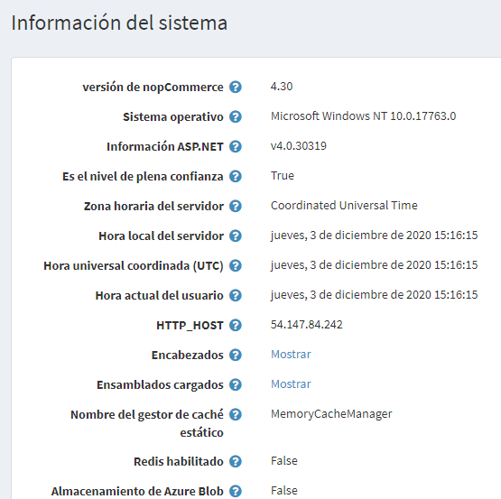

# Información del sistema

El siguiente procedimiento describe cómo ver la información del sistema de la tienda y el servidor del sistema.

Para ver la información del sistema, vaya al menú **Sistema**, seleccione **Información del sistema**. Se mostrará la *Información del sistema*, de la siguiente manera

