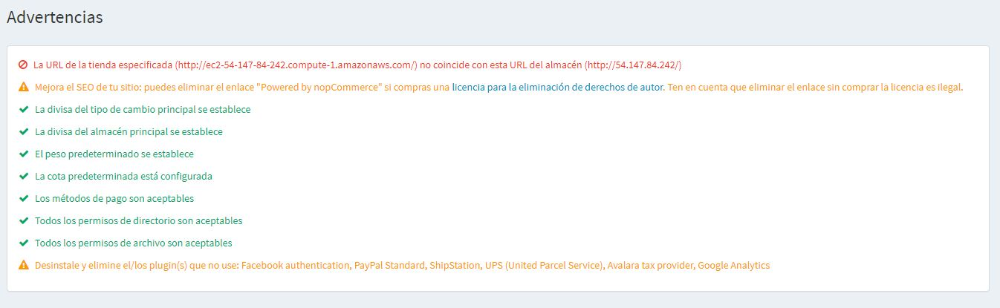

---
title: Warnings
uid: es/running-your-store/system-administration/warnings
author: git.AndreiMaz
contributors: git.exileDev, git.mariannk
---

# Advertencias

El siguiente procedimiento describe cómo ver todas las advertencias que existen actualmente en la tienda.

Para ver las advertencias de la tienda, vaya a **Sistema → Advertencias**. Se mostrará la ventana *Advertencias*, de la siguiente manera:

Le recomendamos que corrija todas las advertencias si existen. De lo contrario, afectará la eficiencia y el rendimiento de su tienda.

Consulte los siguientes artículos para corregir las advertencias existentes:
* [Información de su tienda](xref:es/Getting-started/advanced-configuration/your-store-information)
* [Monedas](xref:es/Getting-started/configure-payments/advanced-configuration/currencies)
* [Medidas](xref:es/Getting-started/configure-shipping/advanced-configuration/Measures)
* [Métodos de pago](xref:es/Getting-started/configure-payments/payment-methods/index)
* [Complementos en nopCommerce](xref:es/Getting-started/advanced-configuration/plugins-in-nopcommerce)