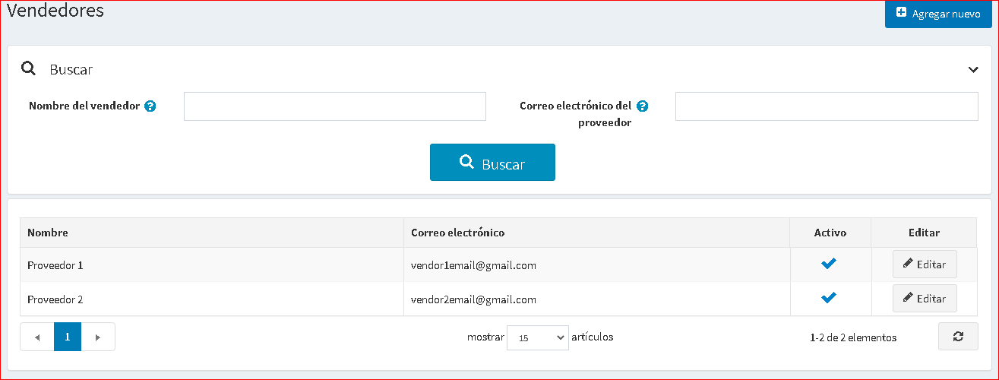
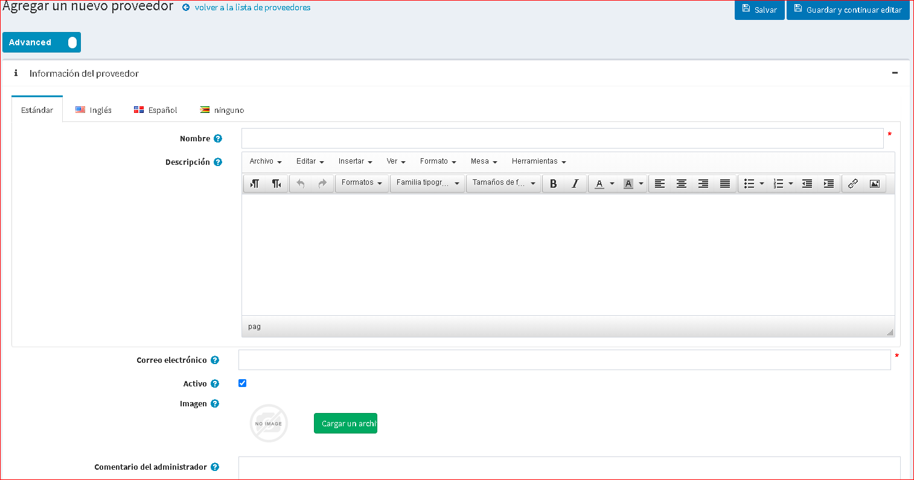
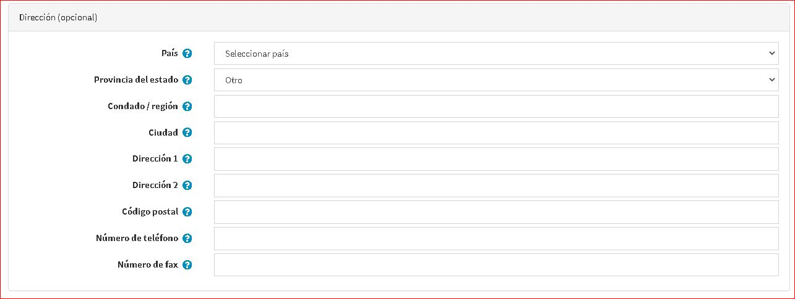
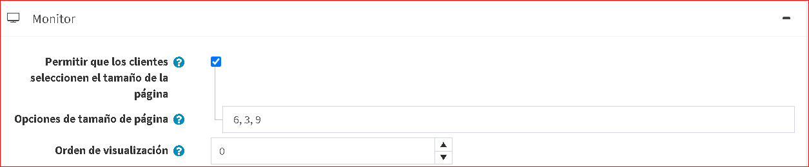
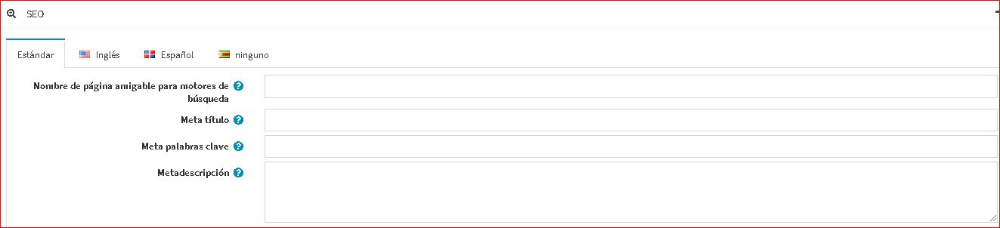
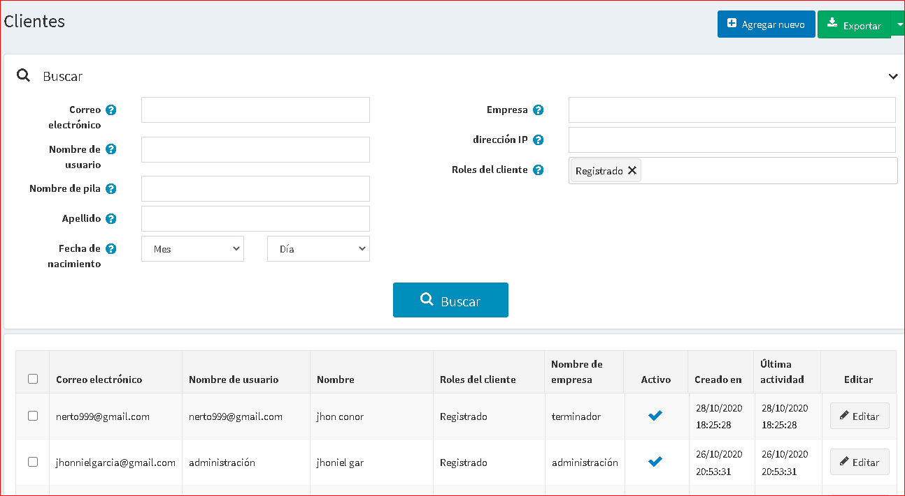

# Gestión de proveedores

* Proveedores* es una categoría especial de clientes que deben considerarse por separado.

nopCommerce tiene herramientas para *múltiples proveedores* y envío directo que le permiten vender en línea sin tener que mantener existencias o enviar pedidos. En este caso, cada producto se asigna a un proveedor particular cuyos detalles (incluida la dirección de correo electrónico) se almacenan.

Cuando se realiza un pedido, se envía un correo electrónico a un proveedor de cada producto del pedido. El correo electrónico incluye los productos, las cantidades, etc. El proveedor envía el artículo al cliente en nombre del comerciante, que normalmente paga a cada uno de sus proveedores al final del mes.

Los productos de varios proveedores independientes aparecen en el catálogo de productos común y los visitantes de su sitio web pueden comprar en una tienda web, incluso si sus productos son suministrados por cientos de proveedores diferentes de todo el mundo.

A cada proveedor se le podría proporcionar un acceso al panel de administrador para administrar sus productos, revisar informes de ventas y detalles de pedidos relacionados con sus productos. Los proveedores no pueden ver las actividades de los demás.

El dinero va a la cuenta comercial del administrador de la tienda, quien luego distribuye manualmente los fondos entre los proveedores de acuerdo con el historial de pedidos, que se rastrea y administra por separado para cada proveedor. De esta manera, el cliente solo ve un cargo de la empresa principal.

El siguiente procedimiento describe cómo configurar y proporcionar un registro de proveedor con acceso al sitio del portal de proveedores.

## Configurar una cuenta de proveedor

Vaya a **Clientes → Proveedores**. Se muestra la ventana *Proveedores*:

Haga clic en **Agregar nuevo**.

### Información del proveedor

En el panel *Información del proveedor*, defina los siguientes detalles del proveedor:

* **Nombre** del proveedor.
* **Descripción** para el proveedor.
* **Correo electrónico** del proveedor. Las notificaciones de "Pedido realizado" se enviarán a este correo electrónico.
* Marque la casilla de verificación **Activo** para activar el proveedor.
* Sube un proveedor **Imagen**.
* **Comentario del administrador** un comentario opcional o información para uso interno.

> [!NOTE]
>
> Algunas de las plantillas de mensajes de proveedores, como *OrderPaid.VendorNotification* y *OrderPlaced.VendorNotification*, están deshabilitadas de forma predeterminada. Vea cómo cambiar esto en la sección [Plantillas de mensajes](xref:es/running-your-store/content-management/message-templates).

### Atributos del proveedor

Cuando cree algunos atributos de proveedor adicionales, también se mostrará el panel *Atributos de proveedor*.

Los propietarios de una tienda pueden crear atributos para un proveedor de la misma forma que pueden para un producto. Esto permitiría a las tiendas de varios proveedores recopilar y mostrar más información sobre el proveedor a los clientes.

 Obtenga más información sobre los atributos del proveedor y cómo crearlos en la sección [Atributos del proveedor](# vendor-atributos) a continuación.

### Dirección (opcional)
En el panel *Direción (opcional)* ingrese la dirección del proveedor.

### Monitor

En el panel *Pantalla*, defina los siguientes parámetros de pantalla:

* Para **Permitir a los clientes seleccionar el tamaño de página** de una lista predefinida de opciones.
  * Si la casilla de verificación anterior está marcada, defina **Opciones de tamaño de página** (separados por comas).
* Si la casilla de verificación anterior no está marcada, ingrese el **Tamaño de página**.
* **Mostrar orden** del proveedor.

### SEO

Consulte la sección [Paneles SEO](xref:en/running-your-store/search-engine-optimization#seo-Panels) para configurar el SEO.

## Asignar un proveedor a un registro de cliente

Este paso es opcional y solo es necesario si desea que sus proveedores puedan iniciar sesión en su portal de administración y administrar sus productos, pedidos, etc.

Si no desea que los proveedores tengan acceso al área de administración, ignore este paso para permitir que el propietario de la tienda administre todas las asignaciones de proveedores.

Vaya a **Clientes → Clientes**. Se muestra la ventana *Clientes*:

Cree un nuevo cliente o haga clic en **Editar** junto al registro de un cliente al que desea asignar un proveedor. Para obtener más información sobre cómo crear un cliente, consulte [Agregar un nuevo cliente] (xref: en / ejecutando-su-tienda / administración-de-clientes / administración-clientes # agregar-un-nuevo-cliente).

* En el panel *Información del cliente*, asegúrese de que la función de cliente *Proveedores* esté seleccionada en el campo **Funciones de cliente**.
  > [!NOTE]
  >
  > Una cuenta de cliente de proveedor no puede pertenecer al rol de cliente *Administradores* predeterminado.

* En el panel *Información del cliente*, busque el campo **Administrador del proveedor**. Seleccione un registro de proveedor creado previamente.

Una vez configurada la cuenta de cliente del proveedor, el proveedor puede usar esta cuenta de cliente para administrar productos, pedidos, envíos y ver informes. El enlace *Administración* en la parte superior de la tienda pública se mostrará después de iniciar sesión.

> [!TIP]
>
> [Tutorial de YouTube: gestión de proveedores](https://www.youtube.com/watch?v=MH6r6tqfLF8&list=PLnL_aDfmRHwsbhj621A-RFb1KnzeFxYz4